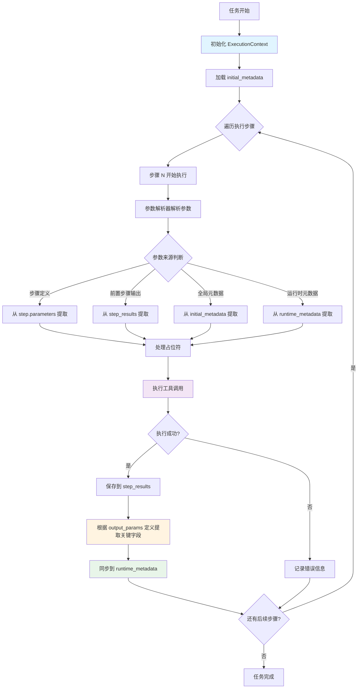

# 数据槽位的智能流转

## 概述

数据槽位的智能流转是任务编排服务的核心机制之一，负责在多步骤执行过程中自动管理和传递数据。该机制确保前置步骤的输出能够正确地流转到后续步骤的输入，实现步骤间的数据依赖和参数传递。

## 核心设计理念

### 1. 三层数据存储架构

系统采用三层数据存储架构，实现数据的分离存储和智能流转：

```
┌─────────────────────────────────────────────────────────┐
│              ExecutionContext (执行上下文)                │
├─────────────────────────────────────────────────────────┤
│                                                         │
│  ┌───────────────────────────────────────────────┐    │
│  │ 1. initial_metadata (初始元数据)               │    │
│  │    - 任务提交时的全局数据                      │    │
│  │    - 只读，不修改                              │    │
│  │    - 示例: project_id, file_path, city_name   │    │
│  └───────────────────────────────────────────────┘    │
│                                                         │
│  ┌───────────────────────────────────────────────┐    │
│  │ 2. runtime_metadata (运行时元数据)             │    │
│  │    - 动态流转，从步骤输出中提取的关键参数      │    │
│  │    - 用于传递给后续步骤                        │    │
│  │    - 示例: datasource_id, model_id            │    │
│  └───────────────────────────────────────────────┘    │
│                                                         │
│  ┌───────────────────────────────────────────────┐    │
│  │ 3. step_results (步骤执行结果)                 │    │
│  │    - 分离存储，完整保留每个步骤的输出          │    │
│  │    - 键: step_id, 值: StepExecutionResult     │    │
│  └───────────────────────────────────────────────┘    │
│                                                         │
└─────────────────────────────────────────────────────────┘
```

### 2. 数据流转优先级

参数解析时的优先级顺序：

```
runtime_metadata > initial_metadata > step_results
```

## 核心流程

### 流程图



### 详细步骤说明

#### 步骤1: 初始化执行上下文

**文件位置**: `src/core/execution_context.rs`

**代码位置**: `ExecutionContext::new()` 和 `init_metadata()`

```rust
// 第 54-81 行
pub fn new(plan_id: String) -> Self {
    Self {
        initial_metadata: Arc::new(RwLock::new(HashMap::new())),
        runtime_metadata: Arc::new(RwLock::new(HashMap::new())),
        step_results: Arc::new(RwLock::new(HashMap::new())),
        plan_id: Arc::new(RwLock::new(plan_id)),
    }
}

pub fn init_metadata(&self, metadata: HashMap<String, String>) {
    let mut meta = self.initial_metadata.write().unwrap();
    meta.clear();
    meta.extend(metadata);
}
```

**功能**: 创建三层数据存储结构，初始化全局元数据。

#### 步骤2: 参数解析

**文件位置**: `src/core/parameter_resolver.rs`

**代码位置**: `ParameterResolver::resolve_parameters()` (第 312-437 行)

**核心逻辑**:
1. 从步骤定义的 `parameters` 字段解析 JSON
2. 处理占位符引用（支持多种格式）
3. 从执行上下文中提取实际值

**支持的占位符格式**:
- `{{{step_id.outputs.field}}}` - 三重大括号（Handlebars风格，LLM常用）
- `{{step_id.outputs.field}}` - 从步骤输出JSON提取字段
- `{{step_id.output.field}}` - 同上（兼容格式）
- `{{step_id.field}}` - 从metadata或步骤输出提取
- `${step_id.output.field}` - 模板占位符格式

**代码示例**:
```rust
// 第 312-437 行
pub fn resolve_parameters(
    step: &PlanStep,
    _tool_info: &ToolInfo,
    context: &ExecutionContext,
) -> HashMap<String, String> {
    let mut parameters = HashMap::new();
    
    // 解析步骤定义中的参数
    match serde_json::from_str::<serde_json::Value>(&step.parameters) {
        Ok(serde_json::Value::Object(params_obj)) => {
            for (key, json_value) in params_obj {
                let value_str = Self::json_value_to_string(&json_value);
                let processed_value = Self::process_parameter_value(&value_str, context);
                parameters.insert(key, processed_value);
            }
        }
        // ...
    }
    
    parameters
}
```

#### 步骤3: 占位符处理

**文件位置**: `src/core/parameter_resolver.rs`

**代码位置**: `process_parameter_value()` (第 526-722 行)

**处理逻辑**:
```rust
// 第 527-785 行
fn process_parameter_value(value: &str, context: &ExecutionContext) -> String {
    // 🔑 处理 {{{...}}} 三重大括号占位符（Handlebars风格，LLM常用）
    if let Some(placeholder_content) = value.strip_prefix("{{{").and_then(|s| s.strip_suffix("}}}")) {
        // 使用与双大括号相同的处理逻辑
        // 尝试从步骤输出中提取
        if placeholder_content.contains(".outputs.") {
            // 提取 step_id.outputs.field_path
            // ...
        }
        
        // 尝试从metadata中查找
        if let Some(meta_value) = context.get_all_metadata().get(placeholder_content) {
            return meta_value.clone();
        }
    }
    
    // 处理 {{...}} 双大括号占位符
    if let Some(placeholder_content) = value.strip_prefix("{{").and_then(|s| s.strip_suffix("}}")) {
        // 尝试从步骤输出中提取
        if placeholder_content.contains(".outputs.") {
            // 提取 step_id.outputs.field_path
            // ...
        }
        
        // 尝试从metadata中查找
        if let Some(meta_value) = context.get_all_metadata().get(placeholder_content) {
            return meta_value.clone();
        }
    }
    
    // 处理 ${...} 模板占位符
    // ...
    
    // 普通值直接返回
    value.to_string()
}
```

#### 步骤4: 执行工具并保存结果

**文件位置**: `src/core/executor.rs`

**代码位置**: `execute_plan_with_context()` (第 102-537 行)

**核心代码**:
```rust
// 第 318-389 行
match self.execute_step(&plan.plan_id, step, &parameters, Some(&context)).await {
    Ok(result) => {
        if result.is_success {
            // 将结果保存到执行上下文
            let context_result = ExecutionContextStepResult {
                step_id: result.step_id.clone(),
                step_name: result.step_name.clone(),
                tool_id: result.tool_id.clone(),
                output: result.output.clone(),
                is_success: result.is_success,
                error_message: result.error_message.clone(),
            };
            context.set_step_result(context_result);
            
            // 流转metadata（见步骤5）
            // ...
        }
    }
    // ...
}
```

#### 步骤5: 智能流转到runtime_metadata（核心机制）

**文件位置**: `src/core/executor.rs`

**代码位置**: 第 390-485 行

**流转策略**:

```rust
// 第 392-484 行
if result.is_success {
    let mut param_names_to_sync: Vec<String> = Vec::new();
    
    // 策略1: 从工具的 output_params 定义中获取参数名
    if let Some(tool_info) = available_tools.iter().find(|t| t.id == step.tool) {
        if let Some(output_params_json) = &tool_info.output_params {
            match serde_json::from_str::<serde_json::Value>(output_params_json) {
                Ok(serde_json::Value::Object(output_map)) => {
                    param_names_to_sync = output_map.keys().cloned().collect();
                }
                // ...
            }
        }
    }
    
    // 策略2: 如果没有 output_params 定义，从实际输出中自动提取所有JSON键
    if param_names_to_sync.is_empty() {
        if let Ok(output_json) = serde_json::from_str::<serde_json::Value>(&result.output) {
            if let serde_json::Value::Object(output_map) = output_json {
                param_names_to_sync = output_map.keys().cloned().collect();
            }
        }
    }
    
    // 执行流转
    if !param_names_to_sync.is_empty() {
        match context.sync_step_output_to_runtime_metadata(
            &step.step_id,
            &param_names_to_sync,
        ) {
            Ok(sync_count) => {
                info!("✅ 成功同步 {} 个输出参数到运行时metadata", sync_count);
            }
            // ...
        }
    }
}
```

#### 步骤6: 同步到runtime_metadata的实现

**文件位置**: `src/core/execution_context.rs`

**代码位置**: `sync_step_output_to_runtime_metadata()` (第 196-309 行)

**核心实现**:
```rust
// 第 196-309 行
pub fn sync_step_output_to_runtime_metadata(
    &self,
    step_id: &str,
    output_param_names: &[String],
) -> std::result::Result<usize, String> {
    // 1. 获取步骤结果
    let step_result = self.step_results
        .read()
        .unwrap()
        .get(step_id)
        .cloned()
        .ok_or_else(|| format!("步骤结果不存在: {}", step_id))?;
    
    // 2. 解析步骤输出为JSON
    let output_json = serde_json::from_str::<serde_json::Value>(&step_result.output)?;
    
    let mut sync_count = 0;
    let mut runtime_meta = self.runtime_metadata.write().unwrap();
    
    // 3. 提取指定字段并放入runtime_metadata
    if let Some(obj) = output_json.as_object() {
        for field_name in output_param_names {
            if let Some(value) = obj.get(field_name) {
                let value_str = match value {
                    serde_json::Value::String(s) => s.clone(),
                    serde_json::Value::Number(n) => n.to_string(),
                    serde_json::Value::Bool(b) => b.to_string(),
                    _ => serde_json::to_string(value)?,
                };
                
                // 同时用step_id作前缀存储，方便追踪
                runtime_meta.insert(field_name.clone(), value_str.clone());
                runtime_meta.insert(format!("{}_{}", step_id, field_name), value_str.clone());
                
                sync_count += 1;
            }
        }
    }
    
    Ok(sync_count)
}
```

## 实际应用示例

### 示例1: 负荷预测流程中的数据流转

```
步骤1: add_datasource
  输入: project_id (来自 initial_metadata)
  输出: {"datasource_id": "ds_001", "datasource_name": "my_datasource"}
  流转: datasource_id → runtime_metadata

步骤2: data_upload
  输入: 
    - project_id (来自 initial_metadata)
    - datasource_id (来自 runtime_metadata，由步骤1流转)
  输出: {"upload_status": "success"}

步骤3: get_data
  输入:
    - datasource_id (来自 runtime_metadata)
  输出: {"data_json": "[...]", "record_count": 1000}
  流转: data_json, record_count → runtime_metadata
```

### 示例2: 占位符引用方式

在规划阶段，LLM可以使用以下方式引用前置步骤的输出：

```json
{
  "step_id": "step_3_get_data",
  "tool_id": "get_data",
  "parameters": {
    "datasource": "{{step_2_add_datasource.outputs.datasource_id}}"
  }
}
```

执行时，参数解析器会：
1. 识别占位符 `{{step_2_add_datasource.outputs.datasource_id}}`
2. 从 `step_2_add_datasource` 的输出JSON中提取 `datasource_id` 字段
3. 替换为实际值（如 `"ds_001"`）

## 关键代码文件清单

| 文件路径 | 核心功能 | 关键方法/行号 |
|---------|---------|--------------|
| `src/core/execution_context.rs` | 执行上下文管理 | `ExecutionContext::new()` (54-62行)<br>`init_metadata()` (65-81行)<br>`sync_step_output_to_runtime_metadata()` (196-309行)<br>`get_all_metadata()` (97-130行)<br>`clear()` (322-344行) - **保留历史数据** |
| `src/core/parameter_resolver.rs` | 参数解析与占位符处理 | `resolve_parameters()` (312-437行)<br>`process_parameter_value()` (516-785行) - **支持三重大括号**<br>`extract_from_step_output()` (449-514行) |
| `src/core/executor.rs` | 步骤执行与数据流转 | `execute_plan_with_context()` (102-537行)<br>数据流转逻辑 (406-501行) |
| `src/core/orchestrator.rs` | 编排器与重试逻辑 | `sync_step_output_to_metadata()` (1575-1679行) - **辅助函数**<br>正常执行同步 (942-949行)<br>参数调整重试同步 (1097-1104行)<br>备选工具重试同步 (1176-1183行) |

## 设计优势

### 1. 数据分离存储
- **initial_metadata**: 保持任务初始状态不变，便于追溯
- **runtime_metadata**: 只包含必要的流转参数，保持清洁
- **step_results**: 完整保留所有步骤输出，便于调试和审计

### 2. 智能自动流转
- 优先使用工具的 `output_params` 定义（明确的契约）
- 自动回退到实际输出提取（灵活性）
- 避免手动配置，减少出错

### 3. 多种引用方式
- 支持多种占位符格式，适应不同场景
- 嵌套路径支持（如 `a.b.c`）
- 兼容性强，易于扩展

### 4. 可追溯性
- 每个参数都有明确来源
- 详细的日志记录
- 便于问题诊断

## 配置与扩展

### 工具的output_params定义示例

```json
{
  "id": "add_datasource",
  "name": "添加数据源",
  "output_params": {
    "datasource_id": {
      "type": "string",
      "description": "数据源唯一标识"
    },
    "datasource_name": {
      "type": "string",
      "description": "数据源名称"
    }
  }
}
```

### 自定义流转规则

如需自定义流转规则，可以修改 `src/core/executor.rs` 中的流转逻辑（第390-485行），例如：
- 添加字段过滤规则
- 实现条件流转
- 添加数据转换逻辑

## 常见问题与解决方案

### Q1: 参数没有正确传递到后续步骤？

**排查步骤**:
1. 检查前置步骤是否成功执行
2. 查看工具的 `output_params` 定义是否包含该字段
3. 检查步骤输出JSON是否包含该字段
4. 查看日志中的流转记录

### Q2: 占位符没有被正确解析？

**排查步骤**:
1. 检查占位符格式是否正确
2. 确认引用的步骤ID是否存在
3. 查看参数解析器的日志输出

### Q3: 如何调试数据流转？

**方法**:
1. 查看执行日志，搜索 "同步到runtime_metadata"
2. 在 `ExecutionContext` 中添加断点
3. 使用 `get_all_metadata()` 查看当前所有可用参数

## 特殊场景：重试与重新规划

### 场景说明

在单步重试（`replan_single_step`）和任务重新规划（`replan_task`）时，数据流转机制需要特殊处理以确保：
1. 已成功执行的步骤输出不会丢失
2. 重试成功后的输出能够正确同步到 `runtime_metadata`
3. 新计划中的步骤能够引用旧计划中成功步骤的输出

### 关键修复点

#### 1. 保留执行上下文（不清空历史数据）

**文件位置**: `src/core/execution_context.rs`

**代码位置**: `clear()` 方法（第322-344行）

```rust
pub fn clear(&self) {
    // 🔑 改进：不再清除 step_results 和 runtime_metadata
    // 保留已成功执行的步骤输出，供重新规划后的新步骤使用
    
    info!(
        plan_id = %self.plan_id.read().unwrap(),
        step_results_count = self.step_results.read().unwrap().len(),
        runtime_metadata_count = self.runtime_metadata.read().unwrap().len(),
        "🔄 执行上下文重置：保留已有的步骤结果和运行时元数据（供重新规划后使用）"
    );
}
```

**原因**: 重新规划后，新计划中的步骤可能需要引用之前成功执行的步骤输出。例如：
- `step_2` 成功创建了数据源
- `step_3` 失败后重新规划
- 新的 `step_3` 仍需要引用 `step_2` 的输出

#### 2. 重试成功后同步输出到 metadata

**文件位置**: `src/core/orchestrator.rs`

**代码位置**: 
- 正常执行成功（第942-949行）
- 参数调整重试成功（第1097-1104行）
- 备选工具重试成功（第1176-1183行）

```rust
// 🔑 【关键修复】同步步骤输出到 runtime_metadata
self.sync_step_output_to_metadata(
    &retry_result.step_id,
    &retry_result.tool_id,
    &retry_result.output,
    &execution_context,
    &available_tools,
).await;
```

**原因**: 在步骤级反思模式下，orchestrator 逐步执行每个步骤，需要手动调用同步逻辑。修复前的问题：
- 步骤输出保存到 `step_results` ✅
- 但**没有**同步到 `runtime_metadata` ❌
- 后续步骤无法通过简单键名引用

#### 3. 辅助函数：sync_step_output_to_metadata

**文件位置**: `src/core/orchestrator.rs`

**代码位置**: 第1575-1679行

```rust
async fn sync_step_output_to_metadata(
    &self,
    step_id: &str,
    tool_id: &str,
    step_output: &str,
    execution_context: &ExecutionContext,
    available_tools: &[ToolInfo],
) {
    // 1. 从工具定义的 output_params 获取参数名
    // 2. 如果没有定义，从实际输出中自动提取
    // 3. 调用 execution_context.sync_step_output_to_runtime_metadata()
}
```

**功能**: 封装同步逻辑，在所有步骤成功的地方统一调用，确保数据流转的一致性。

### 数据流转对比

#### 修复前（❌ 问题）

```
重试成功 
  → set_step_result() [保存到 step_results]
  → ❌ 缺少同步到 runtime_metadata
  → 后续步骤找不到输出 ❌
```

#### 修复后（✅ 正确）

```
重试成功 
  → set_step_result() [保存到 step_results]
  → sync_step_output_to_metadata() [同步到 runtime_metadata] ✅
  → 后续步骤可以引用 ✅
```

### 实际案例

**场景**: 负荷预测任务中的特征工程步骤失败

```
步骤9: feature_engineering (成功)
  输出: {"train_data": "[...]", "test_data": "[...]", "feature_data": "[...]"}
  流转: train_data, test_data, feature_data → runtime_metadata ✅

步骤10: multi_model_training (失败)
  → 触发单步重试
  → 重试成功 ✅
  → 同步输出到 runtime_metadata ✅

步骤11: model_evaluation
  输入: {{step_10_multi_model_training.model_id}} ✅ 正确解析
```

## 总结

数据槽位的智能流转机制是任务编排服务的核心能力，通过三层数据存储架构和智能参数解析，实现了：
- **自动化**: 无需手动配置参数传递
- **灵活性**: 支持多种引用方式和数据来源（包括三重大括号）
- **可靠性**: 完整的数据追溯和错误处理
- **容错性**: 重试和重新规划场景下的数据保留和同步
- **可扩展性**: 易于添加新的流转规则和数据源

该机制确保了复杂多步骤任务的数据依赖能够正确处理，即使在失败重试和重新规划的场景下也能保持数据的完整性和一致性，是实现端到端任务自动化的基础。
