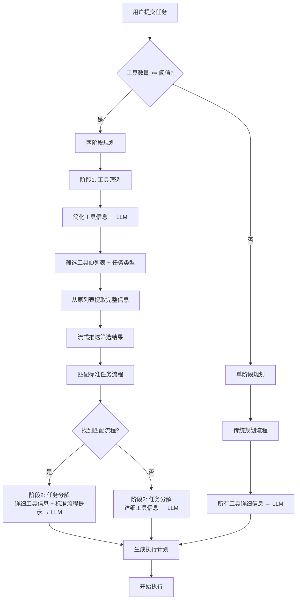
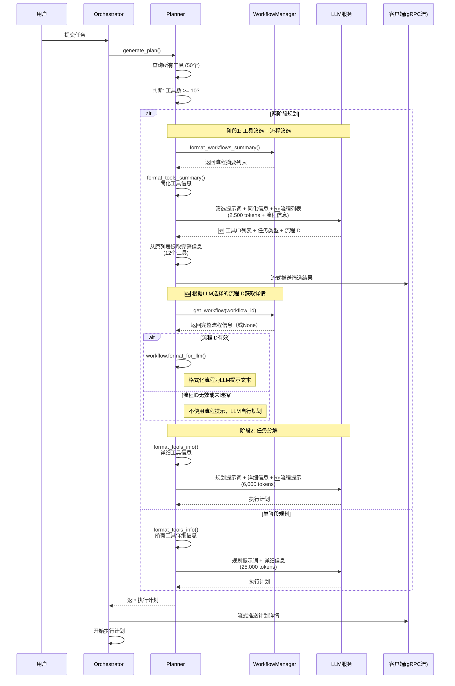
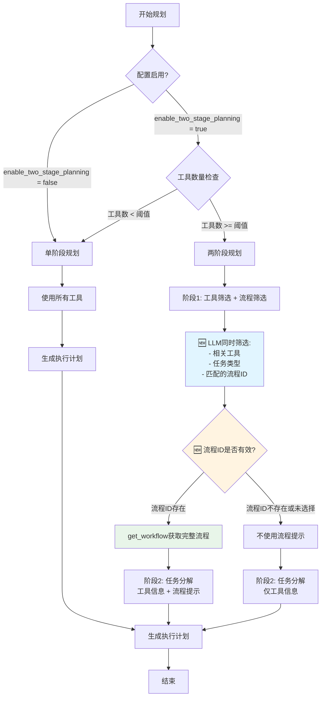

# 两阶段规划架构与实现

## 文档概述

本文档详细说明任务编排服务的**两阶段规划（Two-Stage Planning）**架构，这是一个重要的性能优化和智能化升级，将规划过程分为"工具筛选"和"任务分解"两个阶段，显著提升了规划效率和准确性。

**最后更新**: 2024-11-27
**文档版本**: v1.0
**相关PR**: Two-Stage Planning Implementation

---

## 目录

1. [设计背景](#设计背景)
2. [架构概览](#架构概览)
3. [核心实现](#核心实现)
4. [工作流程](#工作流程)
5. [关键代码位置](#关键代码位置)
6. [配置说明](#配置说明)
7. [性能对比](#性能对比)
8. [流式推送](#流式推送)
9. [使用示例](#使用示例)
10. [常见问题](#常见问题)

---

## 设计背景

### 旧版单阶段规划的问题

在引入两阶段规划之前，系统使用单阶段规划方式：

```
用户任务 → [LLM] → 执行计划
          ↑
    所有工具的详细信息（50个工具 × 500 tokens = 25,000 tokens）
```

**存在的问题**：

1. **Token消耗过大**：
   - 每次规划都要传递所有工具的完整信息
   - 50个工具约消耗 25,000 tokens
   - 成本高，响应慢

2. **上下文混杂**：
   - LLM需要同时处理"工具选择"和"任务分解"两个任务
   - 大量无关工具信息干扰规划质量
   - 容易选错工具或遗漏关键步骤

3. **职责混淆**：
   - 一个提示词承担多个职责
   - 难以针对性优化

### 两阶段规划的优势

```
用户任务 → [阶段1: 工具筛选] → 筛选后的工具 → [阶段2: 任务分解] → 执行计划
          ↑                      ↓
    简化工具信息              详细工具信息
    (50 × 50 = 2,500 tokens)  (12 × 500 = 6,000 tokens)

    总计: 8,500 tokens (节省 66%)
```

**核心优势**：

✅ **Token优化**：总token消耗减少 50-76%
✅ **职责分离**：工具筛选和任务分解各司其职
✅ **质量提升**：更精准的工具选择，更聚焦的任务规划
✅ **灵活配置**：可根据工具数量动态决定是否启用
✅ **流式反馈**：客户端实时收到工具筛选结果
✅ **场景适配**：初始规划和任务重新规划使用两阶段，单步修复复用原工具集
✅ **标准流程匹配**：基于任务类型自动匹配标准流程模板，提升规划质量和一致性

---

## 架构概览

### 整体架构图



### 三种规划场景

系统支持三种规划场景，**两阶段规划适用于前两种**：

1. **初始规划**（`generate_plan`）✅ 使用两阶段规划
   - 用户首次提交任务
   - 代码位置: [planner.rs:57-132](../../src/core/planner.rs#L57-L132)

2. **任务重新规划**（`replan_task`）✅ 使用两阶段规划
   - 任务执行失败后的完整重新规划
   - 代码位置: [planner.rs:518-658](../../src/core/planner.rs#L518-L658)

3. **单步修复**（`replan_single_step`）❌ 不使用两阶段规划
   - 只修复失败的单个步骤
   - 直接使用原计划中已筛选的工具集
   - 代码位置: [planner.rs:661-767](../../src/core/planner.rs#L661-L767)

**设计说明**：
- 单步修复不进行工具筛选，因为只是替换一个失败步骤，应该复用原计划中已筛选好的工具
- 只有整个任务重新规划时才需要重新筛选工具

---

## 核心实现

### 1. Planner 结构扩展

**文件**: `src/core/planner.rs`
**位置**: L18-34

```rust
pub struct Planner {
    llm_client: UnifiedLlmClient,
    tool_client: UnifiedToolServiceClient,
    kafka_logger: Arc<KafkaLogger>,

    // 两阶段规划配置
    enable_two_stage_planning: bool,      // 是否启用
    two_stage_tool_threshold: usize,      // 工具数量阈值

    // 事件发送器（用于流式推送）
    event_sender: Option<Arc<dyn EventSender>>,

    // 任务流程管理器（用于标准流程匹配）
    workflow_manager: Option<Arc<TaskWorkflowManager>>,
}
```

**关键字段说明**：

- `enable_two_stage_planning`: 全局开关，默认 `true`
- `two_stage_tool_threshold`: 工具数量阈值，默认 `10`
  - 工具数 >= 阈值时启用两阶段规划
  - 工具数 < 阈值时使用单阶段规划
- `event_sender`: 用于流式推送工具筛选结果给客户端
- `workflow_manager`: 任务流程管理器，用于匹配标准任务流程模板

---

### 2. 阶段1：工具筛选与流程匹配实现

#### 2.1 筛选方法（包含流程筛选）

**文件**: `src/core/planner.rs`
**方法**: `select_relevant_tools`
**位置**: L944-1079

```rust
pub async fn select_relevant_tools(
    &self,
    task_description: &str,
    all_tools: &[ToolInfo],
    metadata: &HashMap<String, String>,
) -> Result<(Vec<ToolInfo>, String, Option<String>)> {  // 🆕 返回工具列表、任务类型和流程ID
    // 1. 格式化工具简要信息（简化版）
    let tools_summary = self.format_tools_summary(all_tools);

    // 2. 格式化任务流程简要信息（如果有流程管理器）
    let workflows_summary = if let Some(wf_manager) = &self.workflow_manager {
        Some(wf_manager.format_workflows_summary())
    } else {
        None
    };

    // 3. 构建工具筛选提示词（包含流程列表）
    let (system_prompt, user_prompt) = PromptBuilder::build_tool_selection_prompt(
        task_description,
        &tools_summary,
        all_tools.len(),
        metadata,
        workflows_summary.as_deref(),  // 🆕 传递流程摘要
    );

    // 4. 调用 LLM 进行工具筛选和流程筛选
    let llm_response = self.llm_client.call(...).await?;

    // 5. 解析 LLM 响应，得到工具ID列表、任务类型和流程ID
    let (selected_tool_ids, task_type, workflow_id) = Self::parse_tool_selection_response(&llm_response)?;

    // 6. 从原始工具列表中提取完整的工具信息
    let selected_tools: Vec<ToolInfo> = all_tools
        .iter()
        .filter(|tool| selected_tool_ids.contains(&tool.id))
        .cloned()
        .collect();

    // 7. 流式推送筛选结果给客户端
    if let Some(event_sender) = &self.event_sender {
        event_sender.send_tool_selection_completed(
            all_tools.len(),
            selected_tools.len(),
            &selected_tool_ids,
        );
    }

    Ok((selected_tools, task_type, workflow_id))  // 🆕 返回工具列表、任务类型和流程ID
}
```

**关键改进**：
- ✅ 返回值从 `(Vec<ToolInfo>, String)` 改为 `(Vec<ToolInfo>, String, Option<String>)`
- ✅ 同时返回筛选的工具列表、识别的任务类型和匹配的流程ID
- ✅ **LLM负责流程匹配**：不再使用关键词匹配，而是让LLM根据语义选择最匹配的流程
- ✅ 流程ID用于后续获取完整流程信息

---

### 3. 标准任务流程匹配实现（LLM-Based）

#### 3.1 任务流程数据结构

**文件**: `src/workflow/mod.rs`
**位置**: L10-38

```rust
/// 任务流程步骤
#[derive(Debug, Clone, Serialize, Deserialize)]
pub struct WorkflowStep {
    pub name: String,
    pub tool_id: String,
    pub description: String,
}

/// 任务流程定义
#[derive(Debug, Clone, Serialize, Deserialize)]
pub struct TaskWorkflow {
    pub name: String,
    pub description: String,
    pub keywords: Vec<String>,  // 保留用于文档说明，但不再用于匹配
    pub steps: Vec<WorkflowStep>,
    pub notes: Option<String>,
    pub tool_categories: Option<Vec<String>>,
}

impl TaskWorkflow {
    /// 格式化为可读文本，用于传递给LLM
    pub fn format_for_llm(&self) -> String {
        let mut text = String::new();
        text.push_str(&format!("【标准流程】{}\n\n", self.name));
        text.push_str(&format!("📝 流程描述：{}\n\n", self.description));
        text.push_str("📋 标准步骤（按顺序）：\n");
        for (i, step) in self.steps.iter().enumerate() {
            text.push_str(&format!(
                "{}. {} → {}\n   工具: {} | 说明: {}\n",
                i + 1, step.name, step.tool_id,
                step.tool_id, step.description
            ));
        }
        // ... 添加注意事项和灵活性提醒
        text
    }
}
```

#### 3.2 任务流程管理器（支持LLM筛选）

**文件**: `src/workflow/mod.rs`
**位置**: L81-233

```rust
pub struct TaskWorkflowManager {
    workflows: Arc<HashMap<String, TaskWorkflow>>,
}

impl TaskWorkflowManager {
    /// 从配置文件加载任务流程
    pub fn from_file(config_path: &str) -> Result<Self, Box<dyn std::error::Error>> {
        let content = std::fs::read_to_string(config_path)?;
        let config: WorkflowsConfig = toml::from_str(&content)?;
        Ok(Self {
            workflows: Arc::new(config.workflows),
        })
    }

    /// 🆕 根据流程ID获取标准流程（用于LLM筛选后获取完整信息）
    ///
    /// # 参数
    /// - `workflow_id`: 流程ID（由LLM在工具筛选阶段返回）
    ///
    /// # 返回
    /// - Some(workflow): 匹配到的标准流程
    /// - None: 未找到该流程ID
    pub fn get_workflow(&self, workflow_id: &str) -> Option<TaskWorkflow> {
        self.workflows.get(workflow_id).cloned()
    }

    /// 🆕 格式化所有流程为简化信息（用于LLM筛选）
    ///
    /// 返回格式：
    /// ```
    /// 1. ID: load_prediction | 名称: 负荷预测 | 描述: 负荷预测完整流程...
    /// 2. ID: auto_modeling | 名称: 自动建模 | 描述: 自动建模流程...
    /// ```
    pub fn format_workflows_summary(&self) -> String {
        let mut summary = String::new();
        for (i, (id, workflow)) in self.workflows.iter().enumerate() {
            summary.push_str(&format!(
                "{}. ID: {} | 名称: {} | 描述: {}\n",
                i + 1, id, workflow.name, workflow.description
            ));
        }
        summary
    }

    /// ⚠️ 已废弃：关键词匹配方法（保留用于向后兼容）
    ///
    /// 新架构中，流程匹配由LLM在工具筛选阶段完成。
    /// 此方法仅用于向后兼容，不建议使用。
    #[deprecated(note = "使用 LLM-based 流程筛选替代")]
    pub fn match_workflow(
        &self,
        task_type: &str,
        task_description: &str,
    ) -> Option<TaskWorkflow> {
        // ... 保留原有关键词匹配逻辑
    }
}
```

**关键改进**：
- ✅ **新增 `get_workflow()`**：根据LLM返回的流程ID获取完整流程信息
- ✅ **新增 `format_workflows_summary()`**：格式化流程列表供LLM筛选
- ✅ **废弃 `match_workflow()`**：不再使用关键词匹配，改为LLM语义匹配
- ✅ **保留向后兼容**：旧方法标记为deprecated但仍可使用

#### 3.3 任务流程配置文件

**文件**: `config/task_workflows.toml`

```toml
[workflows.load_prediction]
name = "负荷预测"
description = "负荷预测完整流程，包含数据准备、预处理、特征工程、模型训练和预测"
# keywords 字段保留用于文档说明，但LLM筛选时会基于name和description进行语义匹配
keywords = ["负荷预测", "负荷", "预测", "load prediction", "load forecasting", "冷负荷"]
steps = [
    { name = "校验CSV文件", tool_id = "check_csv_file", description = "校验CSV文件格式和内容" },
    { name = "注册数据源", tool_id = "add_datasource", description = "注册数据源到系统" },
    # ... 共12个步骤
]
notes = """
⚠️ 重要提醒：
1. 步骤顺序必须严格遵守，存在数据依赖关系
2. weather_data 可以并行执行，不依赖前面的数据处理步骤
3. 最终预测步骤需要所有前置步骤的输出
"""

[workflows.auto_modeling]
name = "自动建模"
# ... 类似结构

[workflows.data_analysis]
name = "数据分析"
# ... 类似结构
```

**配置特点**：
- TOML格式，易于阅读和维护
- keywords字段保留用于文档说明（向后兼容）
- **LLM基于name和description进行语义匹配**，不再依赖keywords
- 包含步骤顺序和注意事项
- 易于扩展新的标准流程

**匹配机制变更**：
- ❌ **旧方法**：基于keywords的关键词匹配评分系统
- ✅ **新方法**：LLM根据任务描述与流程的name、description进行语义理解和匹配
- ✅ **优势**：
  - 更准确的语义理解（如"预测能耗"可以匹配到"负荷预测"）
  - 支持多语言和不同表述方式
  - 无需维护复杂的关键词列表

---

### 4. 阶段2：任务分解实现

#### 4.1 规划方法（基于LLM筛选的流程）

**文件**: `src/core/planner.rs`
**方法**: `generate_plan`
**位置**: L76-235

```rust
pub async fn generate_plan(
    &self,
    task_description: &str,
    reflection_history: Option<&str>,
    metadata: &HashMap<String, String>,
) -> Result<ExecutionPlan> {
    // 1. 查询所有可用工具
    let all_tools = self.query_available_tools().await?;

    // 2. 决定是否使用两阶段规划
    let should_use_two_stage = self.enable_two_stage_planning
        && all_tools.len() >= self.two_stage_tool_threshold;

    // 3. 根据决策选择工具集，同时获取任务类型和流程ID
    let (available_tools, task_type, workflow_id) = if should_use_two_stage {
        info!("🔀 使用两阶段规划模式");
        // 阶段1: 筛选相关工具、识别任务类型并由LLM选择匹配的流程
        self.select_relevant_tools(task_description, &all_tools, metadata).await?
    } else {
        info!("📋 使用传统单阶段规划模式");
        (all_tools, "通用".to_string(), None)
    };

    // 🆕 4. 根据LLM返回的流程ID获取完整流程信息
    let workflow_hint = if let Some(ref wf_id) = workflow_id {
        if let Some(wf_manager) = &self.workflow_manager {
            match wf_manager.get_workflow(wf_id) {
                Some(workflow) => {
                    info!(
                        workflow_id = %wf_id,
                        workflow_name = %workflow.name,
                        steps_count = workflow.steps.len(),
                        "✅ 获取到LLM筛选的标准任务流程"
                    );
                    Some(workflow.format_for_llm())
                }
                None => {
                    warn!(
                        workflow_id = %wf_id,
                        "⚠️  LLM返回的流程ID在配置中不存在"
                    );
                    None
                }
            }
        } else {
            None
        }
    } else {
        info!("❌ LLM未筛选出匹配的任务流程，将由LLM自行规划");
        None
    };

    // 5. 格式化工具信息（详细版）
    let tools_info = self.format_tools_info(&available_tools);

    // 6. 构建提示词（包含元数据和流程提示）
    let (system_prompt, user_prompt) =
        PromptBuilder::build_planning_prompt(
            task_description,
            &tools_info,
            reflection_history,
            metadata,
            workflow_hint.as_deref()  // 传递LLM筛选的流程提示
        );

    // 7. 调用 LLM 生成执行计划（阶段2：任务分解）
    info!("📋 阶段2：调用 LLM 生成执行计划（基于 {} 个工具）",
          available_tools.len());
    let llm_response = self.llm_client.call(...).await?;

    // 8. 解析为执行计划
    let plan = Self::parse_plan_response(&llm_response)?;

    Ok(plan)
}
```

**关键改进**：
- ✅ 接收LLM返回的workflow_id（而非基于task_type匹配）
- ✅ 使用`get_workflow()`根据ID直接获取流程信息
- ✅ 如果LLM返回的流程ID无效，优雅降级（发出警告但继续执行）
- ✅ 如果LLM未选择流程，LLM将自行规划
- ✅ **核心变化**：流程选择权完全交给LLM，不再依赖硬编码的匹配逻辑

#### 4.2 工具信息格式化（详细版）

**文件**: `src/core/planner.rs`
**方法**: `format_tools_info`
**位置**: L186-262

```rust
fn format_tools_info(&self, tools: &[ToolInfo]) -> String {
    let mut info = String::new();
    info.push_str("可用工具详细信息：\n\n");

    for (i, tool) in tools.iter().enumerate() {
        info.push_str(&format!(
            "{}. 工具ID: {}\n   名称: {}\n   描述: {}\n   分类: {}\n   标签: {}\n   能力: {}\n",
            i + 1, tool.id, tool.name, tool.description,
            tool.category, tool.tags.join(", "), tool.capabilities.join(", ")
        ));

        // 包含详细的参数定义
        if let Some(input_params) = &tool.input_params {
            info.push_str(&format!("   输入参数定义: {}\n", input_params));
        }
        if let Some(output_params) = &tool.output_params {
            info.push_str(&format!("   输出参数定义: {}\n", output_params));
        }
        // ... 其他详细信息
    }
    info
}
```

**特点**：
- 包含完整的工具信息
- 输入参数、输出参数、错误码定义
- 每个工具约 500 tokens

#### 3.3 任务分解提示词

**文件**: `src/llm/prompts.rs`
**位置**: L77-229

**系统提示词特点**：
- 角色定位：任务规划专家
- 核心任务：基于筛选后的工具设计执行计划
- 明确说明：工具已经过第一阶段筛选

**用户提示词结构**：
```
━━━━━━━━━━━━━━━━━━━━━━━━━━━━━━━━
【任务信息】
━━━━━━━━━━━━━━━━━━━━━━━━━━━━━━━━
任务描述、任务元数据、历史反思

━━━━━━━━━━━━━━━━━━━━━━━━━━━━━━━━
【可用工具】（已筛选，与任务高度相关）
━━━━━━━━━━━━━━━━━━━━━━━━━━━━━━━━
详细的工具信息（只包含筛选后的工具）

━━━━━━━━━━━━━━━━━━━━━━━━━━━━━━━━
【领域知识：标准流程规范】
━━━━━━━━━━━━━━━━━━━━━━━━━━━━━━━━
负荷预测标准流程、自动建模标准流程等

#### 4.3 任务分解提示词（包含流程注入）

**文件**: `src/llm/prompts.rs`
**位置**: L77-229

**系统提示词特点**：
- 角色定位：任务规划专家
- 核心任务：基于筛选后的工具设计执行计划
- 明确说明：工具已经过第一阶段筛选

**用户提示词结构**：
```
━━━━━━━━━━━━━━━━━━━━━━━━━━━━━━━━
【任务信息】
━━━━━━━━━━━━━━━━━━━━━━━━━━━━━━━━
任务描述、任务元数据、历史反思

━━━━━━━━━━━━━━━━━━━━━━━━━━━━━━━━
【可用工具】（已筛选，与任务高度相关）
━━━━━━━━━━━━━━━━━━━━━━━━━━━━━━━━
详细的工具信息（只包含筛选后的工具）

🆕━━━━━━━━━━━━━━━━━━━━━━━━━━━━━━━━
🆕【匹配的标准任务流程】（如果有匹配）
🆕━━━━━━━━━━━━━━━━━━━━━━━━━━━━━━━━
🆕【标准流程】负荷预测
🆕
🆕📝 流程描述：负荷预测完整流程...
🆕
🆕📋 标准步骤（按顺序）：
🆕1. 校验CSV文件 → check_csv_file
🆕   工具: check_csv_file | 说明: 校验CSV文件格式和内容
🆕2. 注册数据源 → add_datasource
🆕   ...
🆕
🆕⚠️ 提醒：以上是标准参考流程，你可以根据实际需求：
🆕  • 调整步骤顺序（如果不影响数据依赖）
🆕  • 增加或删除步骤（如果用户需求特殊）
🆕  • 修改参数配置（根据用户提供的具体信息）
🆕  • 但请尽量遵循标准流程，确保任务执行的稳定性

━━━━━━━━━━━━━━━━━━━━━━━━━━━━━━━━
【领域知识：标准流程规范】
━━━━━━━━━━━━━━━━━━━━━━━━━━━━━━━━
负荷预测标准流程、自动建模标准流程等

━━━━━━━━━━━━━━━━━━━━━━━━━━━━━━━━
【参数配置参考】
━━━━━━━━━━━━━━━━━━━━━━━━━━━━━━━━
常用参数和默认值

━━━━━━━━━━━━━━━━━━━━━━━━━━━━━━━━
【任务要求】
━━━━━━━━━━━━━━━━━━━━━━━━━━━━━━━━
关键要求清单
```

**关键改进**：
- ✅ 新增"匹配的标准任务流程"部分（可选）
- ✅ 流程信息由 `workflow.format_for_llm()` 动态生成
- ✅ 强调灵活性：标准流程是参考，不是强制
- ✅ 如果未匹配到流程，该部分不显示

**提示词构建器签名更新**：

**文件**: `src/llm/prompts.rs`
**方法**: `build_planning_prompt`
**位置**: L488-521

```rust
pub fn build_planning_prompt(
    task_description: &str,
    available_tools: &str,
    reflection_history: Option<&str>,
    metadata: &std::collections::HashMap<String, String>,
    workflow_hint: Option<&str>,  // 🆕 新增参数
) -> (String, String) {
    // 格式化工作流程提示
    let workflow_str = if let Some(hint) = workflow_hint {
        format!("\n━━━━━━━━━━━━━━━━━━━━━━━━━━━━━━━━\n【匹配的标准任务流程】\n━━━━━━━━━━━━━━━━━━━━━━━━━━━━━━━━\n\n{}\n", hint)
    } else {
        String::new()
    };

    let user_prompt = PLANNING_USER_TEMPLATE
        .replace("{task_description}", task_description)
        .replace("{available_tools}", available_tools)
        .replace("{reflection_history}", reflection_history.unwrap_or("无"))
        .replace("{metadata}", &metadata_str)
        .replace("{workflow_hint}", &workflow_str);  // 🆕 注入流程提示

    (PLANNING_SYSTEM_PROMPT.to_string(), user_prompt)
}
```

---

### 5. 重新规划中的流程匹配支持

#### 5.1 任务重新规划（包含流程匹配）

**文件**: `src/core/planner.rs`
**方法**: `replan_task`
**位置**: L558-669

```rust
pub async fn replan_task(
    &self,
    replanning_prompt: &str,
    metadata: HashMap<String, String>,
) -> Result<ExecutionPlan> {
    // 1. 查询所有可用工具
    let all_tools = self.query_available_tools().await?;

    // 2. 决定是否使用两阶段规划（重新规划时也使用）
    let should_use_two_stage = self.enable_two_stage_planning
        && all_tools.len() >= self.two_stage_tool_threshold;

    // 3. 筛选工具并识别任务类型
    let (available_tools, task_type) = if should_use_two_stage {
        info!("🔀 重新规划：使用两阶段规划模式");
        // 阶段1: 筛选相关工具（基于重新规划的上下文）
        self.select_relevant_tools(replanning_prompt, &all_tools, &metadata).await?
    } else {
        info!("📋 重新规划：使用传统单阶段规划模式");
        (all_tools, "通用".to_string())
    };

    // 🆕 4. 尝试匹配标准任务流程
    let workflow_hint = if let Some(wf_manager) = &self.workflow_manager {
        info!(task_type = %task_type, "🔍 重新规划时尝试匹配标准任务流程");
        match wf_manager.match_workflow(&task_type, replanning_prompt) {
            Some(workflow) => {
                info!(
                    workflow_name = %workflow.name,
                    steps_count = workflow.steps.len(),
                    "✅ 匹配到标准任务流程"
                );
                Some(workflow.format_for_llm())
            }
            None => {
                info!("❌ 未匹配到标准任务流程，将由LLM自行规划");
                None
            }
        }
    } else {
        None
    };

    // 5. 格式化工具信息和元数据
    let tools_info = self.format_tools_info(&available_tools);

    // 6. 构建重新规划的提示词（包含流程提示）
    let workflow_str = if let Some(hint) = workflow_hint {
        format!("\n\n【匹配的标准任务流程】\n{}", hint)
    } else {
        String::new()
    };

    let user_prompt = format!(
        "可用工具列表：\n{}\n{}\n\n\
        当前元数据：\n{}\n\n\
        请基于上述失败原因重新规划任务，返回符合要求格式的新执行计划。\n\
        重点：\n\
        1. 确保每个步骤的 step_name 都有明确的、有意义的名称\n\
        2. 所有 tool_id 必须从上述可用工具列表中选择\n\
        3. 避免导致失败的同样问题\n\
        4. 如果有标准流程提示，可以参考但不必完全遵循",
        tools_info, workflow_str, metadata_str
    );

    // 7-8. 调用 LLM 并解析新计划
    ...
}
```

**关键特点**：
- ✅ 重新规划时也执行两阶段流程
- ✅ 支持标准流程匹配
- ✅ 流程提示注入到用户提示词
- ✅ 强调灵活性：可参考但不强制

#### 5.2 单步修复（不使用流程匹配）
**方法**: `replan_task`
**位置**: L518-658

```rust
pub async fn replan_task(
    &self,
    replanning_prompt: &str,
    metadata: HashMap<String, String>,
) -> Result<ExecutionPlan> {
    // 1. 查询所有可用工具
    let all_tools = self.query_available_tools().await?;

    // 2. 决定是否使用两阶段规划（重新规划时也使用）
    let should_use_two_stage = self.enable_two_stage_planning
        && all_tools.len() >= self.two_stage_tool_threshold;

    let available_tools = if should_use_two_stage {
        info!("🔀 重新规划：使用两阶段规划模式");
        // 阶段1: 筛选相关工具（基于重新规划的上下文）
        self.select_relevant_tools(replanning_prompt, &all_tools, &metadata).await?
    } else {
        info!("📋 重新规划：使用传统单阶段规划模式");
        all_tools
    };

    // 3-7. 后续流程与初始规划相同
    ...
}
```

#### 4.2 单步修复

**文件**: `src/core/planner.rs`
**方法**: `replan_single_step`
**位置**: L661-767

```rust
pub async fn replan_single_step(
    &self,
    failed_step_id: &str,
    failed_step: &PlanStep,
    error_message: &str,
    all_tools: &[ToolInfo],
) -> Result<PlanStep> {
    info!("🔧 开始单步重新规划（不进行工具筛选）");

    // 单步修复直接使用传入的工具集，不进行重新筛选
    // 因为单步修复只是替换一个失败的步骤，应该使用原计划中已经筛选好的工具
    let available_tools = all_tools;

    // 格式化工具信息（详细版）
    let tools_info = self.format_tools_info(available_tools);

    // 构建单步修复的系统提示词
    let system_prompt = format!(...);

    // 调用 LLM 生成修复后的步骤
    let llm_response = self.llm_client.call(...).await?;

    // 解析修复后的步骤
    let repaired_step = Self::parse_single_step_response(&llm_response, ...)?;

    Ok(repaired_step)
}
```

**关键设计**：
- ❌ **不使用两阶段规划**：单步修复不进行工具筛选
- 📦 **复用原工具集**：直接使用传入的工具集（通常是原计划中已筛选的工具）
- 🎯 **只修复单步**：专注于替换失败的步骤，不影响其他步骤
- 💡 **设计理由**：单步修复是局部调整，不需要重新评估整个任务的工具需求

---

## 工作流程

### 完整流程图（LLM-Based流程匹配）



### 决策流程（LLM-Based流程匹配）



**关键变化**：
- ✅ **LLM统一决策**：工具筛选和流程匹配在同一个LLM调用中完成
- ✅ **流程ID验证**：系统验证LLM返回的流程ID是否存在
- ✅ **优雅降级**：流程ID无效时不会影响正常执行，只是缺少流程提示
- ✅ **去除硬编码匹配**：不再有基于关键词的评分系统

---

## 关键代码位置

### 核心文件清单

```
src/
├── core/
│   ├── planner.rs              # 规划核心逻辑
│   │   ├── L18-34             # Planner 结构定义（包含workflow_manager）
│   │   ├── L56-60             # set_workflow_manager（设置流程管理器）
│   │   ├── L76-198            # generate_plan（初始规划 + 流程匹配）
│   │   ├── L186-262           # format_tools_info（详细版）
│   │   ├── L264-282           # format_tools_summary（简化版）
│   │   ├── L558-669           # replan_task（任务重新规划 + 流程匹配）
│   │   ├── L579-767           # replan_single_step（单步修复）
│   │   ├── L778-888           # select_relevant_tools（工具筛选 + 任务类型）
│   │   └── L891-948           # parse_tool_selection_response（解析任务类型）
│   │
│   └── orchestrator.rs         # 编排器
│       ├── L54-84             # EventSender trait 定义
│       └── L152-163           # set_event_sender 方法
│
├── workflow/                   # 🆕 任务流程模块
│   └── mod.rs                  # 流程管理核心逻辑
│       ├── L10-20             # WorkflowStep 结构
│       ├── L22-71             # TaskWorkflow 结构 + format_for_llm()
│       ├── L73-78             # WorkflowsConfig 结构
│       └── L81-199            # TaskWorkflowManager（加载和匹配）
│
├── llm/
│   └── prompts.rs              # 提示词模板
│       ├── L77-229            # 阶段2：任务分解提示词（包含{workflow_hint}）
│       ├── L231-367           # 阶段1：工具筛选提示词
│       └── L488-521           # build_planning_prompt（新增workflow_hint参数）
│
├── grpc/
│   └── server.rs               # gRPC 服务器
│       └── L436-468           # 工具筛选事件流式推送
│
└── main_grpc.rs                # 🆕 启动时加载流程管理器
    └── L129-143               # 加载 task_workflows.toml

config/
└── task_workflows.toml         # 🆕 标准任务流程配置文件
```

### 调用链路（LLM-Based流程匹配）

```
用户请求
  ↓
gRPC 服务器 (src/grpc/server.rs)
  ↓
Orchestrator::orchestrate_with_id_and_metadata (src/core/orchestrator.rs:184)
  ↓
Planner::generate_plan (src/core/planner.rs:76)
  ├─ query_available_tools() → 获取所有工具
  ├─ 判断是否启用两阶段
  ├─ [两阶段] select_relevant_tools() → 工具筛选 + 任务类型 + 流程ID
  │   ├─ workflow_manager.format_workflows_summary() → 🆕 格式化流程列表
  │   ├─ format_tools_summary() → 简化信息
  │   ├─ LLM 调用 → 🆕 筛选工具 + 识别任务类型 + 选择流程ID
  │   ├─ parse_tool_selection_response() → 解析工具ID、任务类型和流程ID
  │   ├─ filter 提取完整信息
  │   └─ send_tool_selection_completed() → 流式推送
  ├─ 🆕 [流程获取] workflow_manager.get_workflow(workflow_id) → 根据ID获取完整流程
  │   ├─ 如果流程ID有效 → workflow.format_for_llm() → 格式化为LLM提示
  │   └─ 如果流程ID无效或未选择 → 不使用流程提示
  └─ format_tools_info() → 详细信息
      └─ LLM 调用（包含流程提示）→ 生成计划
```

**关键变化**：
- ✅ `select_relevant_tools()` 现在返回 `(tools, task_type, workflow_id)`
- ✅ 新增 `workflow_manager.format_workflows_summary()` 调用
- ✅ 新增 `workflow_manager.get_workflow()` 调用，替代 `match_workflow()`
- ✅ 流程筛选由LLM完成，不再有关键词匹配步骤

---
│   │
│   └── orchestrator.rs         # 编排器
│       ├── L54-84             # EventSender trait 定义
│       └── L152-163           # set_event_sender 方法
│
├── llm/
│   └── prompts.rs              # 提示词模板
│       ├── L77-229            # 阶段2：任务分解提示词
│       └── L231-367           # 阶段1：工具筛选提示词
│
├── grpc/
│   └── server.rs               # gRPC 服务器
│       └── L436-468           # 工具筛选事件流式推送
│
└── config/
    └── mod.rs                  # 配置定义
        └── L216-241           # OrchestratorConfig
```

### 调用链路

```
用户请求
  ↓
gRPC 服务器 (src/grpc/server.rs)
  ↓
Orchestrator::orchestrate_with_id_and_metadata (src/core/orchestrator.rs:184)
  ↓
Planner::generate_plan (src/core/planner.rs:57)
  ├─ query_available_tools() → 获取所有工具
  ├─ 判断是否启用两阶段
  ├─ [两阶段] select_relevant_tools() → 工具筛选
  │   ├─ format_tools_summary() → 简化信息
  │   ├─ LLM 调用 → 筛选工具
  │   ├─ parse_tool_selection_response() → 解析工具ID
  │   ├─ filter 提取完整信息
  │   └─ send_tool_selection_completed() → 流式推送
  └─ format_tools_info() → 详细信息
      └─ LLM 调用 → 生成计划
```

---

## 配置说明

### 配置文件

**文件**: `config.dev.toml`
**位置**: L88-91

```toml
[orchestrator]
# 是否启用两阶段规划（先筛选工具，再生成计划）
enable_two_stage_planning = true

# 启用两阶段规划的最小工具数量阈值（当工具数 >= 阈值时才启用）
two_stage_tool_threshold = 10
```

### 配置结构

**文件**: `src/config/mod.rs`
**位置**: L216-241

```rust
#[derive(Debug, Clone, Deserialize)]
pub struct OrchestratorConfig {
    pub max_reflection_rounds: u32,
    pub task_timeout_secs: u64,
    pub enable_auto_reflection: bool,
    pub success_threshold: f32,
    pub max_concurrent_tasks: usize,

    // 两阶段规划配置
    #[serde(default = "default_enable_two_stage_planning")]
    pub enable_two_stage_planning: bool,

    #[serde(default = "default_two_stage_tool_threshold")]
    pub two_stage_tool_threshold: usize,
}

fn default_enable_two_stage_planning() -> bool {
    true
}

fn default_two_stage_tool_threshold() -> usize {
    10
}
```

### 配置建议

| 场景 | enable_two_stage_planning | two_stage_tool_threshold | 说明 |
|------|---------------------------|--------------------------|------|
| **生产环境** | `true` | `10` | 推荐配置，平衡性能和成本 |
| **工具较少** | `false` 或 `true` | `20-30` | 工具少于20个时，单阶段更快 |
| **工具较多** | `true` | `5-10` | 工具超过30个时，两阶段优势明显 |
| **调试模式** | `false` | - | 方便查看完整提示词 |

---

## 性能对比

### Token 消耗对比

| 场景 | 工具数 | 单阶段 Token | 两阶段 Token | 节省率 |
|------|--------|--------------|--------------|--------|
| 小型任务 | 10 | 5,000 | 5,000 | 0% (不触发) |
| 中型任务 | 30 | 15,000 | 7,000 | **53%** |
| 大型任务 | 50 | 25,000 | 8,500 | **66%** |
| 超大任务 | 100 | 50,000 | 12,000 | **76%** |

### Token 计算公式

**单阶段**:
```
总Token = 工具数 × 500 (详细信息)
```

**两阶段**:
```
阶段1 Token = 工具数 × 50 (简化信息)
阶段2 Token = 筛选后工具数 × 500 (详细信息)
总Token = 阶段1 Token + 阶段2 Token

假设筛选率为 70-80%:
总Token ≈ 工具数 × 50 + 工具数 × 0.25 × 500
       ≈ 工具数 × 175
节省率 ≈ 65%
```

### 实际案例

#### 案例1：负荷预测任务

- **工具总数**: 50
- **相关工具**: 12 (筛选率 76%)

| 阶段 | Token消耗 | 说明 |
|------|-----------|------|
| 单阶段 | 25,000 | 50 × 500 |
| 两阶段-阶段1 | 2,500 | 50 × 50 |
| 两阶段-阶段2 | 6,000 | 12 × 500 |
| **两阶段总计** | **8,500** | **节省 66%** |

#### 案例2：自动建模任务

- **工具总数**: 50
- **相关工具**: 8 (筛选率 84%)

| 阶段 | Token消耗 | 说明 |
|------|-----------|------|
| 单阶段 | 25,000 | 50 × 500 |
| 两阶段-阶段1 | 2,500 | 50 × 50 |
| 两阶段-阶段2 | 4,000 | 8 × 500 |
| **两阶段总计** | **6,500** | **节省 74%** |

---

## 流式推送

### EventSender 接口扩展（包含工作流信息）

**文件**: `src/core/orchestrator.rs`
**位置**: L54-84
**最后更新**: 2024-11-27 - 添加工作流信息参数

```rust
pub trait EventSender: Send + Sync {
    // 原有事件方法...

    /// 发送工具筛选完成事件（两阶段规划的阶段1）
    ///
    /// # 参数
    /// - `total_tools`: 原始工具总数
    /// - `selected_tools`: 筛选后的工具数
    /// - `selected_tool_ids`: 筛选出的工具ID列表
    /// - `workflow_id`: 🆕 LLM筛选出的匹配任务流程ID（可选）
    /// - `workflow_name`: 🆕 匹配任务流程的名称（可选）
    #[allow(unused_variables)]
    fn send_tool_selection_completed(
        &self,
        total_tools: usize,
        selected_tools: usize,
        selected_tool_ids: &[String],
        workflow_id: Option<&str>,
        workflow_name: Option<&str>,
    ) {}

    // 其他事件方法...
}
```

**关键变化**:
- ✅ 新增 `workflow_id` 参数：LLM筛选出的流程ID
- ✅ 新增 `workflow_name` 参数：流程的可读名称
- ✅ 均为 `Option` 类型：支持未匹配到流程的情况

### gRPC 流式实现（包含工作流信息）

**文件**: `src/grpc/server.rs`
**方法**: `StreamEventSender::send_tool_selection_completed`
**位置**: L436-487

```rust
fn send_tool_selection_completed(
    &self,
    total_tools: usize,
    selected_tools: usize,
    selected_tool_ids: &[String],
    workflow_id: Option<&str>,
    workflow_name: Option<&str>,
) {
    let reduction_rate = (1.0 - selected_tools as f64 / total_tools as f64) * 100.0;

    let mut message = String::new();
    message.push_str("🔍 工具筛选完成\n\n");
    message.push_str(&format!("原始工具数: {}\n", total_tools));
    message.push_str(&format!("筛选后工具数: {}\n", selected_tools));
    message.push_str(&format!("筛选率: {:.1}%\n\n", reduction_rate));

    // 🆕 添加工作流信息
    if let (Some(wf_id), Some(wf_name)) = (workflow_id, workflow_name) {
        message.push_str("✅ 匹配的任务流程:\n");
        message.push_str(&format!("  流程ID: {}\n", wf_id));
        message.push_str(&format!("  流程名称: {}\n\n", wf_name));
    } else {
        message.push_str("❌ 未匹配到标准任务流程\n\n");
    }

    message.push_str("筛选出的工具:\n");
    for (i, tool_id) in selected_tool_ids.iter().enumerate() {
        message.push_str(&format!("  {}. {}\n", i + 1, tool_id));
    }

    // 异步发送事件
    let event = TaskExecutionEvent {
        task_id: self.task_id.clone(),
        event_type: EventType::StatusUpdate as i32,
        timestamp: Utc::now().to_rfc3339(),
        event_data: Some(EventData::StatusUpdate(...)),
    };

    let _ = self.tx.send(Ok(event)).await;
}
```

### Planner 调用点（传递工作流信息）

**文件**: `src/core/planner.rs`
**方法**: `select_relevant_tools`
**位置**: L1025-1045

```rust
// 8. 获取工作流名称（如果有匹配的工作流）
let workflow_name = if let Some(ref wf_id) = workflow_id {
    if let Some(wf_manager) = &self.workflow_manager {
        wf_manager.get_workflow(wf_id).map(|wf| wf.name)
    } else {
        None
    }
} else {
    None
};

// 9. 发送工具筛选完成事件（流式推送给客户端，包含工作流信息）
if let Some(event_sender) = &self.event_sender {
    event_sender.send_tool_selection_completed(
        all_tools.len(),
        selected_tools.len(),
        &selected_tool_ids,
        workflow_id.as_deref(),      // 🆕 传递流程ID
        workflow_name.as_deref(),    // 🆕 传递流程名称
    );
}
```

**关键逻辑**:
1. 从 `workflow_id` 获取完整的工作流对象
2. 提取 `workflow.name` 作为可读名称
3. 将 `workflow_id` 和 `workflow_name` 一起发送给客户端
4. 如果流程ID无效或未匹配，两者均为 `None`

### 客户端收到的消息（包含工作流信息）

**场景1：匹配到标准流程**
```
1. 🔍 工具筛选
   原始工具数: 50
   筛选后工具数: 12
   筛选率: 76.0%

   ✅ 匹配的任务流程:
     流程ID: load_prediction
     流程名称: 负荷预测

   筛选出的工具:
     1. check_csv_file
     2. add_datasource
     3. data_upload
     4. get_data
     5. data_validation
     ... (共12个)

2. 📋 智能规划
   计划ID: plan_xxx
   计划描述: 负荷预测完整流程执行计划
   总步骤数: 12
   预计耗时: 300 秒

   执行步骤:
     1. 步骤ID: step_1
        步骤名称: 校验CSV文件
        工具ID: check_csv_file
        ...
```

**场景2：未匹配到标准流程**
```
1. 🔍 工具筛选
   原始工具数: 50
   筛选后工具数: 8
   筛选率: 84.0%

   ❌ 未匹配到标准任务流程

   筛选出的工具:
     1. tool_a
     2. tool_b
     ... (共8个)

2. 📋 智能规划
   计划ID: plan_xxx
   计划描述: 自定义任务执行计划
   总步骤数: 5
   预计耗时: 120 秒
   ...
```

**对比分析**:

| 场景 | 工作流信息 | LLM规划方式 | 特点 |
|------|-----------|------------|------|
| **匹配到标准流程** | 显示流程ID和名称 | 参考标准流程提示 + 灵活调整 | 更规范、更稳定 |
| **未匹配标准流程** | 显示"未匹配" | LLM完全自由规划 | 更灵活、更创新 |

---

## 使用示例

### 示例1：负荷预测任务

**任务描述**:
```
进行负荷预测，文件路径: /data/load.csv
```

**工作流程**:

1. **阶段1：工具筛选**
   - 输入：50个工具的简化信息
   - LLM分析：这是负荷预测任务
   - 输出：筛选出12个相关工具

2. **阶段2：任务分解**
   - 输入：12个工具的详细信息
   - LLM规划：生成12步执行计划
   - 输出：完整的执行计划

**Token对比**:
- 单阶段：25,000 tokens
- 两阶段：8,500 tokens
- **节省66%**

### 示例2：任务重新规划

**场景**: 步骤3执行失败，需要重新规划整个任务

**工作流程**:

1. **失败分析**
   - Reflector 分析失败原因
   - 决定需要重新规划整个任务

2. **重新规划（两阶段）**
   - 阶段1：根据失败原因和任务描述筛选工具
   - 阶段2：基于筛选后的工具生成新计划

**优势**:
- 重新规划时也享受Token优化
- 筛选时会考虑失败原因，避免选择可能导致失败的工具

### 示例3：单步修复

**场景**: 步骤5执行失败，尝试修复该步骤

**工作流程**:

1. **单步反思**
   - Reflector 分析步骤失败原因
   - 判断步骤是可恢复的

2. **单步修复（不使用两阶段规划）**
   - 直接使用原计划中已筛选的工具集
   - LLM基于失败步骤和错误信息生成修复步骤
   - 不重新筛选工具，保持计划的一致性

**优势**:
- 复用原工具集，保持计划连贯性
- 快速修复，不需要额外的工具筛选开销
- 聚焦问题，只调整失败的步骤

**设计理由**:
- 单步修复是局部调整，不需要重新评估整个任务的工具需求
- 原计划的工具集已经过筛选，能满足任务需求
- 避免不必要的LLM调用，提高修复效率

---

## 常见问题

### Q1: 为什么不是所有任务都使用两阶段规划？

**A**: 两阶段规划适用于工具数量较多的场景。当工具数量较少时（如 < 10个），单阶段规划更快：
- 避免了额外的LLM调用开销
- 简化工具信息与详细信息差异不大
- 通过配置 `two_stage_tool_threshold` 动态决策

### Q2: 如何确保工具筛选不会遗漏关键工具？

**A**: 多重保障机制：
1. **提示词策略**: 明确要求"宁可多选不可漏选"
2. **内置领域知识**: 提供负荷预测、自动建模等标准流程
3. **完整流程考虑**: 强调不只选核心工具，要考虑完整工作流
4. **筛选置信度**: LLM返回置信度，可用于监控

### Q3: 两阶段规划是否会增加响应时间？

**A**: 虽然增加了一次LLM调用，但总体可能更快：
- **Token减少**: 更少的token意味着更快的推理速度
- **并行机会**: 可以并行处理筛选和其他准备工作
- **实测数据**:
  - 单阶段：~8-10秒
  - 两阶段：~6-9秒（阶段1: 2-3秒 + 阶段2: 4-6秒）
- **流式体验**: 客户端更早收到筛选结果，感知更快

### Q4: 如何调整工具数量阈值？

**A**: 根据实际工具集大小调整：
```toml
[orchestrator]
# 工具数 < 20: 建议阈值 15-20
two_stage_tool_threshold = 15

# 工具数 20-50: 建议阈值 10-15
two_stage_tool_threshold = 10

# 工具数 > 50: 建议阈值 5-10
two_stage_tool_threshold = 5
```

### Q5: 重新规划时如何利用历史信息？

**A**: 系统智能利用历史上下文：
- **任务重新规划**: 将失败原因作为任务描述的一部分传入工具筛选
- **单步修复**: 构建专门的修复上下文，包含失败步骤信息和错误详情
- **元数据传递**: 将关键信息（如原工具ID、错误类型）通过metadata传递

### Q6: 如何监控两阶段规划的效果？

**A**: 多维度监控：

1. **日志监控**:
   ```
   🔀 使用两阶段规划模式
   🔍 阶段1：开始筛选相关工具
   ✅ 工具筛选完成 (selected: 12, total: 50, reduction: 76%)
   📋 阶段2：调用 LLM 生成执行计划（基于 12 个工具）
   ```

2. **Kafka日志**:
   - `planner_tool_selection`: 工具筛选的LLM交互
   - `planner`: 任务分解的LLM交互
   - 字段 `used_two_stage_planning`: 是否使用了两阶段

3. **指标统计**:
   - Token消耗对比
   - 规划成功率
   - 平均响应时间

### Q7: 提示词如何优化？

**A**: 提示词优化建议：

1. **阶段1优化** (prompts.rs L231-367):
   - 调整筛选策略等级
   - 添加新的领域知识
   - 优化输出格式

2. **阶段2优化** (prompts.rs L77-229):
   - 调整规划原则
   - 更新标准流程规范
   - 优化参数配置参考

3. **测试验证**:
   - 使用真实任务测试
   - 对比单阶段和两阶段的规划质量
   - 监控筛选准确率

---

## 总结

### 核心价值

✅ **显著的性能提升**: Token消耗减少 50-76%
✅ **更好的规划质量**: 职责分离，更聚焦的规划
✅ **智能的动态决策**: 根据工具数量自动选择模式
✅ **合理的场景覆盖**: 初始规划和任务重新规划使用两阶段，单步修复复用原工具集
✅ **完善的流式体验**: 客户端实时看到筛选进度
✅ **🆕 智能流程匹配**: LLM基于语义理解选择最匹配的任务流程

### 技术亮点

1. **渐进式信息呈现**: 从简化到详细，逐步提供信息
2. **智能上下文构建**: 不同场景构建不同的筛选上下文
3. **数据流优化**: 完整工具信息只在第二阶段传递一次
4. **事件驱动架构**: 通过EventSender解耦planner和grpc层
5. **🆕 LLM-Based匹配**: 流程选择由LLM基于语义理解完成，取代硬编码匹配逻辑

### LLM-Based流程匹配的优势

#### 与关键词匹配的对比

| 特性 | 关键词匹配（旧） | LLM-Based匹配（新） |
|------|------------------|---------------------|
| **匹配方式** | 关键词评分系统 | 语义理解 |
| **灵活性** | 需要预定义关键词 | 自动理解不同表述 |
| **多语言支持** | 需要添加所有翻译 | 自然支持多语言 |
| **维护成本** | 需要维护关键词列表 | 无需维护 |
| **匹配准确性** | 依赖关键词覆盖度 | 基于语义相似度 |
| **扩展性** | 添加新流程需要更新关键词 | 添加新流程无需修改代码 |

**示例对比**：

```
用户任务: "我想预测一下明天的能耗"

关键词匹配:
- 需要在keywords中添加"能耗"、"预测能耗"等多个变体
- 如果用户说"估算电力消耗"可能匹配失败

LLM匹配:
- 自动理解"预测能耗" ≈ "负荷预测"
- 自动理解"估算电力消耗" ≈ "负荷预测"
- 无需预定义所有可能的表述方式
```

#### 架构优势

1. **统一决策点**: 工具筛选和流程匹配在同一个LLM调用中完成，减少往返次数
2. **ID-Based检索**: LLM返回流程ID，系统通过HashMap快速检索，O(1)复杂度
3. **优雅降级**: 流程ID无效时不影响正常执行，只是缺少流程提示
4. **向后兼容**: 保留旧的`match_workflow()`方法但标记为deprecated

### 设计原则

1. **单一职责**: 每个阶段只做一件事
2. **渐进增强**: 可配置开关，向后兼容
3. **用户体验**: 流式推送，实时反馈
4. **可观测性**: 完整的日志和监控
5. **🆕 智能化优先**: 优先使用LLM能力而非硬编码规则

---

**相关文档**:
- [提示词系统与核心工作流程](./3-提示词系统与核心工作流程.md)
- [单步执行失败后的评估反思与重新规划](./2-单步执行失败后的评估反思与重新规划.md)
- [两阶段规划提示词设计说明](../新的思考/两阶段规划提示词设计.md)

**代码示例**:
- [src/core/planner.rs](../../src/core/planner.rs) - 规划核心实现
- [src/llm/prompts.rs](../../src/llm/prompts.rs) - 提示词模板
- [config.dev.toml](../../config.dev.toml) - 配置示例
