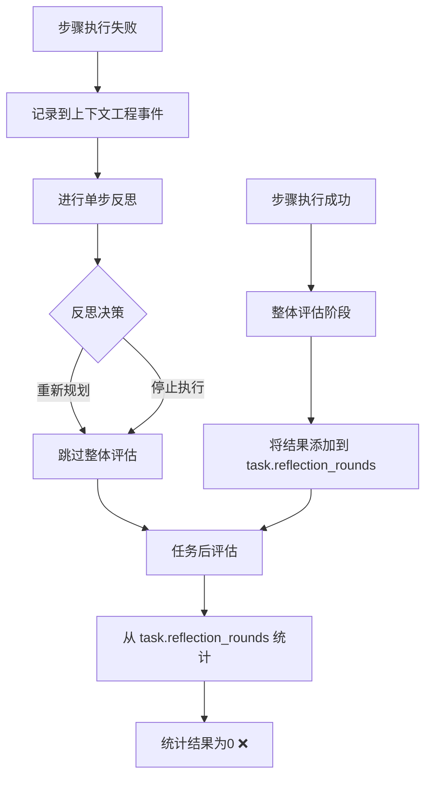
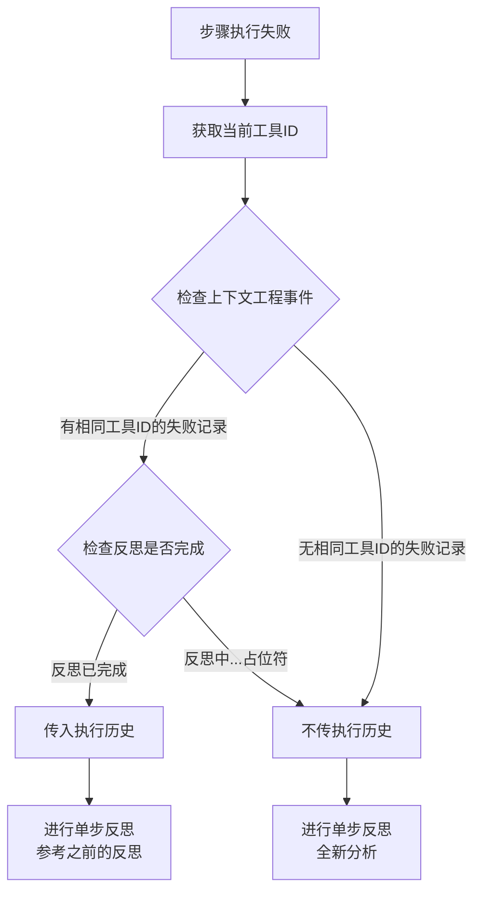

# 单步反思与执行历史优化详解

## 1. 概述

本文档详细说明了单步反思机制中的执行历史传递逻辑优化，以及任务后评估统计失败步骤的修复方案。

### 核心改进

1. **避免重复反思**：通过检查工具ID，避免对相同工具的失败进行重复反思
2. **正确统计失败步骤**：任务后评估从上下文工程事件中提取统计信息，而不是从空的 `task.reflection_rounds`
3. **智能传递执行历史**：根据是否已有相同工具的反思记录，决定是否传递执行历史
4. **修复反思内容占位符问题**：确保执行历史中显示实际反思内容而非"反思分析中..."占位符
5. **增强反思提示词约束**：禁止LLM重复执行历史中已有的反思，无法提供新见解时必须建议停止或重新规划

---

## 2. 问题背景

### 2.1 原始问题

在单步反思流程中发现两个问题：

#### 问题1：失败步骤统计为0
```
【各轮次统计】
第 1 轮: 总步骤 0, 成功 0, 失败 0, 评分 0.0

【关键事件摘要】
- 总共执行 1 轮，0 个步骤
- 成功步骤: 0，失败步骤: 0
```

但实际的上下文工程事件显示：
```
失败步骤列表 (共 2 个):

步骤 #1: 生成计算机工具设计方案
  工具ID: genesis_document_generate
  错误信息: 未找到工具名称为 'computer_tool' 的工具

步骤 #2: 生成计算机工具设计方案
  工具ID: genesis_document_generate
  错误信息: 未找到工具名称为 'computer_tool' 的工具
```

#### 问题2：可能重复反思相同工具的失败
每次步骤失败都会传入完整的执行历史，导致：
- 对同一个工具的相同错误反复分析
- 提示词冗长，包含不必要的重复信息
- LLM可能被大量相似信息干扰

### 2.2 根本原因分析

#### 原因1：单步反思流程不记录到 task.reflection_rounds

**执行流程图：**


**关键点：**
- 只有在**整体评估阶段**（Phase 3）才会将执行结果添加到 `task.reflection_rounds[].executions`
- 单步反思决定重新规划或停止时，**跳过整体评估**，因此失败步骤未被记录
- 上下文工程事件在步骤失败时就立即记录，所以有完整的失败记录

**代码位置：**
- 整体评估后记录：[orchestrator.rs:1260-1286](../../../src/core/orchestrator.rs#L1260-L1286)
- 单步反思流程：[orchestrator.rs:1990-2080](../../../src/core/orchestrator.rs#L1990-L2080)

#### 原因2：执行历史无条件传递

原来的代码：
```rust
// orchestrator.rs:2036-2041 (旧版本)
let execution_history = if let Some(builder_lock) = self.context_engineering_builders.get(task_id) {
    let builder = builder_lock.read().await;
    Some(builder.format_to_file())  // ❌ 无条件传递完整历史
} else {
    None
};
```

这导致：
- 第一次 `genesis_document_generate` 失败 → 传入执行历史 → 反思
- 第二次 `genesis_document_generate` 失败 → 再次传入执行历史（包含第一次的反思）→ 重复反思

---

## 3. 解决方案

### 3.1 任务后评估优化

#### 修改文件
`src/core/post_task_evaluator.rs`

#### 核心思路
既然上下文工程事件有完整的执行记录，任务后评估就应该从中提取统计信息，而不是从空的 `task.reflection_rounds`。

#### 实现细节

**新增方法1：从上下文工程事件提取轮次统计**
```rust
/// 从上下文工程事件中提取轮次统计
fn extract_round_statistics_from_context(&self, context_history: &str) -> String {
    // 从格式化文本中提取成功和失败步骤数量
    let success_count = context_history.matches("成功步骤列表 (共").next()
        .and_then(|s| context_history[context_history.find(s).unwrap()..]
            .split(" 个)").next())
        .and_then(|s| s.split("共 ").nth(1))
        .and_then(|s| s.parse::<usize>().ok())
        .unwrap_or(0);

    let failure_count = context_history.matches("失败步骤列表 (共").next()
        .and_then(|s| context_history[context_history.find(s).unwrap()..]
            .split(" 个)").next())
        .and_then(|s| s.split("共 ").nth(1))
        .and_then(|s| s.parse::<usize>().ok())
        .unwrap_or(0);

    let total_steps = success_count + failure_count;

    format!(
        "第 1 轮: 总步骤 {}, 成功 {}, 失败 {}, 评分 0.0\n",
        total_steps,
        success_count,
        failure_count
    )
}
```

**新增方法2：从上下文工程事件提取关键事件**
```rust
/// 从上下文工程事件中提取关键事件
fn extract_key_events_from_context(&self, context_history: &str) -> String {
    let mut events = Vec::new();

    // 从格式化文本中提取成功和失败步骤数量
    let success_count = context_history.matches("成功步骤列表 (共").next()
        .and_then(|s| context_history[context_history.find(s).unwrap()..]
            .split(" 个)").next())
        .and_then(|s| s.split("共 ").nth(1))
        .and_then(|s| s.parse::<usize>().ok())
        .unwrap_or(0);

    let failure_count = context_history.matches("失败步骤列表 (共").next()
        .and_then(|s| context_history[context_history.find(s).unwrap()..]
            .split(" 个)").next())
        .and_then(|s| s.split("共 ").nth(1))
        .and_then(|s| s.parse::<usize>().ok())
        .unwrap_or(0);

    let total_steps = success_count + failure_count;

    events.push(format!(
        "- 总共执行 1 轮，{} 个步骤",
        total_steps
    ));
    events.push(format!(
        "- 成功步骤: {}，失败步骤: {}",
        success_count, failure_count
    ));

    // 如果有失败步骤，提取失败工具统计
    if failure_count > 0 {
        events.push("- 检测到失败步骤，已进行单步反思分析".to_string());
    }

    events.join("\n")
}
```

**修改主方法：根据数据源选择统计方法**
```rust
pub async fn evaluate_completed_task(
    &self,
    task: &Task,
    context_engineering_history: Option<&str>,
) -> Result<PostTaskEvaluation> {
    // 1. 收集执行历史
    let execution_history = if let Some(ctx_history) = context_engineering_history {
        ctx_history.to_string()
    } else {
        self.format_execution_history(task)
    };

    // 2. 生成轮次统计
    // 🔑 如果有上下文工程历史，从中提取统计信息；否则从 task.reflection_rounds 统计
    let round_statistics = if context_engineering_history.is_some() {
        self.extract_round_statistics_from_context(&execution_history)
    } else {
        self.format_round_statistics(task)
    };

    // 3. 提取关键事件
    // 🔑 如果有上下文工程历史，从中提取关键事件；否则从 task.reflection_rounds 提取
    let key_events = if context_engineering_history.is_some() {
        self.extract_key_events_from_context(&execution_history)
    } else {
        self.extract_key_events(task)
    };

    // ... 后续处理
}
```

#### 效果对比

**修复前：**
```
【各轮次统计】
第 1 轮: 总步骤 0, 成功 0, 失败 0, 评分 0.0

【关键事件摘要】
- 总共执行 1 轮，0 个步骤
- 成功步骤: 0，失败步骤: 0
```

**修复后：**
```
【各轮次统计】
第 1 轮: 总步骤 2, 成功 0, 失败 2, 评分 0.0

【关键事件摘要】
- 总共执行 1 轮，2 个步骤
- 成功步骤: 0，失败步骤: 2
- 检测到失败步骤，已进行单步反思分析
```

---

### 3.2 单步反思执行历史优化

#### 修改文件
`src/core/orchestrator.rs`

#### 核心思路
**避免重复反思**：检查当前失败步骤的工具ID是否已经在上下文工程事件中有反思记录，只在有相同工具失败记录时才传入执行历史。

#### 决策逻辑



#### 实现代码

```rust
// orchestrator.rs:2035-2054
// Phase 7.3: 进行单步反思
let selected_tools = self.planner.get_selected_tools_formatted();

// 🔑 检查当前工具ID是否已经在上下文工程事件中有失败记录
// 如果有相同工具ID的失败步骤，说明之前已经反思过了，传入执行历史
// 如果没有，说明是第一次遇到这个工具失败，不传执行历史（避免重复反思）
let execution_history = if let Some(builder_lock) = self.context_engineering_builders.get(task_id) {
    let builder = builder_lock.read().await;

    // 检查是否有相同工具ID的失败步骤（且反思已完成）
    let has_same_tool_failure = builder.failed_steps.iter()
        .any(|step| step.tool_id == step_info.tool && !step.reflection_and_action.contains("反思分析中..."));

    if has_same_tool_failure {
        // 有相同工具的失败记录，传入执行历史供参考
        Some(builder.format_to_file())
    } else {
        // 第一次遇到这个工具失败，不传执行历史
        None
    }
} else {
    None
};
```

#### 数据结构修改

为了支持访问 `failed_steps`，需要将相关字段设为 `pub`：

```rust
// orchestrator.rs:48-83
pub struct ContextEngineeringEventBuilder {
    task_description: String,
    successful_steps: Vec<SuccessfulStepData>,
    pub failed_steps: Vec<FailedStepData>,  // ✅ 设为 pub
}

pub struct FailedStepData {
    pub step_id: String,
    pub step_name: String,
    pub step_description: String,
    pub tool_id: String,              // ✅ 用于判断工具ID
    pub tool_parameters: String,
    pub error_message: String,
    pub reflection_and_action: String, // ✅ 用于判断反思是否完成
    pub dependencies: Vec<String>,
}
```

---

## 4. 完整工作流程

### 4.1 第一次工具失败

```
步骤1: genesis_document_generate 失败
  ↓
记录到上下文工程事件 (reflection_and_action: "反思分析中...")
  ↓
检查是否有相同工具的已完成反思
  ↓
没有 → execution_history = None
  ↓
进行单步反思（全新分析）
  ↓
更新反思分析到上下文工程事件
  ↓
决策：重新规划/停止执行
```

### 4.2 第二次相同工具失败

```
步骤2: genesis_document_generate 再次失败
  ↓
记录到上下文工程事件 (reflection_and_action: "反思分析中...")
  ↓
检查是否有相同工具的已完成反思
  ↓
有 → execution_history = Some(完整的上下文工程事件)
  ↓
进行单步反思（参考之前的反思结果）
  ↓
LLM可以看到：
  - 第一次失败的反思分析
  - 第一次的错误信息
  - 可以做出更深入的决策
```

### 4.3 任务后评估

```
任务完成/失败
  ↓
获取上下文工程事件的格式化文本
  ↓
从格式化文本中提取统计信息
  - 成功步骤数
  - 失败步骤数
  - 总步骤数
  ↓
生成轮次统计和关键事件
  ↓
调用LLM进行任务后评估
  ↓
保存评估结果到 post_task_evaluations.jsonl
```

---

## 5. 关键收益

### 5.1 避免重复反思

**场景：** 同一个工具连续失败两次

**优化前：**
- 第一次失败：反思 "工具未找到"
- 第二次失败：再次反思 "工具未找到"（浪费LLM调用）

**优化后：**
- 第一次失败：反思 "工具未找到，建议先创建工具"
- 第二次失败：参考第一次反思，做出更深入的决策（如：确认用户意图、检查任务描述）

### 5.2 正确统计失败步骤

**优化前：**
- 统计显示：失败步骤 0 个
- 实际情况：失败步骤 2 个

**优化后：**
- 统计显示：失败步骤 2 个 ✅
- 实际情况：失败步骤 2 个 ✅

### 5.3 减少提示词长度

**第一次失败：**
- 优化前：传入完整执行历史（如果有之前的成功步骤）
- 优化后：不传执行历史，保持提示词简洁

**第二次相同工具失败：**
- 优化前：传入完整执行历史
- 优化后：传入完整执行历史（因为需要参考第一次的反思）

### 5.4 提升反思质量

通过提供之前相同工具的反思结果，LLM可以：
- 避免重复相同的分析
- 识别模式：如果同一个工具多次失败，可能是任务描述有问题
- 做出更明智的决策：如从"重试"改为"重新规划"或"停止执行"

---

## 6. 代码位置索引

| 功能 | 文件 | 行号 | 说明 |
|-----|------|------|------|
| 数据结构定义 | `orchestrator.rs` | 48-83 | ContextEngineeringEventBuilder 和 FailedStepData |
| 单步反思执行历史判断 | `orchestrator.rs` | 2035-2054 | 检查工具ID并决定是否传入执行历史 |
| 记录失败步骤到上下文工程事件 | `orchestrator.rs` | 1991-2029 | 在单步反思前记录失败步骤 |
| 更新反思分析到上下文工程事件 | `orchestrator.rs` | 2150-2206 | 反思完成后更新 reflection_and_action |
| 提取轮次统计 | `post_task_evaluator.rs` | 186-210 | extract_round_statistics_from_context |
| 提取关键事件 | `post_task_evaluator.rs` | 208-244 | extract_key_events_from_context |
| 任务后评估主方法 | `post_task_evaluator.rs` | 34-122 | evaluate_completed_task |
| 反思内容更新修复 | `orchestrator.rs` | 122-152 | add_failed_step 方法（支持更新） |
| 反思内容更新测试 | `orchestrator.rs` | 3541-3597 | test_context_engineering_builder_update_reflection |
| 单步反思系统提示词 | `reflection_prompts.rs` | 235-258 | 新增重复反思约束 |
| 单步反思用户提示词 | `reflection_prompts.rs` | 355-365 | 新增检查提醒 |

---

## 7. 测试场景

### 7.1 场景1：连续相同工具失败

**输入：**
```
任务：生成计算机工具并测试
步骤1: genesis_document_generate 失败（工具不存在）
步骤2: genesis_document_generate 失败（工具不存在）
```

**预期行为：**
- 第一次失败：不传执行历史，全新反思
- 第二次失败：传入执行历史，参考第一次反思
- 任务后评估：正确显示 2 个失败步骤

### 7.2 场景2：不同工具失败

**输入：**
```
任务：生成并测试工具
步骤1: genesis_code_generate 失败
步骤2: genesis_document_generate 失败
```

**预期行为：**
- 第一次失败：不传执行历史，全新反思
- 第二次失败：不传执行历史，全新反思（工具ID不同）
- 任务后评估：正确显示 2 个失败步骤

### 7.3 场景3：成功后失败

**输入：**
```
任务：生成并测试工具
步骤1: genesis_code_generate 成功
步骤2: genesis_document_generate 失败
```

**预期行为：**
- 第一次成功：记录到上下文工程事件
- 第二次失败：不传执行历史（没有相同工具的失败记录）
- 任务后评估：正确显示 1 个成功步骤，1 个失败步骤

---

## 8. 注意事项

### 8.1 执行历史的两种用途

1. **单步反思**：简洁版，仅在有相同工具失败时传入
2. **任务后评估**：完整版，始终传入上下文工程事件的格式化文本

### 8.2 反思状态判断

检查 `reflection_and_action.contains("反思分析中...")` 来判断反思是否完成：
- ✅ 完成：包含完整的反思分析内容
- ❌ 未完成：包含占位符 "反思分析中..."

### 8.3 数据一致性

- **上下文工程事件**：实时记录，始终完整
- **task.reflection_rounds**：只在整体评估后记录，单步反思流程中为空
- **任务后评估**：优先使用上下文工程事件

---

## 9. 反思内容记录机制优化（2026-01-06）

### 9.1 问题描述

在执行历史和上下文工程事件中，失败步骤的"反思与操作"字段显示的是占位符文本 **"反思分析中..."**，而不是实际的反思内容。

### 9.2 根本原因分析

**原有流程存在的问题：**

在 `orchestrator.rs` 中，存在两次记录失败步骤的调用：

```rust
// ❌ 问题1：在反思前记录占位符（第2000-2038行）
builder.add_failed_step(
    failed_step_id,
    step_info.name.clone(),
    // ...
    "反思分析中...".to_string(),  // ⚠️ 中间态占位符
    dependencies,
);

// ✅ 反思完成后记录真实内容（第2132-2192行）
builder.add_failed_step(
    failed_step_id,  // 相同的 step_id
    step_info.name.clone(),
    // ...
    reflection_text.clone(),  // ✅ 实际反思内容
    dependencies,
);
```

**存在的问题：**
1. **中间态泄漏**：占位符 `"反思分析中..."` 会被记录到上下文工程事件中
2. **重复记录**：原 `add_failed_step` 方法只是简单地 `push`，导致同一步骤被记录两次
3. **无必要性**：反思前的占位符记录对单步反思和任务后评估都无实际意义

### 9.3 解决方案

采用**两步优化方案**：

#### 方案1：移除反思前的占位符记录

**修改位置：** `orchestrator.rs` 第1992-1998行

**修改前：**
```rust
// ❌ 在反思前记录占位符
if let Some(builder_lock) = self.context_engineering_builders.get(task_id) {
    let mut builder = builder_lock.write().await;
    builder.add_failed_step(
        failed_step_id,
        // ...
        "反思分析中...".to_string(),  // 占位符
        dependencies,
    );
}

// 进行单步反思...
```

**修改后：**
```rust
// ✅ 直接进行单步反思，不再预先记录占位符
info!("❌ 步骤执行失败，准备进行单步反思");

// 进行单步反思...
```

#### 方案2：增强 add_failed_step 方法支持更新

**修改位置：** `orchestrator.rs` 第122-152行

虽然现在不再使用占位符，但为了代码健壮性，仍增强该方法支持更新：

```rust
pub fn add_failed_step(
    &mut self,
    step_id: String,
    step_name: String,
    step_description: String,
    tool_id: String,
    tool_parameters: String,
    error_message: String,
    reflection_and_action: String,
    dependencies: Vec<String>,
) {
    // 🔍 检查是否已存在相同 step_id 的失败步骤
    if let Some(existing_step) = self.failed_steps.iter_mut().find(|s| s.step_id == step_id) {
        // 如果存在，更新反思信息（其他字段保持不变，避免重复数据）
        existing_step.reflection_and_action = reflection_and_action;
        debug!("📝 更新已存在的失败步骤反思信息: {}", step_id);
    } else {
        // 如果不存在，添加新的失败步骤
        self.failed_steps.push(FailedStepData {
            step_id: step_id.clone(),
            step_name,
            step_description,
            tool_id,
            tool_parameters,
            error_message,
            reflection_and_action,
            dependencies,
        });
        debug!("➕ 添加新的失败步骤: {}", step_id);
    }
}
```

#### 方案3：简化执行历史判断逻辑

**修改位置：** `orchestrator.rs` 第2004-2023行

**修改前：**
```rust
// 检查是否有相同工具ID的失败步骤（且反思已完成）
let has_same_tool_failure = builder.failed_steps.iter()
    .any(|step| step.tool_id == step_info.tool && !step.reflection_and_action.contains("反思分析中..."));
```

**修改后：**
```rust
// 检查是否有相同工具ID的失败步骤（现在不再需要检查占位符）
let has_same_tool_failure = builder.failed_steps.iter()
    .any(|step| step.tool_id == step_info.tool);
```

### 9.4 修复效果

**修复前的流程：**
```
步骤失败 → 记录占位符 "反思分析中..." → 进行反思 → 再次记录/更新真实内容
```

**修复后的流程：**
```
步骤失败 → 进行反思 → 一次性记录完整的反思内容 ✅
```

**优势：**
1. ✅ **无中间态**：上下文工程事件中不再出现 "反思分析中..." 占位符
2. ✅ **简洁高效**：只记录一次，减少写操作
3. ✅ **逻辑清晰**：反思完成后才记录，符合直觉
4. ✅ **代码简化**：移除了不必要的预记录逻辑

### 9.5 单元测试

已添加测试 `test_context_engineering_builder_add_and_update`（第3501-3557行）验证：
1. ✅ 直接添加完整的反思内容（不使用占位符）
2. ✅ 相同 `step_id` 的多次调用会更新而非新增（健壮性保障）
3. ✅ 不同 `step_id` 的调用会正常添加新记录

---

## 10. 单步反思提示词增强约束（2026-01-06）

### 10.1 问题背景

LLM在进行单步反思时，可能会重复执行历史中已有的反思内容，导致：
- 浪费LLM调用资源
- 陷入重复分析的循环
- 无法及时停止明显不可行的方案

### 10.2 解决方案

在单步反思提示词中添加严格的约束条件，要求LLM：

#### 系统提示词新增约束（`STEP_REFLECTION_SYSTEM_PROMPT`）

```markdown
🚨 **核心约束（必须严格遵守）**：
━━━━━━━━━━━━━━━━━━━━━━━━━━━━━━━━
1. **禁止重复反思**：
   - 如果执行历史中已经存在对**相同错误**的反思分析
   - 并且你无法提供**新的见解**或**不同的解决角度**
   - 你**必须**建议停止任务（suggested_action.type = "stop"）或重新规划（suggested_action.type = "replan"）
   - 不要简单重复执行历史中已有的分析内容

2. **何时停止反思**：
   - 执行历史中已有相同工具、相同错误的详细分析
   - 之前的反思已经尝试过所有合理的参数调整方案
   - 问题的根本原因已经被充分识别，但无法通过当前可用工具解决
   - 反复出现相同的错误，表明当前方案不可行
   → **建议**：立即建议 "stop" 或 "replan"，不要继续尝试

3. **只有在以下情况才提供新的反思**：
   - 发现了执行历史中未提及的新根本原因
   - 有新的可用工具或参数组合可以尝试
   - 错误信息发生了变化，表明问题有了新的进展
   - 可以从不同角度分析问题（例如：之前分析的是参数问题，现在发现是依赖问题）
```

#### 用户提示词新增检查提醒（`STEP_REFLECTION_USER_TEMPLATE`）

```markdown
🚨 **重要提醒**：
在开始分析前，请先仔细检查上面的【执行历史】部分：
1. 是否已经存在对相同工具、相同错误的反思分析？
2. 执行历史中的反思内容是否已经覆盖了你即将提出的分析？
3. 之前的尝试是否已经穷尽了合理的解决方案？

如果答案是"是"，你**不应该**重复相同的分析，而应该：
- 建议 suggested_action.type = "stop" （如果是服务端错误或无法解决的问题）
- 建议 suggested_action.type = "replan" （如果需要从更高层面重新思考任务分解）
- 在 analysis 中明确说明："执行历史显示已经多次尝试相同的方案，建议停止当前路径"
```

### 10.3 预期效果

**场景1：首次遇到错误**
```
工具失败 → 无执行历史 → 进行详细反思分析 → 建议调整参数重试
```

**场景2：相同错误再次出现，但有新信息**
```
工具失败 → 有执行历史 → 发现新的根本原因 → 提供新的分析角度 → 建议不同的解决方案
```

**场景3：相同错误重复出现，无新信息**
```
工具失败 → 有执行历史 → 检查发现已详细分析过 → 直接建议"stop"或"replan" → 避免无效循环
```

### 10.4 代码位置

- 文件：`src/llm/reflection_prompts.rs`
- 系统提示词：第235-258行
- 用户提示词：第355-365行

---

## 11. 未来改进方向

### 11.1 更细粒度的工具失败模式识别

当前只检查工具ID是否相同，未来可以考虑：
- 检查错误信息的相似度
- 识别错误类型（参数错误 vs 服务器错误）
- 只在相同类型的错误时才传入执行历史

### 11.2 执行历史压缩

当执行历史很长时，可以考虑：
- 只传入相同工具的失败步骤
- 压缩成功步骤的输出信息
- 使用摘要替代完整内容

### 11.3 反思结果缓存

对于完全相同的错误（工具ID + 错误信息），可以考虑：
- 缓存反思结果
- 直接复用之前的反思决策
- 减少LLM调用次数

---

## 12. 相关文档

- [上下文工程事件实现详解](./11-上下文工程事件实现细节.md)
- [单步重试与重新规划的逻辑实现详解](./3-单步重试与重新规划的逻辑实现详解.md)
- [反思模块与智能重执行机制详解](./9-反思模块与智能重执行机制详解.md)
- [任务后评估功能实现详解](./13-任务后评估功能实现详解.md)

---

**文档版本：** v1.0
**最后更新：** 2026-01-06
**作者：** Claude Sonnet 4.5
