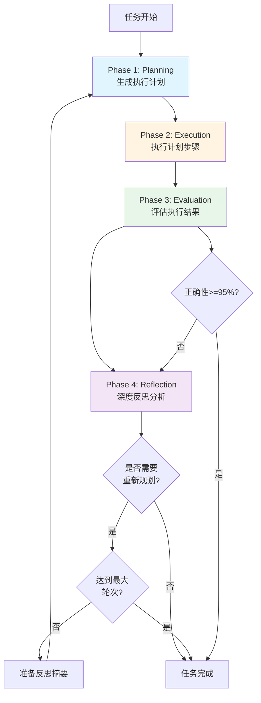

# 提示词系统与核心工作流程

## 概述

提示词系统是任务编排服务与LLM交互的核心接口，定义了规划、评估、反思等各个阶段的提示词模板。核心工作流程基于Reflective Planning循环，通过Planning → Execution → Evaluation → Reflection的迭代过程，实现任务的智能执行和自我优化。

## 提示词系统架构

### 提示词模板分类

```
提示词系统
├── 规划阶段 (Planning)
│   ├── PLANNING_SYSTEM_PROMPT
│   └── PLANNING_USER_TEMPLATE
├── 评估阶段 (Evaluation)
│   ├── EVALUATION_SYSTEM_PROMPT
│   └── EVALUATION_USER_TEMPLATE
├── 反思阶段 (Reflection)
│   ├── REFLECTION_SYSTEM_PROMPT
│   └── REFLECTION_USER_TEMPLATE
└── 单步反思 (Step-Level Reflection)
    └── 动态构建的提示词
```

## 核心工作流程

### Reflective Planning 循环流程图



### 详细流程说明

#### Phase 1: Planning (规划阶段)

**文件**: `src/core/planner.rs` (49-144行)

**方法**: `generate_plan()`

**提示词文件**: `src/llm/prompts.rs` (16-148行)

**核心功能**:
1. 查询可用工具列表
2. 构建规划提示词（包含任务描述、工具信息、反思历史、元数据）
3. 调用LLM生成执行计划
4. 解析JSON格式的计划响应

**提示词结构**:
```rust
// System Prompt (16-67行)
PLANNING_SYSTEM_PROMPT = "
你是一个专业的任务规划专家...
- 深入理解用户的任务需求
- 从可用工具列表中选择最合适的工具
- 将任务分解为清晰、可执行的步骤
- 确保数据在各步骤间正确流动
...
"

// User Prompt Template (69-148行)
PLANNING_USER_TEMPLATE = "
任务描述：{task_description}
可用工具：{available_tools}
任务上下文（元数据）：{metadata}
历史反思（如有）：{reflection_history}

【流程规范】
负荷预测流程与调用的工具id
1. check_csv_file - 校验原始数据文件
2. add_datasource - 注册数据源
3. data_upload - 上传历史数据
...
"
```

**输出格式**:
```json
{
  "plan_id": "plan_xxx",
  "description": "计划描述",
  "steps": [
    {
      "step_id": "step_1",
      "step_name": "步骤名称",
      "tool_id": "工具ID",
      "parameters": {"key": "value"},
      "dependencies": ["step_id1"],
      "expected_output": "预期输出"
    }
  ],
  "estimated_duration_secs": 60
}
```

#### Phase 2: Execution (执行阶段)

**文件**: `src/core/executor.rs` (102-537行)

**方法**: `execute_plan_with_context()`

**核心功能**:
1. 创建执行上下文，初始化元数据
2. 按顺序执行每个步骤
3. 检查步骤依赖关系
4. 解析参数（使用ParameterResolver）
5. 调用工具服务执行
6. 保存执行结果到上下文
7. 流转输出参数到runtime_metadata

**关键代码**:
```rust
// 第 102-537 行
pub async fn execute_plan_with_context(
    &self,
    plan: &ExecutionPlan,
    metadata: &HashMap<String, String>,
    available_tools: &[ToolInfo],
) -> Result<(PlanExecutionResult, ExecutionContext)> {
    // 创建执行上下文
    let context = ExecutionContext::new(plan.plan_id.clone());
    context.init_metadata(metadata.clone());
    
    // 按顺序执行每个步骤
    for (index, step) in plan.steps.iter().enumerate() {
        // 检查依赖
        let dependency_check = self.check_dependencies_detailed(step, &step_results);
        
        // 解析参数
        let parameters = ParameterResolver::resolve_parameters(step, &tool_info, &context);
        
        // 执行步骤
        match self.execute_step(&plan.plan_id, step, &parameters, Some(&context)).await {
            Ok(result) => {
                // 保存结果
                context.set_step_result(context_result);
                
                // 流转metadata
                context.sync_step_output_to_runtime_metadata(&step.step_id, &param_names)?;
            }
        }
    }
    
    Ok((execution_result, context))
}
```

#### Phase 3: Evaluation (评估阶段)

**文件**: `src/core/evaluator.rs` (139-175行)

**方法**: `evaluate()`

**提示词文件**: `src/llm/prompts.rs` (154-206行)

**核心功能**:
1. 格式化执行计划和结果为文本
2. 构建评估提示词
3. 调用LLM进行评估
4. 解析评估结果（包含多维度评分）

**提示词结构**:
```rust
// System Prompt (155-194行)
EVALUATION_SYSTEM_PROMPT = "
你是一个严谨的任务评估专家...
评估维度：
- 完整性：是否完成了所有必要的步骤
- 正确性：结果是否符合预期
- 效率：任务逻辑是否高效
- 可靠性：过程是否稳定可靠

重要提醒：
- 执行时间不在评估考虑范畴内
- 只关注任务的正确性、完整性、可靠性
"

// User Prompt Template (196-206行)
EVALUATION_USER_TEMPLATE = "
任务目标：{task_description}
执行计划：{execution_plan}
执行结果：{execution_results}

请对上述任务的执行情况进行全面评估。
"
```

**输出格式**:
```json
{
  "evaluation_id": "eval_xxx",
  "overall_score": 85.0,
  "is_successful": true,
  "dimensions": {
    "completeness": 90.0,
    "correctness": 95.0,
    "efficiency": 80.0,
    "reliability": 85.0
  },
  "successes": ["成功的方面1", "成功的方面2"],
  "failures": ["失败的方面1"],
  "improvement_suggestions": ["改进建议1", "改进建议2"]
}
```

#### Phase 4: Reflection (反思阶段)

**文件**: `src/core/reflector.rs` (229-273行)

**方法**: `reflect()`

**提示词文件**: `src/llm/prompts.rs` (208-263行)

**核心功能**:
1. 格式化评估结果为文本
2. 构建反思提示词
3. 调用LLM进行深度反思
4. 解析反思结果（包含根本原因、优化建议、是否重新规划）

**提示词结构**:
```rust
// System Prompt (209-249行)
REFLECTION_SYSTEM_PROMPT = "
你是一个深度思考的反思专家...
反思问题：
- 任务结果是否正确？
- 是否完成了所有必要的步骤？
- 我的假设哪里出错了？
- 有没有更好的方法来解决这个问题？
- 从这次经验中能学到什么？

重要提醒：
- 执行时间不在反思考虑范畴内
- 只关注任务的业务逻辑、正确性和完整性
"

// User Prompt Template (251-263行)
REFLECTION_USER_TEMPLATE = "
任务目标：{task_description}
原始计划：{original_plan}
评估结果：{evaluation_result}
当前轮次：第 {current_round} 轮（共 {max_rounds} 轮）

请对上述情况进行深度反思，并提供改进建议。
"
```

**输出格式**:
```json
{
  "reflection_id": "refl_xxx",
  "root_causes": ["根本原因1", "根本原因2"],
  "incorrect_assumptions": ["错误假设1"],
  "alternative_approaches": ["替代方法1", "替代方法2"],
  "optimization_suggestions": [
    {
      "aspect": "优化方面",
      "current_issue": "当前问题",
      "proposed_solution": "建议方案",
      "expected_improvement": "预期改进"
    }
  ],
  "lessons_learned": ["经验教训1", "经验教训2"],
  "should_replan": true
}
```

## 核心工作流程实现

### 主循环控制

**文件**: `src/core/orchestrator.rs` (262-624行)

**方法**: `execute_reflective_loop()`

**核心逻辑**:
```rust
// 第 262-624 行
async fn execute_reflective_loop(&self, task: &mut Task) -> Result<String> {
    let mut reflection_summary: Option<String> = None;
    let mut consecutive_failures = 0;
    
    loop {
        // 检查是否达到最大轮次
        if task.is_max_rounds_reached() {
            return self.generate_final_output(task);
        }
        
        // 检查是否连续失败过多
        if consecutive_failures >= MAX_CONSECUTIVE_FAILURES {
            return Err(ServiceError::TaskExecutionFailed(...));
        }
        
        // 开始新的反思轮次
        let round = task.start_new_round();
        
        // === Phase 1: Planning ===
        let plan = self.execute_planning_phase(
            &task.description,
            reflection_summary.as_deref(),
            &task.metadata
        ).await?;
        
        // === Phase 2: Execution ===
        let execution_result = self.execute_execution_phase_with_metadata(
            &plan,
            &task.metadata
        ).await?;
        
        // 更新连续失败计数器
        if execution_result.failure_count > 0 {
            consecutive_failures += 1;
        } else {
            consecutive_failures = 0;
        }
        
        // === Phase 3: Evaluation ===
        let evaluation = self.execute_evaluation_phase(
            &task.description,
            &plan,
            &execution_result
        ).await?;
        
        // 检查正确性是否已经满足要求（>= 95%）
        if evaluation.dimensions.correctness >= 95.0 {
            return self.generate_final_output(task);
        }
        
        // === Phase 4: Reflection ===
        let reflection = self.execute_reflection_phase(
            &task.description,
            &plan,
            &evaluation,
            task.current_round,
            self.config.max_reflection_rounds,
        ).await?;
        
        // 检查是否应该终止循环
        let should_terminate = !reflection.should_replan
            || task.is_max_rounds_reached()
            || (evaluation.is_successful && evaluation.overall_score >= self.config.success_threshold);
        
        if should_terminate {
            return self.generate_final_output(task);
        }
        
        // 准备下一轮的反思摘要
        reflection_summary = Some(self.reflector.generate_summary(&reflection));
    }
}
```

### 终止条件

系统在以下情况下终止Reflective Planning循环：

1. **正确性极高**: `evaluation.dimensions.correctness >= 95.0`
2. **质量足够**: `evaluation.is_successful && evaluation.overall_score >= success_threshold`
3. **不需要重新规划**: `!reflection.should_replan`
4. **达到最大轮次**: `task.is_max_rounds_reached()`
5. **连续失败过多**: `consecutive_failures >= MAX_CONSECUTIVE_FAILURES`

## 关键代码文件清单

| 文件路径 | 核心功能 | 关键方法/行号 |
|---------|---------|--------------|
| `src/llm/prompts.rs` | 提示词模板定义 | `PLANNING_SYSTEM_PROMPT` (16-67行)<br>`EVALUATION_SYSTEM_PROMPT` (155-194行)<br>`REFLECTION_SYSTEM_PROMPT` (209-249行)<br>`PromptBuilder` (310-384行) |
| `src/core/orchestrator.rs` | 核心工作流程控制 | `execute_reflective_loop()` (262-624行)<br>`orchestrate_with_id_and_metadata()` (184-259行) |
| `src/core/planner.rs` | 规划阶段实现 | `generate_plan()` (49-144行)<br>`parse_plan_response()` (263-397行) |
| `src/core/executor.rs` | 执行阶段实现 | `execute_plan_with_context()` (102-537行) |
| `src/core/evaluator.rs` | 评估阶段实现 | `evaluate()` (139-175行)<br>`parse_evaluation_response()` (178-284行) |
| `src/core/reflector.rs` | 反思阶段实现 | `reflect()` (229-273行)<br>`parse_reflection_response()` (333-396行) |

## 提示词设计原则

### 1. 角色定位明确
每个阶段的System Prompt都明确定义了LLM的角色：
- Planning: "专业的任务规划专家"
- Evaluation: "严谨的任务评估专家"
- Reflection: "深度思考的反思专家"

### 2. 输出格式规范
所有提示词都包含明确的JSON Schema定义，确保输出可解析。

### 3. 领域知识注入
Planning阶段的提示词包含：
- 流程规范（负荷预测流程、自动建模流程）
- 默认参数配置
- 工具选择原则
- 任务分析能力

### 4. 避免干扰因素
Evaluation和Reflection阶段明确指出：
- "执行时间不在评估/反思考虑范畴内"
- "只关注任务的正确性、完整性、可靠性"

## 配置参数

**文件**: `config.toml`

```toml
[orchestrator]
max_reflection_rounds = 5
task_timeout_secs = 3600
enable_auto_reflection = true
success_threshold = 80.0

[reflection]
enable_step_level_reflection = true
max_step_retries = 3
max_task_replanning_attempts = 1
```

## 实际应用示例

### 示例: 负荷预测任务的完整流程

```
第1轮 Reflective Planning:

Phase 1 - Planning:
  输入: "进行负荷预测，文件路径: /data/load.csv"
  输出: 12步执行计划（check_csv → add_datasource → ... → load_prediction）

Phase 2 - Execution:
  执行12个步骤
  结果: 步骤5 (data_validation) 失败

Phase 3 - Evaluation:
  overall_score: 45.0
  correctness: 40.0
  failures: ["数据验证失败"]

Phase 4 - Reflection:
  root_causes: ["时间范围参数不正确"]
  should_replan: true

第2轮 Reflective Planning:

Phase 1 - Planning (with reflection):
  输入: 原任务 + 反思摘要
  输出: 改进的12步计划（修正了时间范围参数）

Phase 2 - Execution:
  执行12个步骤
  结果: 全部成功

Phase 3 - Evaluation:
  overall_score: 95.0
  correctness: 98.0
  is_successful: true

Phase 4 - Reflection:
  should_replan: false

任务完成！
```

## 设计优势

1. **自我优化**: 通过反思循环不断改进
2. **领域适应**: 提示词包含领域知识
3. **可控迭代**: 明确的终止条件
4. **结构化输出**: JSON Schema确保可解析性
5. **上下文传递**: 反思摘要传递给下一轮

## 总结

提示词系统和核心工作流程是任务编排服务的智能核心，通过精心设计的提示词模板和Reflective Planning循环，实现了任务的智能规划、执行、评估和自我优化，是系统自主决策能力的基础。
