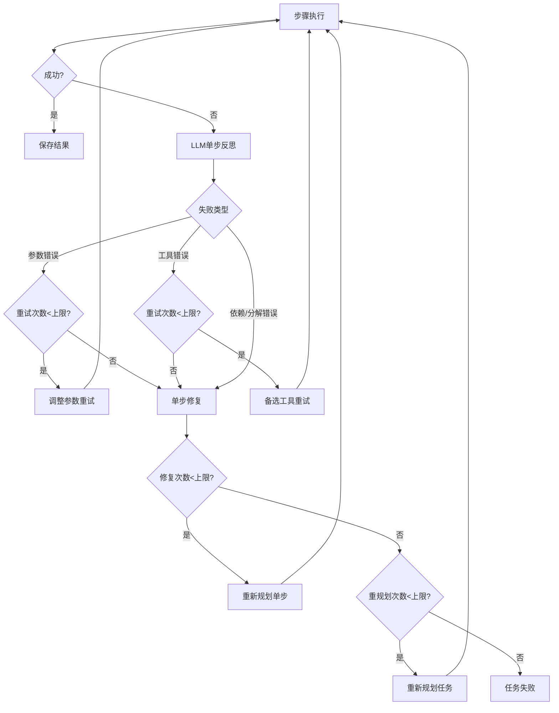

# 单步执行失败后的评估反思与重新规划

## 概述

单步执行失败后的评估反思与重新规划是任务编排服务的自愈能力核心，实现了步骤级的智能错误处理和自动恢复。该机制在单个步骤失败时立即进行分析，根据失败原因采取不同的恢复策略，包括参数调整重试、工具替换、单步修复或整体重新规划。

## 核心设计理念

### 1. 分层反思策略

系统采用三层反思策略，根据失败严重程度采取不同的恢复措施：

```
第1层: 步骤级重试 (Step-Level Retry)
  ├─ 调整参数重试 (RetryWithAdjustedParams)
  └─ 使用备选工具重试 (RetryWithAlternativeTool)

第2层: 单步修复 (Single-Step Repair)
  └─ 重新规划失败的单个步骤

第3层: 任务级重新规划 (Task-Level Replanning)
  └─ 重新规划整个任务
```

### 2. 失败次数控制机制

```
step_retry_count: 当前步骤重试次数 (上限: 默认3次)
single_step_repair_count: 单步修复次数 (上限: 默认1次)
task_replan_count: 任务重新规划次数 (上限: 默认1次)
consecutive_failures: 连续失败次数 (上限: 默认3次)
```

## 核心流程图



## 详细步骤说明

### 步骤1: 失败检测与反思触发

**文件**: `src/core/orchestrator.rs` (808-845行)

步骤执行失败后，立即调用LLM进行单步反思分析。

### 步骤2: LLM单步反思分析

**文件**: `src/core/reflector.rs` (587-670行)

**方法**: `reflect_on_step()`

调用LLM分析失败原因，返回：
- 根本原因分类 (parameter_error/tool_error/dependency_error等)
- 具体根本原因
- 是否可恢复
- 建议的修复方案
- 可信度评分

### 步骤3: 根据反思结果采取行动

**文件**: `src/core/orchestrator.rs` (900-1100行)

#### 3.1 参数调整重试
- 条件: `step_retry_count < max_step_retries`
- 使用调整后的参数重新执行
- 成功则继续，失败则增加计数

#### 3.2 备选工具重试
- 条件: `step_retry_count < max_step_retries`
- 使用备选工具重新执行
- 成功则继续，失败则增加计数

#### 3.3 单步修复

**文件**: `src/core/planner.rs` (575-688行)

**方法**: `replan_single_step()`

- 条件: `single_step_repair_count < max_single_step_repairs`
- 调用LLM重新规划失败的单个步骤
- 只修复当前步骤，不影响其他步骤
- 替换步骤定义后重新执行

#### 3.4 任务级重新规划

**文件**: `src/core/planner.rs` (451-569行)

**方法**: `replan_task()`

- 条件: `task_replan_count < max_task_replanning_attempts`
- 调用LLM重新规划整个任务
- 生成全新的执行计划
- 重置执行状态，从头开始

## 关键代码文件清单

| 文件路径 | 核心功能 | 关键方法/行号 |
|---------|---------|--------------|
| `src/core/orchestrator.rs` | 步骤级反思主流程 | `execute_execution_phase_with_metadata()` (663-1100行) |
| `src/core/reflector.rs` | 单步反思分析 | `reflect_on_step()` (587-670行)<br>`StepReflection` 结构 (78-131行) |
| `src/core/planner.rs` | 重新规划 | `replan_single_step()` (575-688行)<br>`replan_task()` (451-569行) |
| `src/core/executor.rs` | 单步执行 | `execute_single_step()` (716-740行)<br>`execute_single_step_with_overrides()` (742-850行) |

## 配置文件

**文件**: `config.toml` 或 `config.dev.toml`

```toml
[reflection]
enable_step_level_reflection = true
max_step_retries = 3
max_task_replanning_attempts = 1
```

## 实际应用示例

### 示例1: 参数错误 → 调整参数重试

```
步骤: data_upload
错误: "数据源不存在: ds_invalid"
反思: parameter_error
行动: 调整参数 {"datasource_id": "ds_001"}
结果: 重试成功
```

### 示例2: 工具错误 → 备选工具重试

```
步骤: process_data
错误: "工具服务连接超时"
反思: tool_error
行动: 使用备选工具 "alternative_processor"
结果: 重试成功
```

### 示例3: 任务分解错误 → 重新规划

```
步骤: feature_engineering
错误: "缺少必要的前置数据"
反思: decomposition_error
行动: 单步修复失败 → 任务重新规划
结果: 生成新计划，包含缺失的前置步骤
```

## 设计优势

1. **分层恢复**: 从简单到复杂的恢复策略
2. **智能分析**: LLM进行根本原因分析
3. **可控重试**: 多层次的失败计数器
4. **上下文保持**: 重试时保持执行状态

## 总结

该机制通过分层反思和智能恢复策略，实现了任务执行的自愈能力，大大提高了任务成功率和系统鲁棒性。
