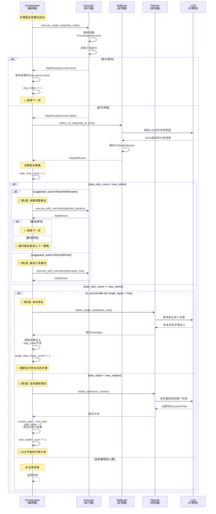

# 单步重试与重新规划的逻辑实现详解

## 概述

本文档详细说明任务编排服务中单步重试与重新规划的完整实现逻辑，包括失败检测、智能反思、分层恢复策略和代码实现细节。

## 目录

1. [核心架构](#核心架构)
2. [完整执行流程](#完整执行流程)
3. [核心组件详解](#核心组件详解)
4. [分层恢复策略](#分层恢复策略)
5. [关键代码实现](#关键代码实现)
6. [实战示例](#实战示例)
7. [配置说明](#配置说明)

---

## 核心架构

### 系统组件关系

```
┌─────────────────────────────────────────────────────────────┐
│                       Orchestrator                          │
│  (任务编排器 - 主控制流程)                                      │
│  📁 src/core/orchestrator.rs                                │
└────────┬────────────────────────────────────────────────────┘
         │
         ├──► ┌──────────────────────────────────────┐
         │    │        Executor                      │
         │    │   (步骤执行器)                        │
         │    │   📁 src/core/executor.rs            │
         │    │   🔧 execute_single_step (742行)     │
         │    └──────────────────────────────────────┘
         │
         ├──► ┌──────────────────────────────────────┐
         │    │        Reflector                     │
         │    │   (反思分析器)                        │
         │    │   📁 src/core/reflector.rs           │
         │    │   🔍 reflect_on_step (587行)         │
         │    └──────────────────────────────────────┘
         │
         └──► ┌──────────────────────────────────────┐
              │        Planner                       │
              │   (任务规划器)                        │
              │   📁 src/core/planner.rs             │
              │   🔄 replan_single_step (577行)      │
              │   🔄 replan_task (453行)             │
              └──────────────────────────────────────┘
```

### 关键数据结构

#### StepReflection（单步反思结果）

**文件**: `src/core/reflector.rs` (78-98行)

```rust
pub struct StepReflection {
    pub reflection_id: String,         // 反思ID
    pub step_id: String,               // 步骤ID
    pub root_cause: String,            // 根本原因描述
    pub root_cause_category: String,   // 根因分类
    pub suggested_action: StepAction,  // 建议的恢复行动
    pub confidence: f32,               // 可信度(0-100)
    pub analysis: String,              // 详细分析
    pub alternative_solutions: Vec<String>, // 备选方案
    pub is_recoverable: bool,          // 是否可恢复
}
```

#### StepAction（恢复行动类型）

```rust
pub enum StepAction {
    RetryWithAdjustedParams(HashMap<String, String>), // 调整参数重试
    RetryWithAlternativeTool(String),                 // 使用备选工具
    ReplanEntireTask,                                 // 重新规划整个任务
    StopExecution,                                    // 停止执行
}
```

---

## 完整执行流程

### 时序图



## 核心组件详解

### Orchestrator（任务编排器）

- **文件**: `src/core/orchestrator.rs`
- **核心方法**: `execute_execution_phase_with_metadata()`（约 663-1559 行）
- **职责**:
  - 负责执行阶段主循环（顺序遍历 `current_plan.steps`）。
  - 维护三类计数：`step_retry_count`、`single_step_repair_count`、`task_replan_count`。
  - 调用 `Executor` 执行单步；失败时触发 `Reflector` 做单步反思；必要时调用 `Planner` 做单步修复或任务级重规划。
  - 向客户端发送步骤执行、评估、反思、重规划等事件。

### Reflector（反思分析器）

- **文件**: `src/core/reflector.rs`
- **关键结构**: `StepReflection`（78-98 行）
- **关键方法**: `reflect_on_step()`（587-669 行）
- **职责**:
  - 基于步骤 ID、工具 ID、错误信息、步骤描述和当前 metadata 构造 prompt。
  - 调用 LLM 返回结构化 JSON，解析为 `StepReflection`：包括根因分类、是否可恢复、建议行动 `StepAction` 等。
  - 解析失败时降级为默认 `StepReflection`，避免阻塞整体流程。

### Planner（任务规划器）

- **文件**: `src/core/planner.rs`
- **整体重规划**: `replan_task()`（452-571 行）
  - 根据失败原因与元数据构造 prompt，请求 LLM 重新生成完整 `ExecutionPlan`。
  - 解析 LLM 响应为新计划，并记录到 Kafka。
- **单步修复**: `replan_single_step()`（573-650 行）
  - 只修复指定失败步骤，保持 `step_id` 不变。
  - 让 LLM 在可用工具列表中选择更合适的工具 / 参数，生成新的 `PlanStep`。

### Executor（步骤执行器）

- **文件**: `src/core/executor.rs`
- **相关方法**:
  - `execute_single_step()`（741-755 行）
  - `execute_single_step_with_overrides()`（759-865 行）
- **职责**:
  - 根据 `ExecutionPlan` 和 `ExecutionContext` 解析参数（支持参数覆盖 `param_overrides`）。
  - 支持工具覆盖 `tool_override`，用于备选工具重试场景。
  - 调用底层工具并返回 `StepResult`，供 Orchestrator 做后续处理。

## 分层恢复策略

系统采用三层恢复策略，由 Orchestrator 在单步失败时统一调度：

1. **第 1 层：步骤级重试**（参数重试 / 备选工具重试）
2. **第 2 层：单步修复**（只重写当前失败步骤）
3. **第 3 层：任务级重新规划**（重新生成整个执行计划）

### 第 1 层：步骤级重试

- **触发条件**：
  - 当前步骤执行失败，`StepResult.is_success = false`；
  - `step_retry_count < max_step_retries`；
  - 单步反思 `StepReflection.suggested_action` 为：
    - `RetryWithAdjustedParams(...)`，或
    - `RetryWithAlternativeTool(...)`。
- **实现要点（orchestrator.rs 1056-1205 行附近）**：
  - 参数重试：调用 `execute_single_step_with_overrides(..., Some(adjusted_params), None)`。
  - 工具重试：调用 `execute_single_step_with_overrides(..., None, Some(alternative_tool_id))`。
  - 成功则视为正常成功路径，推进到下一步；失败则增加 `step_retry_count`，在上限内继续循环尝试或升级到下一层。

### 第 2 层：单步修复（Single-Step Repair）

- **触发条件**：
  - 已经达到步骤重试上限，或反思建议直接任务重规划；
  - 反思结果 `is_recoverable = true`；
  - `single_step_repair_count < max_single_step_repairs`。
- **实现要点（orchestrator.rs 1303-1416 行）**：
  - Orchestrator 调用 `planner.replan_single_step(...)` 请求 LLM 生成新的 `PlanStep`。
  - 替换 `current_plan.steps` 中对应的步骤定义，保持 `step_id` 不变。
  - 重置当前步骤的重试计数，并从当前 `step_index` 再次执行（相当于“修好这一步再跑一遍”）。

### 第 3 层：任务级重新规划（Task-Level Replanning）

- **触发条件**：
  - 单步修复失败或不适用，或反思结果 `is_recoverable = false`；
  - `task_replan_count < max_task_replans`。
- **实现要点（orchestrator.rs 1418-1559 行 + planner.rs 452-571 行）**：
  - 构造 `replanning_prompt`，整合失败步骤、根因分类、分析和备选方案等信息。
  - 调用 `replan_task(...)` 生成新的 `ExecutionPlan`。
  - 将 `current_plan` 替换为新计划，`step_index` 置 0，并重置执行上下文，从头重新执行。

### 终止条件

- `task_replan_count >= max_task_replans`：直接返回 `TaskExecutionFailed`，任务终止；
- 反思建议 `StepAction::StopExecution`：立即终止执行并返回错误。

## 代码执行路径详解（按分支）

本节从“代码执行路径”的角度，分别说明几种典型分支下的调用顺序与关键变量变化，方便从日志或调用栈反向定位逻辑。

为简化描述，统一假设已进入步骤级反思模式（即 `reflection.enable_step_level_reflection = true`），且正在 `execute_execution_phase_with_metadata()` 的主循环中。

### 1. 正常成功路径

**对应代码**：
- `orchestrator.rs`：877-951 行
- `executor.rs`：741-755, 759-865 行

**执行步骤**：

1. Orchestrator 取出当前 `step_info`：
   - 来自 `current_plan.steps[step_index]`，同时维护 `last_step_index`、`step_retry_count` 等变量。
2. 调用执行器：
   - `self.executor.execute_single_step(&current_plan, step_index, &execution_context, &available_tools)`。
   - 内部会解析参数（`ParameterResolver::resolve_parameters`），并调用底层工具，返回 `StepResult`。
3. 将 `StepResult` 适配为 `StepExecutionResult`：
   - 字段包括 `step_id`、`step_name`、`tool_id`、`output`、`is_success`、`error_message`。
4. 调用 `StepLevelReflector::evaluate_step_result(...)` 做轻量级评估（非 LLM）：
   - 若 `evaluation.success == true`，进入成功分支。
5. 成功分支中：
   - `send_step_completed(&step_result)`：向客户端发送“步骤完成”事件。
   - 构造 `EvaluationResult`（四个维度均 100 分）并 `send_evaluation_completed(...)`。
   - 将当前步的 `StepExecutionResult` 写入 `ExecutionContext`，并通过 `sync_step_output_to_metadata(...)` 同步到运行时元数据。
   - `step_results.push(step_result)`，`step_index += 1`，循环进入下一步。

### 2. 失败 + 参数重试分支（`RetryWithAdjustedParams`）

**对应代码**：
- `orchestrator.rs`：952-1134 行
- `reflector.rs`：587-669, 672-723+ 行
- `executor.rs`：759-865 行

**执行步骤**：

1. 初次执行失败：
   - `StepResult.is_success = false`，进入 952 行后的失败分支；
   - `step_retry_count += 1`；
   - `send_step_failed(...)` 将失败结果推到前端；
   - 构造失败的 `EvaluationResult`（四维度为 0），并 `send_evaluation_completed(...)`。
2. 调用单步反思：
   - `self.reflector.reflect_on_step(step_id, tool_id, error_message, description, metadata)`；
   - `reflect_on_step()` 内部调用 LLM，要求输出 JSON；
   - `parse_step_reflection_response()` 将 JSON 解析为 `StepReflection`，包含 `root_cause_category` 和 `suggested_action`。
3. Orchestrator 依据 `StepReflection` 做决策：
   - 在未达到重试上限的情况下（`step_retry_count < max_step_retries`），进入 `match &step_reflection.suggested_action` 分支；
   - 当分支为 `StepAction::RetryWithAdjustedParams(adjusted_params)` 时：
     - 记录 Kafka 日志（理由为“参数调整重试”）。
4. 调用带覆盖参数的执行：
   - `execute_single_step_with_overrides(&current_plan, step_index, &execution_context, &available_tools, Some(adjusted_params.clone()), None)`；
   - 内部将 `adjusted_params` 与原解析出的参数合并，生成最终调用参数。
5. 二次执行结果：
   - 若 `retry_result.is_success == true`：
     - 流程与“正常成功路径”一致：发送完成事件、评估完成事件、更新 `ExecutionContext` 与 metadata，并 `step_index += 1`。
   - 若仍失败：
     - 打印告警“参数调整重试仍然失败”，不改变 `step_index`，本轮 while 结束后重新从当前步骤开始下一轮循环；
     - 此时 `step_retry_count` 已增加，后续可能再次触发反思或升级到单步修复 / 任务重规划。

### 3. 失败 + 备选工具重试分支（`RetryWithAlternativeTool`）

**对应代码**：
- `orchestrator.rs`：1137-1205 行
- `executor.rs`：759-865 行

**执行步骤**：

1. 与参数重试相同，先经历：
   - 初次失败 → `send_step_failed` + 失败评估；
   - `reflect_on_step` + `StepReflection`，得到 `suggested_action = RetryWithAlternativeTool(tool_id)`。
2. Orchestrator 进入 `RetryWithAlternativeTool` 分支：
   - 记录 Kafka 日志，注明 `alternative_tool` 与 `retry_count`；
   - 调用 `execute_single_step_with_overrides(..., None, Some(alternative_tool_id.clone()))`：
     - 在执行器内部，会将 `tool_override` 写入临时 `modified_step.tool`，其他字段保持不变。
3. 二次执行结果：
   - 若成功：
     - 推送步骤完成事件，更新 `ExecutionContext` 与 metadata，`step_index += 1`；
   - 若仍失败：
     - 打印“备选工具重试仍然失败”，结束本轮 while；
     - 由于 `step_retry_count` 已经累积，下轮循环可能直接进入单步修复或任务重规划。

### 4. 单步修复路径（`replan_single_step`）

**对应代码**：
- `orchestrator.rs`：1303-1416 行
- `planner.rs`：573-650 行

**典型触发场景**：

1. 当前步骤多次重试（参数或工具）仍失败，`step_retry_count >= max_step_retries`；
2. 或者反思建议直接整体重规划，但系统先尝试更轻量的“单步修复”，且 `step_reflection.is_recoverable = true`；
3. 同时 `single_step_repair_count < max_single_step_repairs`。

**执行步骤**：

1. Orchestrator 调用：
   - `self.planner.replan_single_step(&step_info.step_id, &step_info, error_message, &available_tools)`。
2. Planner 构造 prompt：
   - 提供原始失败步骤定义（ID / 名称 / 工具 / 参数 / 错误信息）；
   - 要求 LLM 输出新的步骤 JSON，遵守 schema，`step_id` 不变但工具 / 参数可调整。
3. LLM 响应解析为 `PlanStep`：
   - 若成功，返回 `repaired_step`；
4. Orchestrator 更新计划与状态：
   - 在 `current_plan.steps` 中找到同 `step_id` 的索引并替换为 `repaired_step`；
   - 将 `last_step_index = usize::MAX`，使下一轮循环被视为“切换到新步骤”，从而重置重试计数逻辑；
   - 将 `step_retry_count = 0`；
   - `single_step_repair_count += 1`；
   - 发送一条 `ReflectionResult` 类型的“单步修复完成”事件给客户端。
5. 循环继续：
   - 不改变 `step_index`，下一轮 while 将在同一索引位置执行**修复后的步骤**。

若 `replan_single_step` 本身失败（LLM 解析失败或返回非法计划）：

- 记录“单步修复失败，将尝试全任务重新规划”的日志与 Kafka 事件；
- `single_step_repair_count` 仍然自增；
- 后续直接进入任务级重规划逻辑（见下一节）。

### 5. 任务级重新规划路径（`replan_task`）

**对应代码**：
- `orchestrator.rs`：1418-1559 行
- `planner.rs`：452-571 行

**典型触发场景**：

1. `step_reflection.is_recoverable == false`（例如任务分解错误、前置数据缺失严重）；
2. 或单步修复失败 / 超过次数；
3. 且 `task_replan_count < max_task_replans`。

**执行步骤**：

1. 构建 `replanning_prompt`：
   - 包含失败步骤 ID、根因分类、错误分析以及可选的备选方案列表；
   - 若经历过单步修复失败，会在 prompt 中补充“单步修复失败”的上下文。
2. 调用 Planner 的 `replan_task(&replanning_prompt, metadata.clone())`：
   - Planner 查询可用工具、格式化为文本；
   - 构造 system + user prompt，要求输出完整计划 JSON；
   - 调用 LLM，解析为 `ExecutionPlan`；
   - 记录重规划相关日志与 Kafka 事件。
3. Orchestrator 接收新计划：
   - `current_plan = new_plan`；
   - `step_index = 0`，`last_step_index = usize::MAX`；
   - `step_results.clear()`，`step_retry_count = 0`；
   - 重置 `ExecutionContext`（清空内部状态，重新设置 `plan_id` 与 metadata）。
4. 向客户端推送：
   - `send_reflection_completed(&ReflectionResult{...})`：说明已完成深度分析与重规划；
   - `send_plan_generated(&current_plan)`：推送新计划；
   - 并递增 `task_replan_count`，打印“重规划进度: {}/{}”日志。
5. while 循环继续：
   - 从新的 `current_plan` 第一步开始重新执行完整任务。

### 6. StopExecution 路径（直接停止执行）

**对应代码**：
- `orchestrator.rs`：1218-1234 行

**触发场景**：

- 单步反思结果 `suggested_action = StepAction::StopExecution`，通常意味着：
  - 错误为不可恢复的业务错误（如权限、合规限制等）；
  - 或进一步重试 / 重规划意义不大，反而可能带来副作用。

**执行步骤**：

1. Orchestrator 命中 `StepAction::StopExecution` 分支：
   - 记录一条错误级别的日志 “单步反思建议停止执行”；
   - 发送 Kafka 事件，包含失败步骤 ID 与根因说明。
2. 返回错误：
   - 构造 `ServiceError::TaskExecutionFailed`，携带“无法恢复”的原因说明；
   - 整个 `execute_execution_phase_with_metadata()` 提前返回 `Err(...)`，任务立即结束。

### 7. 单步反思失败时的降级策略

**对应代码**：
- `orchestrator.rs`：974-1001 行
- `reflector.rs`：672-681 行（JSON 解析失败分支）

**两类失败场景**：

1. LLM 调用正常，但输出不是合法 JSON：
   - `parse_step_reflection_response` 中 JSON 解析报错；
   - 记录 debug 日志“单步反思 JSON 解析失败，使用默认值”；
   - 返回一个 fallback 的 `StepReflection`，通常将 `root_cause_category` 设为 `unknown_error` 或类似值。
2. Orchestrator 调用 `reflect_on_step` 直接返回错误：
   - 在 orchestrator 的 974-1001 行，会捕获 `Err(e)`；
   - 打印 warn 日志“单步反思失败，跳过决策直接进行重规划”；
   - 构造一个保守的 `StepReflection`：
     - `root_cause_category = "reflection_error"`；
     - `suggested_action = StepAction::ReplanEntireTask`；
     - `is_recoverable = false`。

后续行为：

- 因为 `suggested_action` 被强制设置为 `ReplanEntireTask`，且 `is_recoverable = false`，
  - 步骤不会再做参数/工具级重试；
  - 会按照“任务级重新规划路径”直接进入 `replan_task` 分支；
- 这样保证即使反思逻辑本身出问题，也不会导致无限循环，而是尽快通过重规划或终止来“收敛”。

## 状态变量变化总览

下表从“状态机”的角度，总结了各类分支下核心状态变量的变化情况。仅列出对排查问题最关键的几个变量：

- `step_index`：当前正在执行的步骤下标
- `step_retry_count`：当前步骤已重试次数
- `single_step_repair_count`：已执行的单步修复次数
- `task_replan_count`：已执行的任务级重规划次数
- `current_plan`：当前执行计划（包含 plan_id 与 steps）
- `ExecutionContext`：执行上下文（记录每步输出）
- `runtime_metadata`：通过 `sync_step_output_to_metadata` 同步后的运行时元数据

| 分支 | 条件概述 | step_index | step_retry_count | single_step_repair_count | task_replan_count | current_plan | ExecutionContext | runtime_metadata | 下一轮循环起点 |
|------|----------|-----------|------------------|--------------------------|-------------------|-------------|------------------|------------------|----------------|
| 正常成功 | 当前步执行成功且评估通过 | `+1` | 不变（通常为 0） | 不变 | 不变 | 不变 | 追加当前步结果 | 追加当前步输出 | 下一步（index+1） |
| 初次失败（尚未重试） | 第一次执行失败 | 不变 | `+1` | 不变 | 不变 | 不变 | 不追加该步（失败结果仅通过事件发出） | 不变 | 本步再次执行或进入重试/重规划决策 |
| 参数重试成功 | 反思建议参数重试，重试后成功 | `+1` | 保持当前值（>0） | 不变 | 不变 | 不变 | 追加当前步成功结果 | 追加当前步输出 | 下一步（index+1） |
| 参数重试仍失败 | 反思建议参数重试，重试仍失败 | 不变 | `+1` | 不变 | 不变 | 不变 | 不追加（失败结果仅事件） | 不变 | 本步再次进入失败处理/反思或升级到下一层 |
| 备选工具重试成功 | 反思建议使用备选工具，重试成功 | `+1` | 保持当前值（>0） | 不变 | 不变 | 不变（但当前步工具实际执行为 override 工具） | 追加当前步成功结果 | 追加当前步输出 | 下一步（index+1） |
| 备选工具重试仍失败 | 反思建议使用备选工具，重试仍失败 | 不变 | `+1` | 不变 | 不变 | 不变 | 不追加 | 不变 | 本步再次进入失败处理/反思或升级到下一层 |
| 单步修复成功 | 达到重试上限或策略要求，调用 `replan_single_step` 成功 | 不变 | 重置为 0 | `+1` | 不变 | 同一 `plan_id` 下替换当前 `step_id` 对应的步骤 | 不变（旧结果仍保留） | 不变 | 下一轮在同一 `step_index` 执行“修复后的步骤” |
| 单步修复失败 | `replan_single_step` 自身失败 | 不变 | 保持当前值 | `+1` | 不变 | 计划结构不变 | 不变 | 不变 | 直接进入任务级重规划决策 |
| 任务级重规划成功 | 触发 `replan_task` 并成功生成新计划 | 置 0 | 重置为 0 | 不变（或保持前值） | `+1` | 替换为新 `ExecutionPlan`（新 plan_id / 新 steps） | 清空内部状态并重新绑定到新 plan_id | 重置为初始 metadata（不含新输出） | 下一轮从新计划第 1 步开始执行 |
| 任务级重规划失败 | `replan_task` 自身失败 | 不变 | 不变 | 不变 | 保持当前值 | 不变 | 不变 | 不变 | 直接返回 `TaskExecutionFailed`，不再进入下一轮 |
| StopExecution | 反思建议 `StopExecution` | 不变 | 不变 | 不变 | 不变 | 不变 | 不变 | 不变 | 立刻返回错误，任务结束 |
| 反思失败降级 | `reflect_on_step` 或 JSON 解析失败，强制 `ReplanEntireTask` | 不变 | 保持当前值 | 不变 | 不变（直到真正执行 `replan_task` 时才 `+1`） | 不变 | 不变 | 不变 | 后续直接进入任务级重规划路径 |

> 提示：排查问题时，配合日志中打印的 `step_index`、`step_retry_count`、`single_step_repair_count`、`task_replan_count` 以及 Kafka 事件，可以很快定位当前执行正处于哪一行逻辑、哪一层恢复策略。

## 复杂场景 Walk-through 示例

下面以一个“**参数多次重试 → 单步修复 → 单步修复仍失败 → 整体重规划**”的复杂场景，按时间顺序详细说明一次完整执行中各变量和主要函数调用的演变。

### 场景设定

- 原始计划 `Plan P1`：包含 4 个步骤 `S1, S2, S3, S4`；
- 当前执行到步骤 `S3`：
  - 工具 ID：`tool_extract_features`
  - 初始参数中引用了前置步骤 `S2` 的输出；
- 实际运行中：
  - 第一次执行 `S3` 时，由于上游数据不完整导致失败；
  - LLM 先多次给出“参数调整重试”的建议；
  - 达到重试上限后，LLM 认为问题可恢复，建议单步修复；
  - 单步修复后新的 `S3'` 依然失败；
  - 最终触发任务级重规划，生成新计划 `P2`。

### 阶段一：首次执行 S3 失败

1. Orchestrator 正在循环执行 `P1`：
   - `step_index = 2`（假设从 0 开始，对应 S3）；
   - `step_retry_count = 0`，`single_step_repair_count = 0`，`task_replan_count = 0`；
2. 调用执行器：
   - `execute_single_step(P1, step_index=2, &execution_context, &available_tools)`；
   - 底层工具报错：`"缺少必需的特征列"`；
   - 返回 `StepResult{ is_success = false, error_message = Some(...) }`；
3. Orchestrator 进入失败分支：
   - `step_retry_count` 从 0 增加到 1；
   - `send_step_failed` + 发送失败评估（评分为 0）；
4. 调用 `reflect_on_step(...)`：
   - LLM 判断根因：`root_cause_category = "parameter_error"`；
   - 给出 `suggested_action = RetryWithAdjustedParams({...})`；
5. 由于 `step_retry_count < max_step_retries`，系统进入“参数重试”路径。

### 阶段二：多次参数重试仍然失败

1. 第 2 次执行 S3：
   - Orchestrator 调用 `execute_single_step_with_overrides(..., Some(adjusted_params1), None)`；
   - 工具仍因上游数据问题失败；
   - `step_retry_count` 从 1 增加到 2；
   - 再次发送失败事件 + 失败评估；
   - 再次调用 `reflect_on_step`，LLM 依然建议参数重试。
2. 第 3 次执行 S3：
   - 再次带新的 `adjusted_params2` 调用 `execute_single_step_with_overrides`；
   - 依旧失败；
   - `step_retry_count` 从 2 增加到 3，达到 `max_step_retries = 3`；
3. 在本轮失败处理结尾：
   - 判断 `step_retry_count >= max_step_retries`，不再执行参数/工具重试；
   - 转入“单步修复 / 任务重规划”决策逻辑（即 1303 行后的那段）。

### 阶段三：单步修复 S3 → 得到新步骤 S3'

1. 反思结果认为问题可恢复：
   - `is_recoverable = true`；
2. 同时 `single_step_repair_count = 0 < max_single_step_repairs = 1`：
   - Orchestrator 选择先尝试 **单步修复** 而不是直接重规划；
3. 调用 Planner：
   - `replan_single_step("S3", &S3, error_message, &available_tools)`；
   - LLM 返回新的步骤定义 `S3'`：可能更换了工具或显式增加了前置依赖等；
4. Orchestrator 更新状态：
   - 在 `current_plan.steps` 中用 `S3'` 替换原来的 `S3`；
   - `last_step_index = usize::MAX`（下一轮视为新步骤）；
   - `step_retry_count` 重置为 0；
   - `single_step_repair_count` 从 0 增加到 1；
   - 发送“单步修复完成”的 `ReflectionResult` 给前端；
5. while 循环继续：
   - `step_index` 仍为 2，但下一轮会执行已经修复过的 `S3'`。

### 阶段四：S3' 仍然失败 → 触发任务级重规划

1. 执行修复后的 S3'：
   - 调用 `execute_single_step(P1', step_index=2, ...)`（P1' 表示包含 S3' 的计划）；
   - 由于根本性任务分解问题，S3' 仍然失败；
   - `step_retry_count` 从 0 增加到 1；
   - 再次发送失败事件 + 失败评估；
2. 再次反思：
   - 这次 LLM 认为问题属于 `decomposition_error`，甚至可能将 `is_recoverable` 置为 `false`；
3. 在失败处理的后半段：
   - 即使此时 `step_retry_count` 还未再次达到重试上限，由于 `is_recoverable = false` 或已无意义继续修复，系统会走向 **任务级重规划** 分支；
4. 调用 `replan_task(...)`：
   - Planner 基于“上游缺少必要特征步骤”等信息，生成新计划 `P2`：
     - 在 `S2` 与 `S3` 之间新增若干前置步骤（如补数、特征构造等）；
5. Orchestrator 切换到新计划：
   - `current_plan = P2`；
   - `step_index = 0`，`last_step_index = usize::MAX`；
   - `step_results.clear()`，`step_retry_count = 0`；
   - 重新初始化 `ExecutionContext`，仅携带初始 metadata，不再带失败链路中的中间结果；
   - `task_replan_count` 从 0 增加到 1；
   - 推送“重规划完成”以及“新计划生成”的事件给客户端。

### 阶段五：在新计划 P2 上重新执行

1. while 循环重新从 `step_index = 0` 开始：
   - 依次执行 P2 的各个步骤，包含新插入的前置修复步骤；
2. 如果 P2 正常执行完成：
   - 整体执行成功；
   - 从外部看，这个任务经历了：
     - 多次参数重试 → 单步修复 → 整体重规划 → 新计划成功。
3. 如果 P2 仍然在某一步发生严重失败，且 `task_replan_count` 已达到上限：
   - 会触发“终止条件”中所述的任务失败返回逻辑。

## 关键代码实现（行号索引）

| 模块 | 文件 | 方法 / 结构 | 行号（约） | 说明 |
|------|------|-------------|-----------|------|
| Orchestrator | `src/core/orchestrator.rs` | `execute_execution_phase_with_metadata` | 663-1559 | 执行主循环与三层恢复核心逻辑 |
| Reflector | `src/core/reflector.rs` | `StepReflection` | 78-98 | 单步反思结果结构体 |
| Reflector | `src/core/reflector.rs` | `reflect_on_step` | 587-669 | 调用 LLM 做单步诊断 |
| Reflector | `src/core/reflector.rs` | `parse_step_reflection_response` | 672-723+ | 解析 LLM JSON 响应为 `StepReflection` / `StepAction` |
| Planner | `src/core/planner.rs` | `replan_task` | 452-571 | 整体任务重规划实现 |
| Planner | `src/core/planner.rs` | `replan_single_step` | 573-650 | 单步修复实现 |
| Executor | `src/core/executor.rs` | `execute_single_step` | 741-755 | 提供无覆盖版本单步执行 |
| Executor | `src/core/executor.rs` | `execute_single_step_with_overrides` | 759-865 | 支持参数/工具覆盖的单步执行 |

> 行号为当前仓库版本的大致范围，如有重构请以实际文件为准。

## 实战示例

### 示例 1：参数错误 → 调整参数重试成功

- 步骤：`data_upload`
- 错误：`"数据源不存在: ds_invalid"`
- 单步反思：
  - `root_cause_category = "parameter_error"`
  - `is_recoverable = true`
  - `suggested_action = RetryWithAdjustedParams({"datasource_id": "ds_001"})`
- 实际行为：
  - Orchestrator 进入参数重试分支，使用新的 `datasource_id` 调用 `execute_single_step_with_overrides`。
  - 步骤成功后，执行继续向后推进，计划整体保持不变。

### 示例 2：工具错误 → 备选工具重试

- 步骤：`process_data`
- 错误：`"工具服务连接超时"`
- 单步反思：
  - `root_cause_category = "tool_error"`
  - `is_recoverable = true`
  - `suggested_action = RetryWithAlternativeTool("alternative_processor")`
- 实际行为：
  - Orchestrator 使用 `alternative_processor` 作为 `tool_override` 重试执行。
  - 若重试成功，则接下来的步骤在新工具的输出基础上继续执行。

### 示例 3：任务分解错误 → 单步修复失败后整体重规划

- 步骤：`feature_engineering`
- 错误：`"缺少必要的前置数据"`
- 单步反思：
  - `root_cause_category = "decomposition_error"`
  - `is_recoverable = true`
- 实际行为：
  1. 在步骤重试已达上限后，Orchestrator 先尝试 `replan_single_step`，让 LLM 修复该步骤定义；
  2. 若修复后的步骤仍失败，则进入 `replan_task` 分支，生成包含新增前置步骤的新计划；
  3. 使用新计划从头开始执行，原失败步骤对应的逻辑已被新步骤链替代。

### 示例 4：不可恢复的外部错误 → 直接停止

- 场景：外部账号被封禁、额度耗尽等无法靠重试解决的问题；
- 单步反思：
  - `root_cause_category = "external_error"`
  - `is_recoverable = false`
  - `suggested_action = StopExecution`
- 实际行为：
  - Orchestrator 命中 `StopExecution` 分支，直接返回 `TaskExecutionFailed`，并记录日志与 Kafka 事件，提醒运维/业务人工介入。

## 配置说明

### 反思与重试相关配置

- **文件**：`config.toml` / `config.dev.toml` / `config.local.toml`

```toml
[reflection]
enable_step_level_reflection = true          # 是否启用步骤级反思
max_step_retries = 3                         # 单个步骤最大重试次数
max_task_replanning_attempts = 1             # 任务级重新规划最大次数
```

- **读取位置**：`src/core/orchestrator.rs`（690-773 行附近）
  - `AppConfig::load().map(|cfg| cfg.reflection)` 读取上述配置；
  - `enable_step_level_reflection = false` 时，将走旧版无反思执行逻辑，不触发本文描述的单步重试/重规划。

### 建议配置策略

- **开发 / 测试环境**：
  - 建议开启步骤级反思，并适度提高 `max_step_retries` 与 `max_task_replanning_attempts` 以观察自愈行为；
- **生产环境**：
  - 建议控制重试与重规划次数（如 `max_step_retries = 2~3`，`max_task_replanning_attempts = 1`），防止长时间无效自旋。

## 小结

单步重试与重新规划机制由 Orchestrator 统一协调 Reflector、Planner 与 Executor：

- **Reflector** 负责“想清楚为什么失败、是否还能救”；
- **Executor** 负责“按原样或调整后的方式再跑一次”；
- **Planner** 负责“修某一步”或“重写整套计划”；
- **Orchestrator** 把它们串成一个可控的三层自愈闭环。

结合合理的配置，这套机制能在绝大多数可恢复错误下自动完成诊断与修复，只在真正不可恢复时才中止任务并暴露给人工处理。

