# Task Orchestration Service - 项目架构解析

**版本**: v0.1.0
**生成日期**: 2026-01-13
**语言**: Rust 2021 Edition

---

## 目录

- [1. 项目概述](#1-项目概述)
- [2. 核心概念与设计理念](#2-核心概念与设计理念)
- [3. 系统架构](#3-系统架构)
- [4. 核心模块详解](#4-核心模块详解)
- [5. 工作流程与数据流](#5-工作流程与数据流)
- [6. 技术栈与依赖](#6-技术栈与依赖)
- [7. 配置管理](#7-配置管理)
- [8. 部署架构](#8-部署架构)

---

## 1. 项目概述

### 1.1 项目定位

**Task Orchestration Service** 是一个基于 **反思规划（Reflective Planning）** 范式的智能任务编排服务，采用 Rust 实现的生产级微服务架构。

### 1.2 核心特性

- ✅ **智能任务分解**: 基于 LLM 的动态任务规划与分解
- ✅ **两阶段规划**: 工具选择 + 详细规划的二阶段策略
- ✅ **并行执行引擎**: DAG 依赖分析和智能并行调度
- ✅ **自适应反思**: 失败自动分析、根因定位、策略调整
- ✅ **持续学习**: 任务后评估，经验提取与知识沉淀
- ✅ **参数智能解析**: 多源参数整合 + LLM 动态推断
- ✅ **企业级集成**: Consul 服务发现、Kafka 事件流、分布式追踪

### 1.3 项目信息

```toml
[package]
name = "task-orchestration-service"
version = "0.1.0"
edition = "2021"
authors = ["Task Orchestration Team"]
```

---

## 2. 核心概念与设计理念

### 2.1 反思规划（Reflective Planning）范式

这是本项目的核心设计哲学，实现了一个动态迭代的任务执行循环：

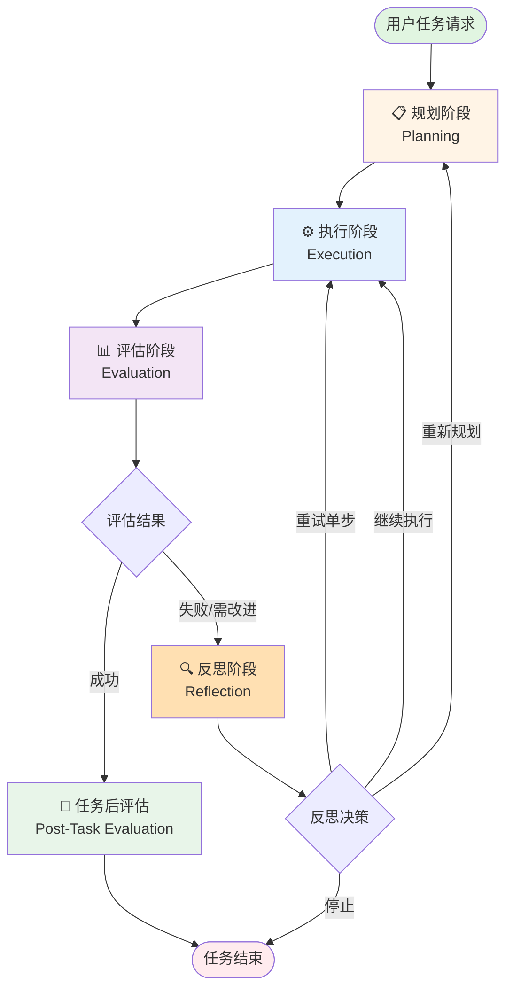
```mermaid
graph TB
    Start([用户任务请求]) --> Planning[📋 规划阶段<br/>Planning]
    Planning --> Execution[⚙️ 执行阶段<br/>Execution]
    Execution --> Evaluation[📊 评估阶段<br/>Evaluation]
    Evaluation --> Decision{评估结果}

    Decision -->|成功| PostEval[📝 任务后评估<br/>Post-Task Evaluation]
    Decision -->|失败/需改进| Reflection[🔍 反思阶段<br/>Reflection]

    Reflection --> Strategy{反思决策}
    Strategy -->|重试单步| Execution
    Strategy -->|重新规划| Planning
    Strategy -->|继续执行| Execution
    Strategy -->|停止| End([任务结束])

    PostEval --> End

    style Start fill:#e1f5e1
    style Planning fill:#fff4e6
    style Execution fill:#e3f2fd
    style Evaluation fill:#f3e5f5
    style Reflection fill:#ffe0b2
    style PostEval fill:#e8f5e9
    style End fill:#ffebee
```

### 2.2 任务状态生命周期

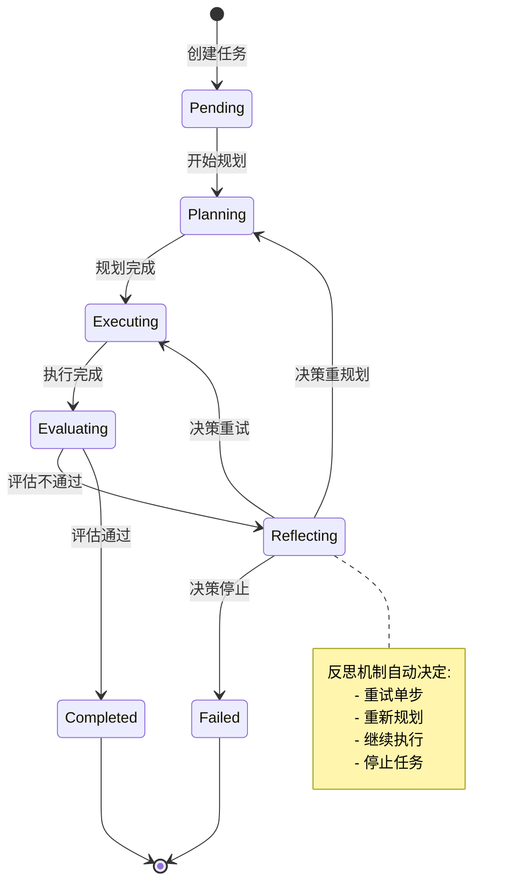
```mermaid
stateDiagram-v2
    [*] --> Pending: 创建任务
    Pending --> Planning: 开始规划
    Planning --> Executing: 规划完成
    Executing --> Evaluating: 执行完成
    Evaluating --> Reflecting: 评估不通过
    Evaluating --> Completed: 评估通过
    Reflecting --> Planning: 决策重规划
    Reflecting --> Executing: 决策重试
    Reflecting --> Failed: 决策停止
    Completed --> [*]
    Failed --> [*]

    note right of Reflecting
        反思机制自动决定:
        - 重试单步
        - 重新规划
        - 继续执行
        - 停止任务
    end note
```

**状态说明**：

| 状态 | 描述 | 触发条件 |
|------|------|---------|
| `Pending` | 任务已创建，等待处理 | 任务初始化 |
| `Planning` | 正在生成执行计划 | Orchestrator 启动规划 |
| `Executing` | 正在执行步骤 | 规划完成或反思决策重试 |
| `Evaluating` | 正在评估执行质量 | 执行完成 |
| `Reflecting` | 正在深度反思分析 | 评估不通过 |
| `Completed` | 任务成功完成 | 评估通过 |
| `Failed` | 任务失败 | 反思决策停止或致命错误 |

### 2.3 核心组件协作关系

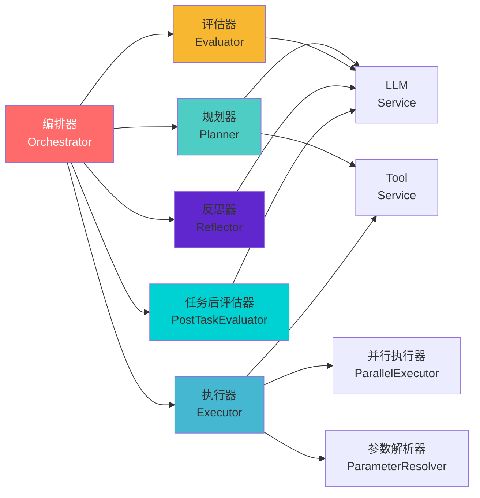
```mermaid
graph LR
    Orchestrator[编排器<br/>Orchestrator]

    Orchestrator --> Planner[规划器<br/>Planner]
    Orchestrator --> Executor[执行器<br/>Executor]
    Orchestrator --> Evaluator[评估器<br/>Evaluator]
    Orchestrator --> Reflector[反思器<br/>Reflector]
    Orchestrator --> PostEval[任务后评估器<br/>PostTaskEvaluator]

    Planner --> LLM[LLM<br/>Service]
    Planner --> ToolSvc[Tool<br/>Service]
    Executor --> ToolSvc
    Executor --> ParallelExec[并行执行器<br/>ParallelExecutor]
    Executor --> ParamResolver[参数解析器<br/>ParameterResolver]
    Evaluator --> LLM
    Reflector --> LLM
    PostEval --> LLM

    style Orchestrator fill:#ff6b6b,color:#fff
    style Planner fill:#4ecdc4
    style Executor fill:#45b7d1
    style Evaluator fill:#f7b731
    style Reflector fill:#5f27cd
    style PostEval fill:#00d2d3
```

---

## 3. 系统架构

### 3.1 整体架构图

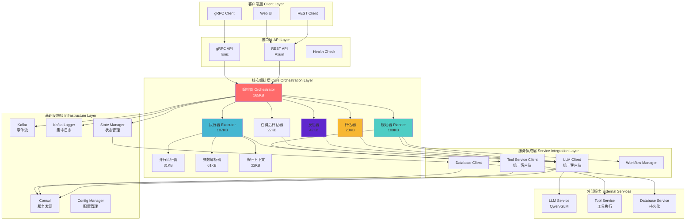
```mermaid
graph TB
    subgraph "客户端层 Client Layer"
        RestClient[REST Client]
        GrpcClient[gRPC Client]
        WebUI[Web UI]
    end

    subgraph "接口层 API Layer"
        RestAPI[REST API<br/>Axum]
        GrpcAPI[gRPC API<br/>Tonic]
        Health[Health Check]
    end

    subgraph "核心编排层 Core Orchestration Layer"
        Orchestrator[编排器 Orchestrator<br/>165KB]
        Planner[规划器 Planner<br/>100KB]
        Executor[执行器 Executor<br/>107KB]
        ParallelExec[并行执行器<br/>31KB]
        Evaluator[评估器<br/>20KB]
        Reflector[反思器<br/>42KB]
        PostEval[任务后评估器<br/>22KB]
        ParamResolver[参数解析器<br/>61KB]
        ExecContext[执行上下文<br/>22KB]
    end

    subgraph "服务集成层 Service Integration Layer"
        LLMClient[LLM Client<br/>统一客户端]
        ToolClient[Tool Service Client<br/>统一客户端]
        DBClient[Database Client]
        WorkflowMgr[Workflow Manager]
    end

    subgraph "基础设施层 Infrastructure Layer"
        Consul[Consul<br/>服务发现]
        Kafka[Kafka<br/>事件流]
        Logger[Kafka Logger<br/>集中日志]
        Config[Config Manager<br/>配置管理]
        StateManager[State Manager<br/>状态管理]
    end

    subgraph "外部服务 External Services"
        LLMService[LLM Service<br/>Qwen/GLM]
        ToolService[Tool Service<br/>工具执行]
        DBService[Database Service<br/>持久化]
    end

    RestClient --> RestAPI
    GrpcClient --> GrpcAPI
    WebUI --> RestAPI

    RestAPI --> Orchestrator
    GrpcAPI --> Orchestrator

    Orchestrator --> Planner
    Orchestrator --> Executor
    Orchestrator --> Evaluator
    Orchestrator --> Reflector
    Orchestrator --> PostEval

    Planner --> LLMClient
    Planner --> ToolClient
    Planner --> WorkflowMgr

    Executor --> ToolClient
    Executor --> ParallelExec
    Executor --> ParamResolver
    Executor --> ExecContext

    Evaluator --> LLMClient
    Reflector --> LLMClient
    PostEval --> LLMClient

    LLMClient --> Consul
    ToolClient --> Consul
    DBClient --> Consul

    LLMClient --> LLMService
    ToolClient --> ToolService
    DBClient --> DBService

    Orchestrator --> StateManager
    Orchestrator --> Logger
    Orchestrator --> Kafka

    StateManager --> DBClient

    style Orchestrator fill:#ff6b6b,color:#fff
    style Planner fill:#4ecdc4
    style Executor fill:#45b7d1
    style Evaluator fill:#f7b731
    style Reflector fill:#5f27cd
```

### 3.2 分层架构

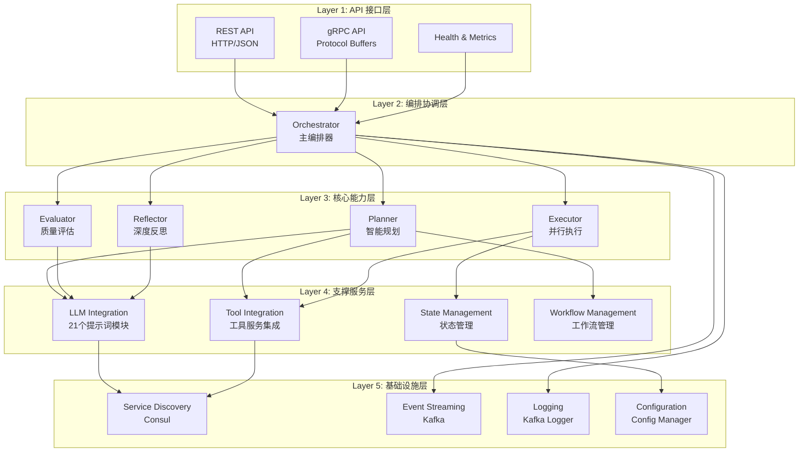
```mermaid
graph TD
    subgraph "Layer 1: API 接口层"
        A1[REST API<br/>HTTP/JSON]
        A2[gRPC API<br/>Protocol Buffers]
        A3[Health & Metrics]
    end

    subgraph "Layer 2: 编排协调层"
        B1[Orchestrator<br/>主编排器]
    end

    subgraph "Layer 3: 核心能力层"
        C1[Planner<br/>智能规划]
        C2[Executor<br/>并行执行]
        C3[Evaluator<br/>质量评估]
        C4[Reflector<br/>深度反思]
    end

    subgraph "Layer 4: 支撑服务层"
        D1[LLM Integration<br/>21个提示词模块]
        D2[Tool Integration<br/>工具服务集成]
        D3[State Management<br/>状态管理]
        D4[Workflow Management<br/>工作流管理]
    end

    subgraph "Layer 5: 基础设施层"
        E1[Service Discovery<br/>Consul]
        E2[Event Streaming<br/>Kafka]
        E3[Logging<br/>Kafka Logger]
        E4[Configuration<br/>Config Manager]
    end

    A1 --> B1
    A2 --> B1
    A3 --> B1

    B1 --> C1
    B1 --> C2
    B1 --> C3
    B1 --> C4

    C1 --> D1
    C1 --> D2
    C1 --> D4
    C2 --> D2
    C2 --> D3
    C3 --> D1
    C4 --> D1

    D1 --> E1
    D2 --> E1
    D3 --> E4

    B1 --> E2
    B1 --> E3
```

---

## 4. 核心模块详解

### 4.1 Orchestrator - 主编排器

**文件**: [src/core/orchestrator.rs](src/core/orchestrator.rs) (165KB)

**核心职责**:
- 统筹协调所有核心组件（Planner、Executor、Evaluator、Reflector）
- 管理任务状态转换和生命周期
- 控制反思循环流程，决策是否继续/重试/重规划
- 构建上下文工程事件（Context Engineering Events）
- 发送流式事件给客户端

**关键方法**:

```rust
// 主入口：执行任务（带元数据）
pub async fn orchestrate_with_metadata(
    &self,
    task_description: String,
    metadata: HashMap<String, String>,
) -> Result<OrchestrationResult>

// 核心循环：反思规划循环
async fn reflective_planning_loop(
    &self,
    task: &mut Task,
    execution_context: &ExecutionContext,
) -> Result<()>
```

**上下文工程事件构建器**:

```rust
pub struct ContextEngineeringEventBuilder {
    task_description: String,
    successful_steps: Vec<SuccessfulStepData>,
    failed_steps: Vec<FailedStepData>,
    current_round: u32,
    total_step_retries: u32,
    total_task_replans: u32,
}
```

### 4.2 Planner - 规划器

**文件**: [src/core/planner.rs](src/core/planner.rs) (100KB)

**核心职责**:
- 将任务描述分解为可执行步骤序列
- 实现两阶段规划（工具选择 → 详细规划）
- 内置工作流匹配和语义路由
- 工具筛选（基于相似度阈值）
- 支持继续规划（Continue Planning）

**两阶段规划流程**:

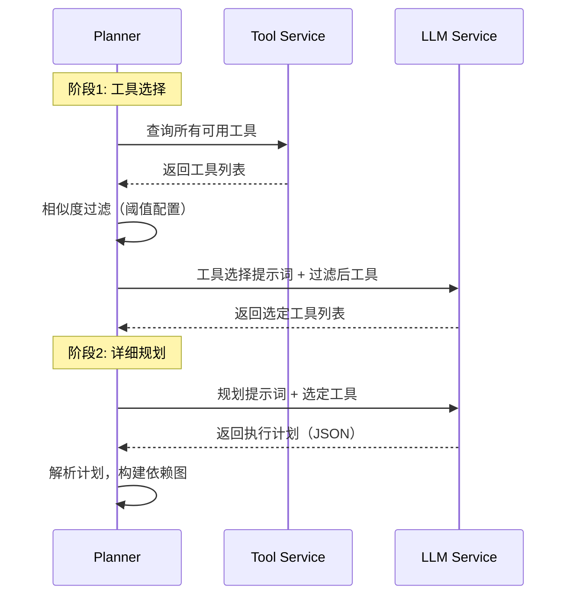
```mermaid
sequenceDiagram
    participant P as Planner
    participant TS as Tool Service
    participant LLM as LLM Service

    Note over P: 阶段1: 工具选择
    P->>TS: 查询所有可用工具
    TS-->>P: 返回工具列表
    P->>P: 相似度过滤（阈值配置）
    P->>LLM: 工具选择提示词 + 过滤后工具
    LLM-->>P: 返回选定工具列表

    Note over P: 阶段2: 详细规划
    P->>LLM: 规划提示词 + 选定工具
    LLM-->>P: 返回执行计划（JSON）
    P->>P: 解析计划，构建依赖图
```

**关键配置**:

```rust
pub struct Planner {
    enable_two_stage_planning: bool,        // 是否启用两阶段规划
    two_stage_tool_threshold: usize,        // 工具数量阈值
    enable_builtin_workflows: bool,         // 是否启用内置工作流
    tool_selection_threshold: f32,          // 工具筛选相似度阈值 (0-100)
    response_mode: ResponseMode,            // 响应模式
    enable_streaming: bool,                 // 是否启用流式返回
}
```

**语义路由**:

从任务描述中提取意图标记：

```rust
fn extract_intent_from_task(task_description: &str) -> Option<String>
```

支持格式：
- `"意图: 数据查询, 用户输入: ..."`
- `"Intent: device_control"`

### 4.3 Executor - 执行器

**文件**: [src/core/executor.rs](src/core/executor.rs) (107KB)

**核心职责**:
- 顺序或并行执行计划步骤
- 通过 Tool Service 调用工具
- 参数解析与动态推断
- 执行超时控制
- 管理执行上下文

**执行流程**:

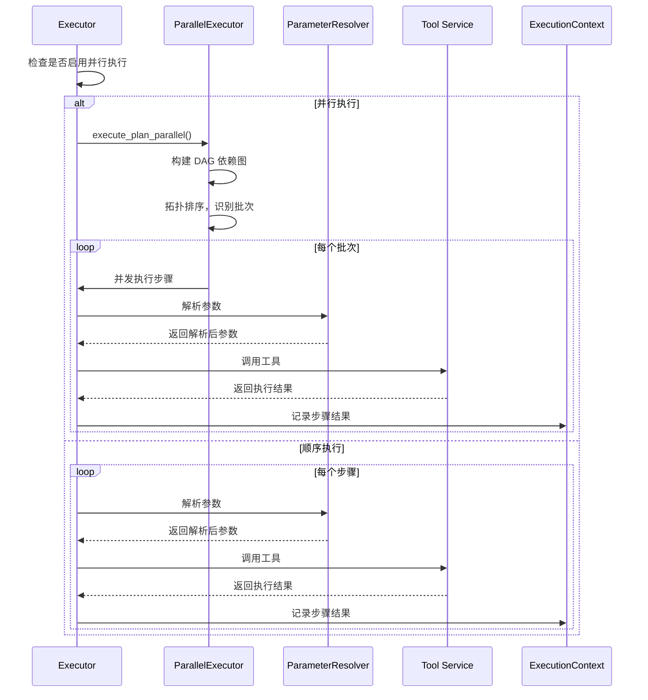
```mermaid
sequenceDiagram
    participant E as Executor
    participant PE as ParallelExecutor
    participant PR as ParameterResolver
    participant TS as Tool Service
    participant EC as ExecutionContext

    E->>E: 检查是否启用并行执行

    alt 并行执行
        E->>PE: execute_plan_parallel()
        PE->>PE: 构建 DAG 依赖图
        PE->>PE: 拓扑排序，识别批次
        loop 每个批次
            PE->>E: 并发执行步骤
            E->>PR: 解析参数
            PR-->>E: 返回解析后参数
            E->>TS: 调用工具
            TS-->>E: 返回执行结果
            E->>EC: 记录步骤结果
        end
    else 顺序执行
        loop 每个步骤
            E->>PR: 解析参数
            PR-->>E: 返回解析后参数
            E->>TS: 调用工具
            TS-->>E: 返回执行结果
            E->>EC: 记录步骤结果
        end
    end
```

**配置项**:

```rust
pub struct Executor {
    enable_parallel: bool,                      // 是否启用并行执行
    parallel_max_concurrent: usize,             // 最大并发步骤数
    parallel_min_steps: usize,                  // 触发并行的最小步骤数
    enable_dynamic_parameter_inference: bool,   // 动态参数推断
    execution_timeout: Duration,                // 执行超时
}
```

### 4.4 ParallelExecutor - 并行执行器

**文件**: [src/core/parallel_executor.rs](src/core/parallel_executor.rs) (31KB)

**核心职责**:
- 构建步骤依赖图（DAG）
- 拓扑排序识别并行批次
- 使用 Semaphore 控制并发数
- 批次间串行等待

**并行执行策略**:

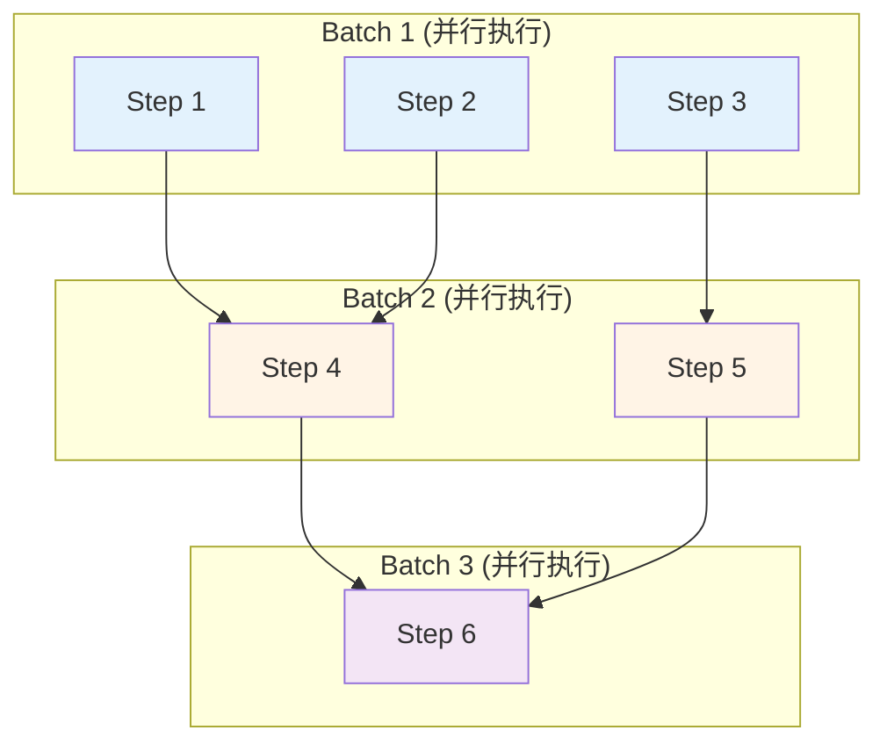
```mermaid
graph TB
    subgraph "Batch 1 (并行执行)"
        S1[Step 1]
        S2[Step 2]
        S3[Step 3]
    end

    subgraph "Batch 2 (并行执行)"
        S4[Step 4]
        S5[Step 5]
    end

    subgraph "Batch 3 (并行执行)"
        S6[Step 6]
    end

    S1 --> S4
    S2 --> S4
    S3 --> S5
    S4 --> S6
    S5 --> S6

    style S1 fill:#e3f2fd
    style S2 fill:#e3f2fd
    style S3 fill:#e3f2fd
    style S4 fill:#fff4e6
    style S5 fill:#fff4e6
    style S6 fill:#f3e5f5
```

**关键方法**:

```rust
// 构建依赖图
fn build_dependency_graph(plan: &ExecutionPlan) -> HashMap<String, Vec<String>>

// 拓扑排序
fn topological_sort(graph: &HashMap<String, Vec<String>>) -> Vec<Vec<String>>

// 并行执行计划
pub async fn execute_plan_parallel(&self, plan: ExecutionPlan) -> Result<PlanExecutionResult>
```

### 4.5 Evaluator - 评估器

**文件**: [src/core/evaluator.rs](src/core/evaluator.rs) (20KB)

**核心职责**:
- 多维度评估执行质量
- 打分（0-100）
- 生成 Markdown 评估报告
- 判断是否需要反思

**评估维度**:

```rust
pub struct EvaluationDimensions {
    pub completeness: f32,      // 完整性 (0-100)
    pub correctness: f32,       // 正确性 (0-100)
    pub efficiency: f32,        // 效率 (0-100)
    pub reliability: f32,       // 可靠性 (0-100)
}
```

**评估结果**:

```rust
pub struct EvaluationResult {
    pub evaluation_id: String,
    pub overall_score: f32,                     // 总体评分
    pub is_successful: bool,                    // 是否成功
    pub dimensions: EvaluationDimensions,       // 各维度评分
    pub successes: Vec<String>,                 // 成功方面
    pub failures: Vec<String>,                  // 失败方面
    pub improvement_suggestions: Vec<String>,   // 改进建议
}
```

### 4.6 Reflector - 反思器

**文件**: [src/core/reflector.rs](src/core/reflector.rs) (42KB)

**核心职责**:
- 失败原因根因分析
- 单步反思（Step-level Reflection）
- 全局反思（Full Reflection）
- 生成替代方案
- 决策下一步行动

**反思类型**:

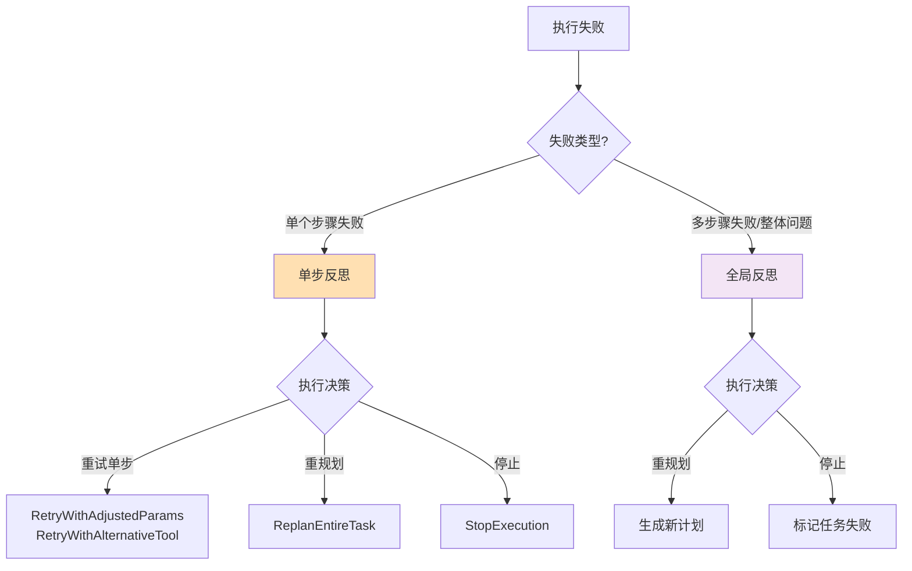
```mermaid
graph TD
    Start[执行失败] --> Check{失败类型?}

    Check -->|单个步骤失败| StepReflection[单步反思]
    Check -->|多步骤失败/整体问题| FullReflection[全局反思]

    StepReflection --> StepAction{执行决策}
    FullReflection --> FullAction{执行决策}

    StepAction -->|重试单步| Retry1[RetryWithAdjustedParams<br/>RetryWithAlternativeTool]
    StepAction -->|重规划| Replan1[ReplanEntireTask]
    StepAction -->|停止| Stop1[StopExecution]

    FullAction -->|重规划| Replan2[生成新计划]
    FullAction -->|停止| Stop2[标记任务失败]

    style StepReflection fill:#ffe0b2
    style FullReflection fill:#f3e5f5
```

**单步反思**:

```rust
pub struct StepReflection {
    pub reflection_id: String,
    pub step_id: String,
    pub root_cause: String,                 // 根本原因
    pub root_cause_category: String,        // 原因分类
    pub suggested_action: StepAction,       // 建议行动
    pub confidence: f32,                    // 可信度 (0-100)
    pub analysis: String,                   // 详细分析
    pub alternative_solutions: Vec<String>, // 备选方案
    pub is_recoverable: bool,               // 是否可恢复
}
```

**执行决策**:

```rust
pub enum StepAction {
    RetryWithAdjustedParams(HashMap<String, String>),  // 调整参数重试
    RetryWithAlternativeTool(String),                  // 使用备选工具
    ReplanEntireTask,                                   // 重新规划
    StopExecution,                                      // 停止执行
}
```

### 4.7 PostTaskEvaluator - 任务后评估器

**文件**: [src/core/post_task_evaluator.rs](src/core/post_task_evaluator.rs) (22KB)

**核心职责**:
- 从完成的任务中提取经验
- 识别成功模式和失败教训
- 生成知识文档
- 为未来相似任务提供参考

**评估结果结构**:

```rust
pub struct PostTaskEvaluation {
    pub task_summary: String,               // 任务摘要
    pub execution_highlights: Vec<String>,  // 执行亮点
    pub challenges_faced: Vec<String>,      // 遇到的挑战
    pub solutions_applied: Vec<String>,     // 应用的解决方案
    pub best_practices: Vec<BestPractice>,  // 最佳实践
    pub anti_patterns: Vec<AntiPattern>,    // 反模式
    pub tool_effectiveness: Vec<ToolMemo>,  // 工具效能记录
    pub scores: EvaluationScores,           // 评分
    pub recommendations: Vec<String>,       // 建议
}
```

### 4.8 ParameterResolver - 参数解析器

**文件**: [src/core/parameter_resolver.rs](src/core/parameter_resolver.rs) (61KB)

**核心职责**:
- 智能参数提取
- 多来源参数整合
- JSON 值转换
- 参数占位符替换（`$step_N.field`）

**参数解析优先级**:

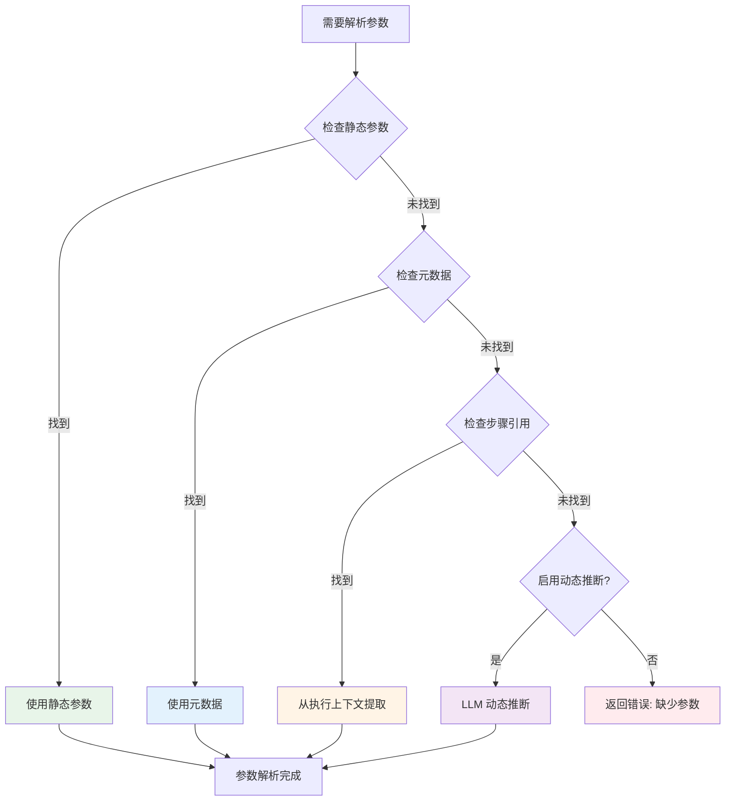
```mermaid
graph TD
    Start[需要解析参数] --> P1{检查静态参数}
    P1 -->|找到| UseStatic[使用静态参数]
    P1 -->|未找到| P2{检查元数据}

    P2 -->|找到| UseMeta[使用元数据]
    P2 -->|未找到| P3{检查步骤引用}

    P3 -->|找到| UseStep[从执行上下文提取]
    P3 -->|未找到| P4{启用动态推断?}

    P4 -->|是| LLMInfer[LLM 动态推断]
    P4 -->|否| Error[返回错误: 缺少参数]

    UseStatic --> End[参数解析完成]
    UseMeta --> End
    UseStep --> End
    LLMInfer --> End

    style UseStatic fill:#e8f5e9
    style UseMeta fill:#e3f2fd
    style UseStep fill:#fff4e6
    style LLMInfer fill:#f3e5f5
    style Error fill:#ffebee
```

**参数引用格式**:

- `$step_1.result` - 引用步骤 1 的完整结果
- `$step_2.data.temperature` - 引用嵌套字段
- `$metadata.user_id` - 引用元数据字段

### 4.9 ExecutionContext - 执行上下文

**文件**: [src/core/execution_context.rs](src/core/execution_context.rs) (22KB)

**核心职责**:
- 维护执行历史
- 存储步骤结果
- 管理元数据流转
- 支持变量替换

**数据结构**:

```rust
pub struct ExecutionContext {
    initial_metadata: Arc<RwLock<HashMap<String, String>>>,     // 初始元数据
    runtime_metadata: Arc<RwLock<HashMap<String, String>>>,     // 运行时元数据
    step_results: Arc<RwLock<HashMap<String, StepExecutionResult>>>, // 步骤结果
    plan_id: Arc<RwLock<String>>,                               // 计划 ID
}
```

**元数据流转机制**:

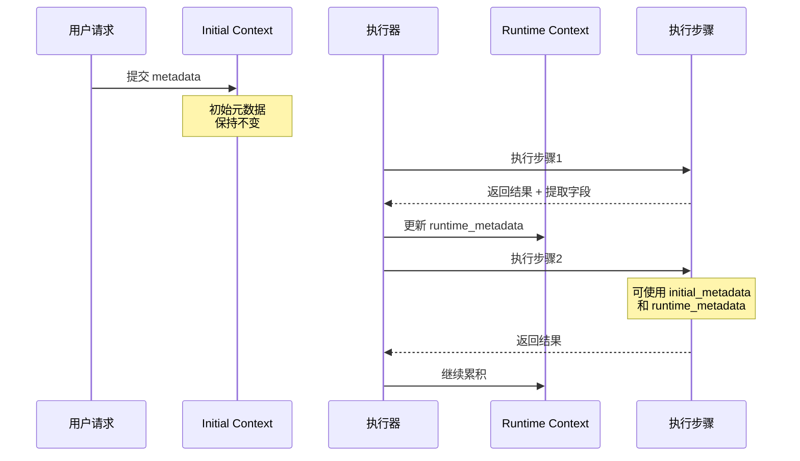
```mermaid
sequenceDiagram
    participant User as 用户请求
    participant IC as Initial Context
    participant Executor as 执行器
    participant RC as Runtime Context
    participant Step as 执行步骤

    User->>IC: 提交 metadata
    Note over IC: 初始元数据<br/>保持不变

    Executor->>Step: 执行步骤1
    Step-->>Executor: 返回结果 + 提取字段
    Executor->>RC: 更新 runtime_metadata

    Executor->>Step: 执行步骤2
    Note over Step: 可使用 initial_metadata<br/>和 runtime_metadata
    Step-->>Executor: 返回结果
    Executor->>RC: 继续累积
```

---

## 5. 工作流程与数据流

### 5.1 完整任务执行流程

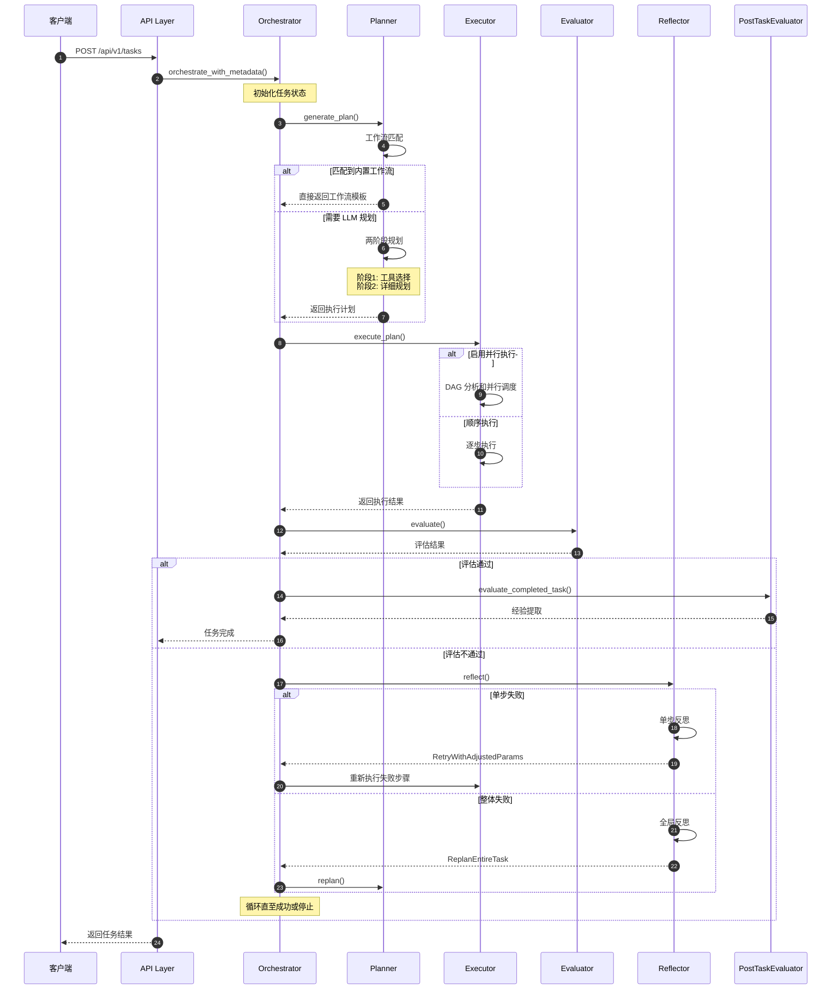
```mermaid
sequenceDiagram
    autonumber
    participant Client as 客户端
    participant API as API Layer
    participant Orch as Orchestrator
    participant Plan as Planner
    participant Exec as Executor
    participant Eval as Evaluator
    participant Refl as Reflector
    participant Post as PostTaskEvaluator

    Client->>API: POST /api/v1/tasks
    API->>Orch: orchestrate_with_metadata()

    Note over Orch: 初始化任务状态
    Orch->>Plan: generate_plan()
    Plan->>Plan: 工作流匹配

    alt 匹配到内置工作流
        Plan-->>Orch: 直接返回工作流模板
    else 需要 LLM 规划
        Plan->>Plan: 两阶段规划
        Note over Plan: 阶段1: 工具选择<br/>阶段2: 详细规划
        Plan-->>Orch: 返回执行计划
    end

    Orch->>Exec: execute_plan()

    alt 启用并行执行
        Exec->>Exec: DAG 分析和并行调度
    else 顺序执行
        Exec->>Exec: 逐步执行
    end

    Exec-->>Orch: 返回执行结果

    Orch->>Eval: evaluate()
    Eval-->>Orch: 评估结果

    alt 评估通过
        Orch->>Post: evaluate_completed_task()
        Post-->>Orch: 经验提取
        Orch-->>API: 任务完成
    else 评估不通过
        Orch->>Refl: reflect()

        alt 单步失败
            Refl->>Refl: 单步反思
            Refl-->>Orch: RetryWithAdjustedParams
            Orch->>Exec: 重新执行失败步骤
        else 整体失败
            Refl->>Refl: 全局反思
            Refl-->>Orch: ReplanEntireTask
            Orch->>Plan: replan()
        end

        Note over Orch: 循环直至成功或停止
    end

    API-->>Client: 返回任务结果
```

### 5.2 两阶段规划详细流程

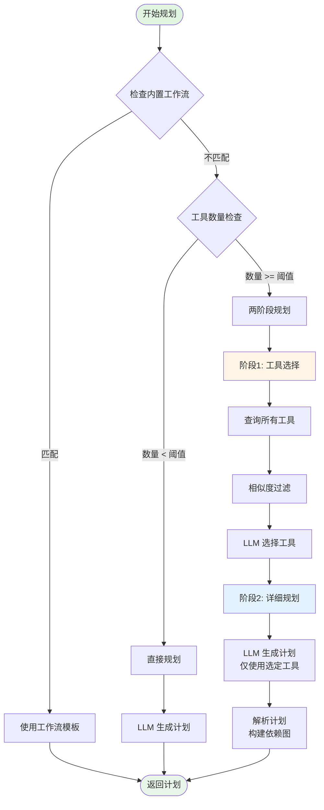
```mermaid
flowchart TD
    Start([开始规划]) --> CheckWorkflow{检查内置工作流}

    CheckWorkflow -->|匹配| UseWorkflow[使用工作流模板]
    CheckWorkflow -->|不匹配| CheckToolCount{工具数量检查}

    UseWorkflow --> End([返回计划])

    CheckToolCount -->|数量 < 阈值| DirectPlan[直接规划]
    CheckToolCount -->|数量 >= 阈值| TwoStage[两阶段规划]

    DirectPlan --> LLMPlan1[LLM 生成计划]
    LLMPlan1 --> End

    TwoStage --> Stage1[阶段1: 工具选择]
    Stage1 --> QueryTools[查询所有工具]
    QueryTools --> FilterTools[相似度过滤]
    FilterTools --> LLMSelect[LLM 选择工具]
    LLMSelect --> Stage2[阶段2: 详细规划]
    Stage2 --> LLMPlan2[LLM 生成计划<br/>仅使用选定工具]
    LLMPlan2 --> ParsePlan[解析计划<br/>构建依赖图]
    ParsePlan --> End

    style Start fill:#e1f5e1
    style Stage1 fill:#fff4e6
    style Stage2 fill:#e3f2fd
    style End fill:#e8f5e9
```

### 5.3 并行执行 DAG 流程

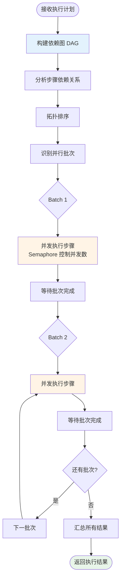
```mermaid
flowchart TD
    Start([接收执行计划]) --> BuildDAG[构建依赖图 DAG]

    BuildDAG --> AnalyzeDeps[分析步骤依赖关系]
    AnalyzeDeps --> TopoSort[拓扑排序]
    TopoSort --> IdentifyBatches[识别并行批次]

    IdentifyBatches --> Batch1{Batch 1}

    Batch1 --> Concurrent1[并发执行步骤<br/>Semaphore 控制并发数]
    Concurrent1 --> Wait1[等待批次完成]

    Wait1 --> Batch2{Batch 2}
    Batch2 --> Concurrent2[并发执行步骤]
    Concurrent2 --> Wait2[等待批次完成]

    Wait2 --> MoreBatches{还有批次?}
    MoreBatches -->|是| NextBatch[下一批次]
    NextBatch --> Concurrent2

    MoreBatches -->|否| Aggregate[汇总所有结果]
    Aggregate --> End([返回执行结果])

    style BuildDAG fill:#e3f2fd
    style Concurrent1 fill:#fff4e6
    style Concurrent2 fill:#fff4e6
    style End fill:#e8f5e9
```

### 5.4 反思循环决策流程

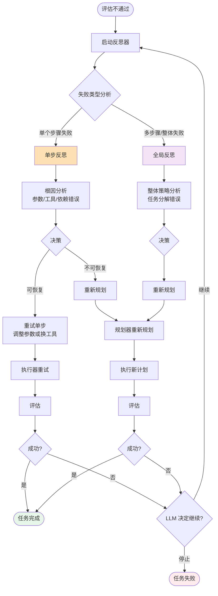
```mermaid
flowchart TD
    Start([评估不通过]) --> Reflect[启动反思器]

    Reflect --> CheckFailType{失败类型分析}

    CheckFailType -->|单个步骤失败| StepReflect[单步反思]
    CheckFailType -->|多步骤/整体失败| FullReflect[全局反思]

    StepReflect --> StepAnalysis[根因分析<br/>参数/工具/依赖错误]
    StepAnalysis --> StepDecision{决策}

    StepDecision -->|可恢复| RetryStep[重试单步<br/>调整参数或换工具]
    StepDecision -->|不可恢复| ReplanTask1[重新规划]

    FullReflect --> FullAnalysis[整体策略分析<br/>任务分解错误]
    FullAnalysis --> FullDecision{决策}

    FullDecision --> ReplanTask2[重新规划]

    RetryStep --> Execute[执行器重试]
    ReplanTask1 --> Planner1[规划器重新规划]
    ReplanTask2 --> Planner1

    Execute --> Eval1[评估]
    Planner1 --> Execute2[执行新计划]
    Execute2 --> Eval2[评估]

    Eval1 --> CheckSuccess1{成功?}
    Eval2 --> CheckSuccess2{成功?}

    CheckSuccess1 -->|是| Success([任务完成])
    CheckSuccess1 -->|否| LLMDecide{LLM 决定继续?}

    CheckSuccess2 -->|是| Success
    CheckSuccess2 -->|否| LLMDecide

    LLMDecide -->|继续| Reflect
    LLMDecide -->|停止| Failed([任务失败])

    style StepReflect fill:#ffe0b2
    style FullReflect fill:#f3e5f5
    style Success fill:#e8f5e9
    style Failed fill:#ffebee
```

---

## 6. 技术栈与依赖

### 6.1 核心技术栈

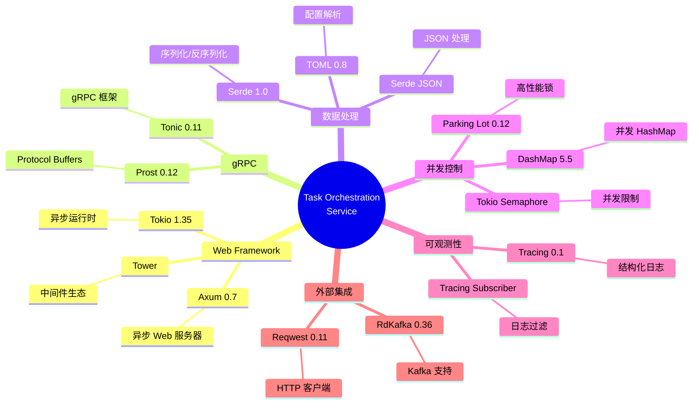
```mermaid
mindmap
  root((Task Orchestration<br/>Service))
    Web Framework
      Axum 0.7
        异步 Web 服务器
      Tokio 1.35
        异步运行时
      Tower
        中间件生态
    gRPC
      Tonic 0.11
        gRPC 框架
      Prost 0.12
        Protocol Buffers
    数据处理
      Serde 1.0
        序列化/反序列化
      Serde JSON
        JSON 处理
      TOML 0.8
        配置解析
    并发控制
      DashMap 5.5
        并发 HashMap
      Parking Lot 0.12
        高性能锁
      Tokio Semaphore
        并发限制
    可观测性
      Tracing 0.1
        结构化日志
      Tracing Subscriber
        日志过滤
    外部集成
      Reqwest 0.11
        HTTP 客户端
      RdKafka 0.36
        Kafka 支持
```

### 6.2 关键依赖

| 类别 | 依赖 | 版本 | 用途 |
|------|------|------|------|
| **Web 框架** | axum | 0.7 | HTTP 服务器 |
| | tokio | 1.35 | 异步运行时 |
| | tower-http | 0.5 | HTTP 中间件（CORS, 限流等） |
| **gRPC** | tonic | 0.11 | gRPC 框架 |
| | prost | 0.12 | Protocol Buffers |
| **序列化** | serde | 1.0 | 序列化框架 |
| | serde_json | 1.0 | JSON 支持 |
| | toml | 0.8 | TOML 配置 |
| **并发** | dashmap | 5.5 | 并发 HashMap |
| | parking_lot | 0.12 | 同步原语 |
| **日志** | tracing | 0.1 | 结构化日志 |
| | tracing-subscriber | 0.3 | 日志订阅 |
| **HTTP 客户端** | reqwest | 0.11 | HTTP 请求 |
| **事件流** | rdkafka | 0.36 | Kafka 集成（可选） |
| **工具** | uuid | 1.6 | UUID 生成 |
| | chrono | 0.4 | 时间处理 |
| | regex | 1.10 | 正则表达式 |

### 6.3 项目统计

```
总源文件数: 90+ Rust 文件
核心模块代码: 388KB (core/)
LLM 集成代码: 353KB (llm/, 21 个模块)
总代码行数: 约 15,000+ 行
```

---

## 7. 配置管理

### 7.1 配置文件结构

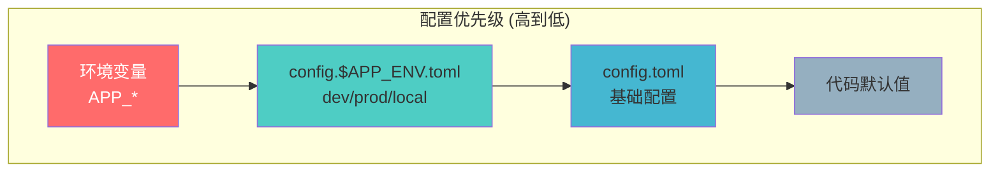
```mermaid
graph TD
    subgraph "配置优先级 (高到低)"
        Env[环境变量<br/>APP_*]
        EnvFile[config.$APP_ENV.toml<br/>dev/prod/local]
        BaseFile[config.toml<br/>基础配置]
        Default[代码默认值]
    end

    Env --> EnvFile
    EnvFile --> BaseFile
    BaseFile --> Default

    style Env fill:#ff6b6b,color:#fff
    style EnvFile fill:#4ecdc4
    style BaseFile fill:#45b7d1
    style Default fill:#95afc0
```

### 7.2 主要配置项

#### 7.2.1 服务器配置

```toml
[server]
host = "0.0.0.0"
port = 8084
request_timeout_secs = 300
max_connections = 1000
```

#### 7.2.2 LLM 配置

```toml
[llm]
service_name = "llm-service"              # Consul 服务名
endpoint = "http://localhost:9000"        # 备用端点
protocol = "grpc"                         # http 或 grpc
enable_streaming = true                   # 流式响应
default_model = "Qwen3-Max"
temperature = 0.7
top_p = 0.9
timeout_secs = 120
max_retries = 3
max_streaming_indicators = 5              # 流式进度图标循环数
```

#### 7.2.3 工具服务配置

```toml
[tool_service]
service_name = "tool-service"
endpoint = "http://localhost:50052"
protocol = "grpc"
timeout_secs = 60
enable_caching = true
cache_ttl_secs = 300
```

#### 7.2.4 编排器配置

```toml
[orchestrator]
# 并行执行配置
enable_parallel_execution = true
parallel_max_concurrent = 8
parallel_min_steps = 2

# 评估配置
evaluation_score_threshold = 70.0

# 规划配置
enable_two_stage_planning = true
two_stage_tool_threshold = 20
tool_selection_threshold = 60.0           # 工具筛选相似度阈值

# 工作流配置
enable_builtin_workflows = true

# 执行配置
step_execution_timeout_secs = 60
```

#### 7.2.5 反思配置

```toml
[reflection]
enable_single_step_reflection = true      # 启用单步反思
single_step_confidence_threshold = 70.0   # 可信度阈值
max_retry_attempts = 3                    # 最大重试次数
```

#### 7.2.6 响应配置

```toml
[response]
mode = "user"                             # user: 用户友好, agent: 代理详细
enable_markdown_formatting = true         # Markdown 格式化
include_execution_details = false         # 是否包含执行细节
```

#### 7.2.7 Consul 配置

```toml
[consul]
enabled = true
address = "http://consul:8500"
service_name = "task-orchestrator"
health_check_interval_secs = 10
deregister_after_secs = 30
```

#### 7.2.8 Kafka 配置

```toml
[kafka_service]
enabled = true
brokers = ["kafka:9092"]
audit_topic = "task-orchestration-audit"
log_topic = "task-orchestration-logs"
producer_timeout_ms = 5000
compression = "gzip"
```

#### 7.2.9 调试配置

```toml
[debug]
enable_parameter_inference = false        # 动态参数推断
log_llm_requests = false                  # 记录 LLM 请求
log_tool_calls = true                     # 记录工具调用
save_execution_history = true             # 保存执行历史
execution_history_path = "./execution_logs"
```

### 7.3 环境变量覆盖

所有配置项都可以通过环境变量覆盖：

```bash
# 格式: APP_<SECTION>_<KEY>
export APP_SERVER_PORT=9090
export APP_LLM_ENDPOINT=http://new-llm:9000
export APP_ORCHESTRATOR_PARALLEL_MAX_CONCURRENT=16
export APP_DEBUG_ENABLE_PARAMETER_INFERENCE=true
```

---

## 8. 部署架构

### 8.1 微服务架构

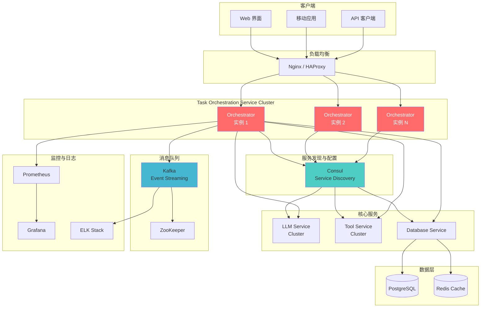
```mermaid
graph TB
    subgraph "客户端"
        WebUI[Web 界面]
        Mobile[移动应用]
        API_Client[API 客户端]
    end

    subgraph "负载均衡"
        LB[Nginx / HAProxy]
    end

    subgraph "Task Orchestration Service Cluster"
        TOS1[Orchestrator<br/>实例 1]
        TOS2[Orchestrator<br/>实例 2]
        TOS3[Orchestrator<br/>实例 N]
    end

    subgraph "服务发现与配置"
        Consul[Consul<br/>Service Discovery]
    end

    subgraph "核心服务"
        LLM_Cluster[LLM Service<br/>Cluster]
        Tool_Cluster[Tool Service<br/>Cluster]
        DB_Service[Database Service]
    end

    subgraph "数据层"
        PostgreSQL[(PostgreSQL)]
        Redis[(Redis Cache)]
    end

    subgraph "消息队列"
        Kafka[Kafka<br/>Event Streaming]
        ZK[ZooKeeper]
    end

    subgraph "监控与日志"
        Prometheus[Prometheus]
        Grafana[Grafana]
        ELK[ELK Stack]
    end

    WebUI --> LB
    Mobile --> LB
    API_Client --> LB

    LB --> TOS1
    LB --> TOS2
    LB --> TOS3

    TOS1 --> Consul
    TOS2 --> Consul
    TOS3 --> Consul

    Consul --> LLM_Cluster
    Consul --> Tool_Cluster
    Consul --> DB_Service

    TOS1 --> LLM_Cluster
    TOS1 --> Tool_Cluster
    TOS1 --> DB_Service
    TOS1 --> Kafka

    DB_Service --> PostgreSQL
    DB_Service --> Redis

    Kafka --> ZK

    TOS1 --> Prometheus
    Kafka --> ELK
    Prometheus --> Grafana

    style TOS1 fill:#ff6b6b,color:#fff
    style TOS2 fill:#ff6b6b,color:#fff
    style TOS3 fill:#ff6b6b,color:#fff
    style Consul fill:#4ecdc4
    style Kafka fill:#45b7d1
```

### 8.2 Docker Compose 部署示例

```yaml
version: '3.8'

services:
  # Task Orchestrator Service
  task-orchestrator:
    image: task-orchestrator:0.1.0
    build:
      context: .
      dockerfile: Dockerfile
    ports:
      - "8084:8084"
    environment:
      - APP_ENV=prod
      - APP_SERVER_HOST=0.0.0.0
      - APP_SERVER_PORT=8084
      - APP_CONSUL_ADDRESS=http://consul:8500
      - APP_KAFKA_SERVICE_BROKERS=kafka:9092
    depends_on:
      - consul
      - kafka
    restart: unless-stopped
    networks:
      - orchestrator-net
    healthcheck:
      test: ["CMD", "curl", "-f", "http://localhost:8084/health"]
      interval: 30s
      timeout: 10s
      retries: 3

  # Consul Service Discovery
  consul:
    image: consul:1.15
    ports:
      - "8500:8500"
    command: agent -server -bootstrap -ui -client=0.0.0.0
    networks:
      - orchestrator-net

  # Kafka Event Streaming
  zookeeper:
    image: confluentinc/cp-zookeeper:7.5.0
    environment:
      ZOOKEEPER_CLIENT_PORT: 2181
    networks:
      - orchestrator-net

  kafka:
    image: confluentinc/cp-kafka:7.5.0
    depends_on:
      - zookeeper
    ports:
      - "9092:9092"
    environment:
      KAFKA_ZOOKEEPER_CONNECT: zookeeper:2181
      KAFKA_ADVERTISED_LISTENERS: PLAINTEXT://kafka:9092
      KAFKA_OFFSETS_TOPIC_REPLICATION_FACTOR: 1
    networks:
      - orchestrator-net

  # PostgreSQL Database
  postgres:
    image: postgres:15
    environment:
      POSTGRES_DB: orchestrator
      POSTGRES_USER: admin
      POSTGRES_PASSWORD: password
    volumes:
      - postgres-data:/var/lib/postgresql/data
    networks:
      - orchestrator-net

  # Redis Cache
  redis:
    image: redis:7
    ports:
      - "6379:6379"
    networks:
      - orchestrator-net

networks:
  orchestrator-net:
    driver: bridge

volumes:
  postgres-data:
```

### 8.3 Kubernetes 部署架构

```yaml
apiVersion: apps/v1
kind: Deployment
metadata:
  name: task-orchestrator
  labels:
    app: task-orchestrator
spec:
  replicas: 3
  selector:
    matchLabels:
      app: task-orchestrator
  template:
    metadata:
      labels:
        app: task-orchestrator
    spec:
      containers:
      - name: orchestrator
        image: task-orchestrator:0.1.0
        ports:
        - containerPort: 8084
        env:
        - name: APP_ENV
          value: "prod"
        - name: APP_CONSUL_ADDRESS
          value: "http://consul:8500"
        - name: APP_KAFKA_SERVICE_BROKERS
          value: "kafka-service:9092"
        resources:
          requests:
            memory: "512Mi"
            cpu: "500m"
          limits:
            memory: "1Gi"
            cpu: "1000m"
        livenessProbe:
          httpGet:
            path: /health
            port: 8084
          initialDelaySeconds: 30
          periodSeconds: 10
        readinessProbe:
          httpGet:
            path: /health
            port: 8084
          initialDelaySeconds: 10
          periodSeconds: 5
---
apiVersion: v1
kind: Service
metadata:
  name: task-orchestrator-service
spec:
  selector:
    app: task-orchestrator
  ports:
  - protocol: TCP
    port: 8084
    targetPort: 8084
  type: LoadBalancer
```

### 8.4 监控指标

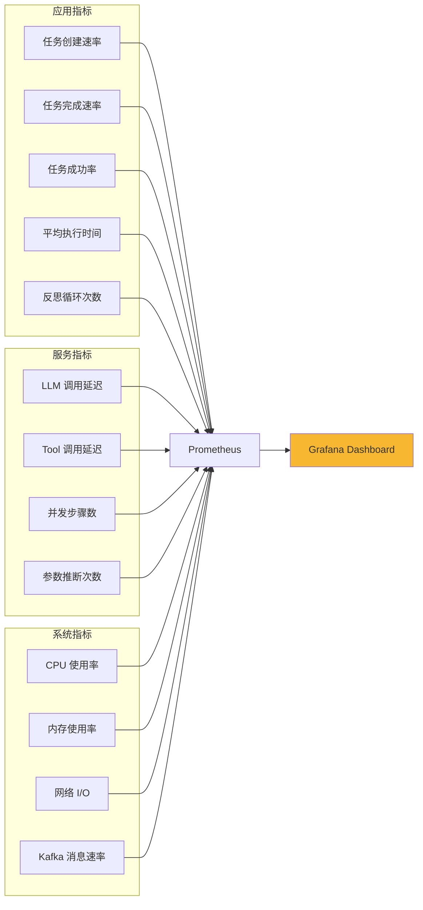
```mermaid
graph LR
    subgraph "应用指标"
        M1[任务创建速率]
        M2[任务完成速率]
        M3[任务成功率]
        M4[平均执行时间]
        M5[反思循环次数]
    end

    subgraph "服务指标"
        M6[LLM 调用延迟]
        M7[Tool 调用延迟]
        M8[并发步骤数]
        M9[参数推断次数]
    end

    subgraph "系统指标"
        M10[CPU 使用率]
        M11[内存使用率]
        M12[网络 I/O]
        M13[Kafka 消息速率]
    end

    M1 --> Prometheus
    M2 --> Prometheus
    M3 --> Prometheus
    M4 --> Prometheus
    M5 --> Prometheus
    M6 --> Prometheus
    M7 --> Prometheus
    M8 --> Prometheus
    M9 --> Prometheus
    M10 --> Prometheus
    M11 --> Prometheus
    M12 --> Prometheus
    M13 --> Prometheus

    Prometheus --> Grafana[Grafana Dashboard]

    style Grafana fill:#f7b731
```

---

## 附录

### A. 目录结构树

```
task-orchestration-service/
├── src/
│   ├── main.rs                          # HTTP 服务入口
│   ├── main_grpc.rs                     # gRPC 服务入口
│   ├── lib.rs                           # 库根
│   │
│   ├── api/                             # API 层
│   │   ├── handlers.rs                  # 请求处理器
│   │   ├── models.rs                    # 数据模型
│   │   └── health.rs                    # 健康检查
│   │
│   ├── core/                            # 核心编排层
│   │   ├── orchestrator.rs              # 主编排器 (165KB)
│   │   ├── planner.rs                   # 规划器 (100KB)
│   │   ├── executor.rs                  # 执行器 (107KB)
│   │   ├── parallel_executor.rs         # 并行执行器 (31KB)
│   │   ├── evaluator.rs                 # 评估器 (20KB)
│   │   ├── reflector.rs                 # 反思器 (42KB)
│   │   ├── post_task_evaluator.rs       # 任务后评估器 (22KB)
│   │   ├── parameter_resolver.rs        # 参数解析器 (61KB)
│   │   ├── execution_context.rs         # 执行上下文 (22KB)
│   │   └── mod.rs
│   │
│   ├── llm/                             # LLM 集成层 (21个模块)
│   │   ├── unified_client.rs            # 统一客户端
│   │   ├── client.rs                    # HTTP 客户端
│   │   ├── grpc_client.rs               # gRPC 客户端
│   │   ├── planning_prompts.rs          # 规划提示词
│   │   ├── selection_prompts.rs         # 工具选择提示词
│   │   ├── replanning_prompts.rs        # 重规划提示词
│   │   ├── continue_planning_prompts.rs # 继续规划提示词
│   │   ├── reflection_prompts.rs        # 反思提示词
│   │   ├── single_step_repair_prompts.rs # 单步修复提示词
│   │   ├── evaluation_prompts.rs        # 评估提示词
│   │   ├── post_task_evaluation_prompts.rs # 任务后评估提示词
│   │   ├── parameter_inference_prompts.rs  # 参数推断提示词
│   │   ├── scene_guidance.rs            # 场景引导
│   │   ├── message_templates.rs         # 消息模板
│   │   ├── ai_reporter_prompts.rs       # AI 报告提示词
│   │   ├── message_formatter_prompts.rs # 消息格式化提示词
│   │   └── ...
│   │
│   ├── tool/                            # 工具服务客户端
│   │   ├── unified_client.rs
│   │   ├── client.rs
│   │   ├── grpc_client.rs
│   │   └── client_with_discovery.rs
│   │
│   ├── state/                           # 状态管理
│   │   ├── task_state.rs
│   │   └── mod.rs
│   │
│   ├── config/                          # 配置管理
│   │   └── mod.rs
│   │
│   ├── consul/                          # Consul 集成
│   │   ├── discovery.rs
│   │   └── registry.rs
│   │
│   ├── database/                        # 数据库客户端
│   │   ├── client.rs
│   │   └── service.rs
│   │
│   ├── kafka/                           # Kafka 集成
│   │   ├── producer.rs
│   │   ├── consumer.rs
│   │   ├── audit.rs
│   │   └── grpc_client.rs
│   │
│   ├── grpc/                            # gRPC 服务
│   │   ├── server.rs
│   │   └── mod.rs
│   │
│   ├── logging/                         # 日志系统
│   │   └── kafka_logger.rs
│   │
│   ├── workflow/                        # 工作流管理
│   │   └── mod.rs
│   │
│   ├── utils/                           # 工具函数
│   │   ├── errors.rs
│   │   ├── string_utils.rs
│   │   └── mod.rs
│   │
│   ├── message_formatter.rs             # 消息格式化器
│   └── ai_reporter.rs                   # AI 报告生成器
│
├── proto/                               # Protocol Buffers
│   ├── task_orchestrator.proto
│   ├── llm.proto
│   ├── tool_service.proto
│   └── ...
│
├── config.dev.toml                      # 开发环境配置
├── config.prod.toml                     # 生产环境配置
├── Cargo.toml                           # Rust 项目配置
├── build.rs                             # 构建脚本
└── README.md
```

### B. API 端点清单

| 端点 | 方法 | 描述 | 请求体 | 响应 |
|------|------|------|--------|------|
| `/health` | GET | 健康检查 | - | `{"status": "healthy"}` |
| `/api/v1/tasks` | POST | 创建任务 | `CreateTaskRequest` | `CreateTaskResponse` |
| `/api/v1/tasks/:id` | GET | 获取任务状态 | - | `TaskStatusResponse` |
| `/api/v1/tasks/:id/result` | GET | 获取任务结果 | - | `TaskResultResponse` |
| `/api/v1/tasks` | GET | 列出所有任务 | - | `TaskListResponse` |

### C. 关键指标与性能

| 指标 | 目标值 | 说明 |
|------|--------|------|
| API 响应时间 | < 100ms | 任务创建接口 |
| 规划时间 | < 5s | 单次规划生成 |
| 并发任务数 | > 1000 | 同时处理的任务 |
| 步骤执行并发 | 8 | 默认并行步骤数 |
| 反思循环次数 | 无限制 | 由 LLM 自主决定 |
| 可用性 | 99.9% | 服务可用性目标 |

---

## 总结

本文档详细介绍了 Task Orchestration Service 的架构设计、核心模块、工作流程和部署方案。主要特点包括：

1. **反思规划范式**: 动态迭代的任务执行循环，自适应优化
2. **模块化设计**: 9大核心模块，职责清晰，易于扩展
3. **智能规划**: 两阶段规划 + 内置工作流 + 语义路由
4. **并行执行**: DAG 依赖分析和智能并行调度
5. **自愈能力**: 单步反思 + 全局反思，自动恢复
6. **企业集成**: Consul + Kafka + 分布式追踪

该服务适用于工业自动化、数据处理、智能助手等多种场景。

---

**文档维护**: Task Orchestration Team
**最后更新**: 2026-01-13
**版本**: 1.0
